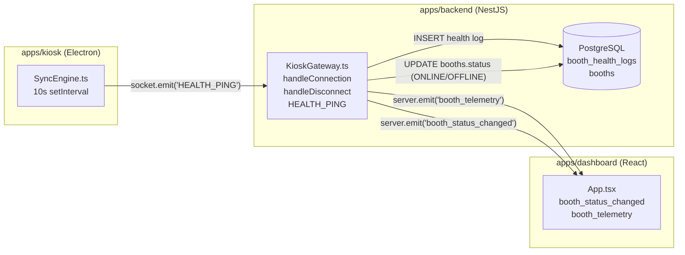
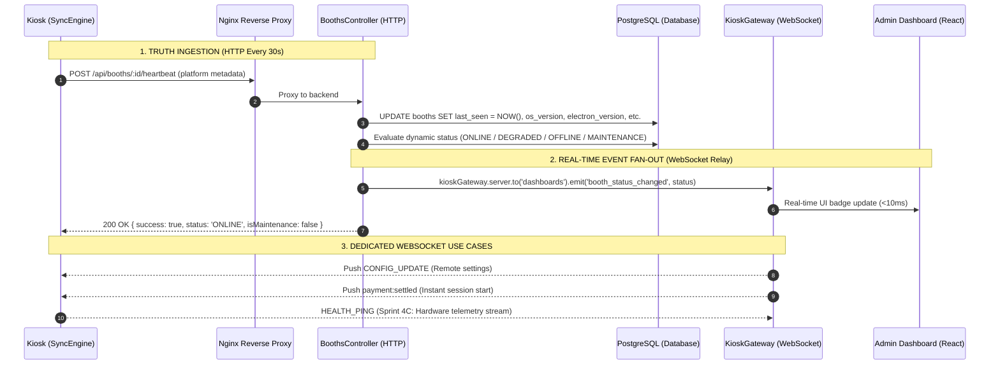

# HEARTBEAT SOURCE OF TRUTH DECISION: WEBSOCKET VS. HTTP

**Document Version**: 1.0.0  
**Target Systems**: `apps/backend` (NestJS Gateway & Controllers), `apps/kiosk` (Electron `SyncEngine`), `apps/dashboard` (React Admin)  
**Status**: Formal Architectural Decision Record (ADR)  
**Implementation Constraint**: Analysis & Decision Only — Implementation Deferred  

---

## Executive Summary

| Question | Forensic Finding & Architectural Decision |
| :--- | :--- |
| **1. Does a WebSocket heartbeat already exist?** | **YES**. Implemented in backend [kiosk.gateway.ts](file:///c:/Users/ezarh/.gemini/antigravity-ide/scratch/Pictolabs/pictolabs-rebuild/apps/backend/src/gateway/kiosk.gateway.ts#L106-L132) listening to `@SubscribeMessage('HEALTH_PING')` and connection lifecycle handlers. |
| **2. Is it actively used by kiosk clients?** | **YES**. Implemented in [SyncEngine.ts:685-697](file:///c:/Users/ezarh/.gemini/antigravity-ide/scratch/Pictolabs/pictolabs-rebuild/apps/kiosk/electron/services/SyncEngine.ts#L685-L697) transmitting hardware telemetry every 10 seconds whenever the Socket.IO client is connected. |
| **3. Which should be the Single Source of Truth?** | **HTTP HEARTBEAT (`POST /api/booths/:id/heartbeat`) MUST BE THE SOURCE OF TRUTH**.<br>Socket.IO must serve purely as a **real-time push event bus**, not the persistence layer or truth decider. |

---

## 1. Forensic Audit of Existing Socket.IO Heartbeat

### 1.1 Codebase Implementation

The existing codebase contains a bi-directional Socket.IO WebSocket implementation across three tiers:



#### 1. Kiosk Client (`apps/kiosk/electron/services/SyncEngine.ts`):
- Connection setup at lines 616–627 with `reconnection: true`, `reconnectionDelay: 2000`, `auth: { deviceSecret }`.
- Active timer at lines 685–697:
  ```typescript
  // Start health ping (transmits real-time hardware telemetry to Cloud Backend)
  healthPingInterval = setInterval(() => {
    if (socket?.connected) {
      const pHealth = getCachedPrinterHealth();
      socket.emit('HEALTH_PING', {
        cpuTemp: 44.5,
        paperCount: pHealth.code === 'PAPER_OUT' ? 0 : 350,
        cameraState: 'OK',
        printerState: pHealth.code,
        printerReady: pHealth.ready,
        printerMessage: pHealth.message,
      });
    }
  }, 10_000);
  ```

#### 2. Backend Gateway (`apps/backend/src/gateway/kiosk.gateway.ts`):
- Connection lifecycle:
  - `handleConnection(client: Socket)`: Authenticates kiosk via `deviceSecret`, executes `this.prisma.booth.update({ where: { id }, data: { status: 'ONLINE' } })`, joins rooms `booth:${id}` and `kiosks`, and emits `booth_status_changed` (`status: 'ONLINE'`) to `dashboards`.
  - `handleDisconnect(client: Socket)`: Executes `this.prisma.booth.update({ where: { id }, data: { status: 'OFFLINE' } })` and emits `booth_status_changed` (`status: 'OFFLINE'`) to `dashboards`.
- Ingestion handler:
  - `@SubscribeMessage('HEALTH_PING')`: Receives payload, creates a row in `prisma.boothHealthLog`, and broadcasts `booth_telemetry` to `dashboards`.

#### 3. Dashboard Web Client (`apps/dashboard/src/App.tsx`):
- Connects to `http://localhost:4000` via Socket.IO.
- Listens to `booth_status_changed` to update local booth status badges (`ONLINE`/`OFFLINE`).
- Listens to `booth_telemetry` to update `paperRemaining` and `cpuTemp` in real time.

---

### 1.2 Critical Flaws in the Existing Socket.IO Mechanism

Our forensic audit identified **five fundamental architectural defects** in relying on the current WebSocket mechanism for fleet operational status:

| Defect # | Flaw | Impact on Production Operations |
| :--- | :--- | :--- |
| **Bug 1** | **Direct Database Pollution (`status: 'ONLINE'` / `'OFFLINE'`)** | `KioskGateway` hardcodes `status: 'ONLINE'` into `booths` on connect and `status: 'OFFLINE'` on disconnect. This directly violates the core architectural directive: *"Do NOT store ONLINE/DEGRADED/OFFLINE as source of truth. Compute from last_seen."* |
| **Bug 2** | **Accidental Wiping of `MAINTENANCE` Mode** | If an operator flags a booth as `MAINTENANCE` via `PATCH /api/booths/:id/status`, any temporary Wi-Fi drop that reconnects the WebSocket will trigger `handleConnection`, which unconditionally overwrites `booths.status = 'ONLINE'`, destroying the maintenance lock! |
| **Bug 3** | **No `last_seen` Timestamp Tracking** | `HEALTH_PING` creates a new row in `booth_health_logs` (generating ~8,640 DB rows per booth/day!), but **never updates `booths.last_seen`**. The `booths` record remains stale. |
| **Bug 4** | **Missing Runtime Metadata** | `HEALTH_PING` only sends `{ cpuTemp, paperCount, cameraState, printerState }`. It transmits **zero** platform attributes (`appVersion`, `osVersion`, `electronVersion`, `releaseChannel`, `machineName`, `localIp`). |
| **Bug 5** | **Connection Flapping & Ghost Connections** | In edge mall environments, cellular/Wi-Fi packet jitter causes socket disconnects every few minutes. Tying database status to socket lifecycle causes severe status flapping. Conversely, if a kiosk hardware freezes without a TCP FIN packet, the server retains the socket as connected until long ping timeouts expire. |

---

## 2. Comparison: WebSocket Heartbeat vs. HTTP Heartbeat

| Dimension | Option A: WebSocket (`HEALTH_PING`) | Option B: HTTP (`POST /api/booths/:id/heartbeat`) |
| :--- | :--- | :--- |
| **Database Truth Principle** | ❌ **Fails**. Relies on in-memory TCP socket state or writes transient `ONLINE`/`OFFLINE` to DB. | ✅ **Complies**. Strictly updates `last_seen`. Status is dynamically computed on read from time delta. |
| **Maintenance Mode Safety** | ❌ **High Risk**. Reconnection lifecycle overwrites `MAINTENANCE` mode in DB unless heavily patched. | ✅ **Complete Isolation**. HTTP handler updates `last_seen` without ever modifying `booths.status`. |
| **Horizontal Scalability** | ⚠️ **Complex**. Requires Redis pub/sub adapter (`@socket.io/redis-adapter`) and sticky sessions across multiple VPS/containers. | ✅ **Stateless**. Any backend container behind Nginx or Cloudflare can handle the HTTP ping with zero shared memory. |
| **Degraded State Evaluation** | ❌ **Impossible**. A WebSocket is binary (connected or disconnected). It cannot express a "degraded" state (60s–300s delay). | ✅ **Built-in**. `now - last_seen` naturally yields `ONLINE` (<60s), `DEGRADED` (<300s), and `OFFLINE` (>=300s). |
| **Edge Network Resilience** | ⚠️ **Fragile**. Sensitive to NAT firewall idle drops, cellular proxy resets, and TLS handshake timeouts. | ✅ **Robust**. Standard HTTP request with exponential backoff and retry policies. |
| **Payload Scope (Sprint 4B)** | ❌ **Tangled**. Emits hardware telemetry (`cpuTemp`, `paperCount`) which belongs to Sprint 4C. | ✅ **Clean Separation**. Pure host platform telemetry (`appVersion`, `osVersion`, `electronVersion`, `releaseChannel`). |
| **Standard Observability / SRE** | ⚠️ **Opaque**. Difficult to monitor with standard probes, curl, or synthetic monitors. | ✅ **Standardized**. Standard REST API with OpenAPI/Swagger docs, HTTP status codes, and APM tracing. |
| **Bandwidth & Resource Load** | ✅ **Low**. Frame payload is ~150 bytes every 10s (~1.3 MB/day). | ✅ **Negligible**. Heartbeat every 30s (~500 bytes with headers = ~1.4 MB/day). |
| **Real-Time Push to Dashboards** | ✅ **Native**. Server can immediately broadcast to connected clients. | ⚠️ **Indirect**. Requires gateway broadcast hook on HTTP request ingestion. |

---

## 3. Recommendation and Rationale

### 3.1 The Architectural Verdict

> [!IMPORTANT]
> **VERDICT: The HTTP Heartbeat (`POST /api/booths/:id/heartbeat`) MUST be the Single Source of Truth for booth operational presence and liveness.**
> 
> Socket.IO should **NOT** govern booth liveness or write operational states to the database. Instead, Socket.IO must be positioned as a **downstream real-time transport mechanism**.

### 3.2 Rationale: Why HTTP Heartbeat Wins as Source of Truth

1. **Deterministic State Derivation (PostgreSQL as Immutable Anchor)**:
   Fleet presence in an enterprise photobooth network cannot depend on transient in-memory Node.js socket maps (`connectedBooths`). If a server process crashes, restarts, or undergoes a rolling deployment, in-memory socket maps vanish. By having HTTP heartbeats write to `booths.last_seen` in PostgreSQL, any service, worker, or replica can deterministically evaluate:
   $$\text{status} = f(\text{now} - \text{last\_seen}, \text{booths.status})$$

2. **Decoupling Network Availability from Administrative Overrides**:
   HTTP heartbeat processing strictly touches `last_seen` and platform metadata. It **never mutates `booths.status`**. This guarantees that an administrative lock (`MAINTENANCE`) can never be accidentally overwritten by a background network pulse.

3. **Smooth Degradation vs. Harsh Socket Binary**:
   Edge network drops in shopping malls last between 5 and 90 seconds. With WebSocket lifecycle tracking, every drop triggers an immediate `OFFLINE` alarm, causing alert fatigue. With HTTP `last_seen` computation, a missed ping smoothly transitions to `DEGRADED` after 60 seconds, and only escalates to `OFFLINE` after 300 seconds (5 minutes).

4. **Microservice & Multi-Container Ready**:
   Pictolabs production infrastructure uses Nginx load balancing over Docker containers. Stateless HTTP heartbeats can be distributed across arbitrary backend instances without requiring sticky sessions or complex Redis socket routing.

---

## 4. The Recommended Hybrid Architecture

To combine the rock-solid reliability of HTTP truth with the real-time responsiveness of WebSockets, Pictolabs should operate on a **Hybrid Ingestion & Broadcast Architecture**:



### Roles and Responsibilities:

| System Layer | Protocol | Role & Scope | Source of Truth? |
| :--- | :--- | :--- | :---: |
| **Liveness & Fleet Monitoring** | **HTTP REST** (`POST /api/booths/:id/heartbeat`) | Ingests runtime metadata (`osVersion`, `electronVersion`, `releaseChannel`, `machineName`, `localIp`). Updates `last_seen`. | **YES (Single Source of Truth)** |
| **Status Inspection & API Queries** | **HTTP REST** (`GET /api/booths`, `GET /api/booths/:id/status`) | Evaluates `now - last_seen` dynamically on read. | **YES** |
| **Administrative Override** | **HTTP REST** (`PATCH /api/booths/:id/status`) | Persists `MAINTENANCE` or `NORMAL` in `booths.status`. | **YES** |
| **Live Dashboard Badges** | **Socket.IO** (`booth_status_changed`) | Relays real-time state changes from HTTP controller to browser without browser polling. | **NO (Relay Only)** |
| **Remote Kiosk Control** | **Socket.IO** (`CONFIG_UPDATE`, `PUSH_CONFIG`) | Pushes remote configuration changes from cloud to kiosk. | **NO (Command Bus)** |
| **Payment Auto-Advance** | **Socket.IO** (`payment:settled`, `payment:expired`) | Sub-second kiosk screen transition upon QRIS webhook settlement. | **NO (Signal Bus)** |
| **Hardware Telemetry (Sprint 4C)** | **Socket.IO** (`HEALTH_PING` $\rightarrow$ `booth_telemetry`) | Streams high-frequency sensor telemetry (`cpuTemp`, `paperCount`, `cameraState`, `printerState`). | **NO (Sensor Stream)** |

---

## 5. Required Action Items Prior to Full Client Rollout

When moving to implementation, the following targeted adjustments should be executed:

1. **Remediate `KioskGateway` Database Writes**:
   - Remove `this.prisma.booth.update({ data: { status: 'ONLINE' } })` from `handleConnection`.
   - Remove `this.prisma.booth.update({ data: { status: 'OFFLINE' } })` from `handleDisconnect`.
   - Ensure socket connection/disconnection only updates in-memory room assignments and emits advisory events, leaving database truth untouched.

2. **Kiosk Client Heartbeat Implementation (`SyncEngine.ts`)**:
   - Introduce an HTTP heartbeat timer in `SyncEngine.ts` firing every 30 seconds (`POST /api/booths/:id/heartbeat`) with:
     - `appVersion`: Kiosk package version
     - `machineName`: Host computer name
     - `localIp`: Primary network interface IPv4
     - `osVersion`: `os.type() + ' ' + os.release()`
     - `electronVersion`: `process.versions.electron`
     - `releaseChannel`: Configured channel (`stable`)
   - Handle network errors gracefully with retry/backoff.

3. **Retain Socket.IO for Real-Time Functions**:
   - Keep Socket.IO connection active for sub-second payment settlements and remote config updates.
   - Defer hardware sensor telemetry payloads in `HEALTH_PING` to **Sprint 4C**.
