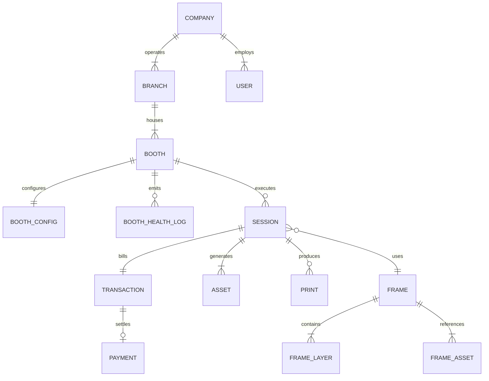
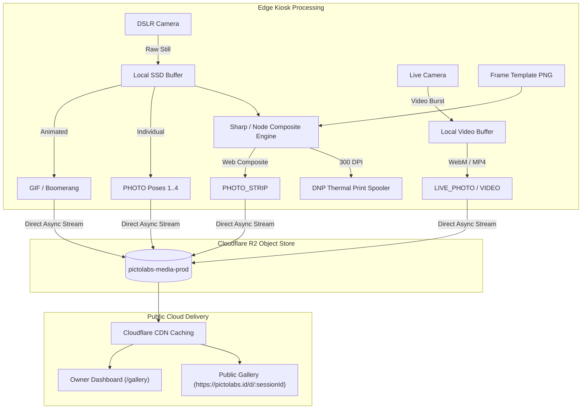
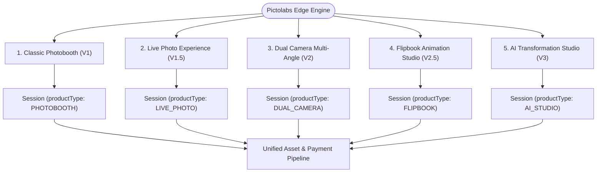
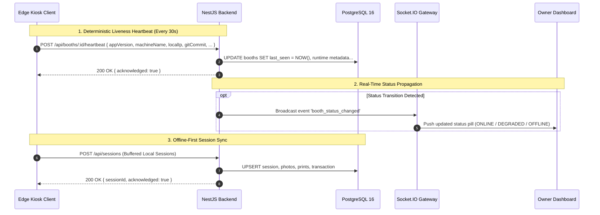
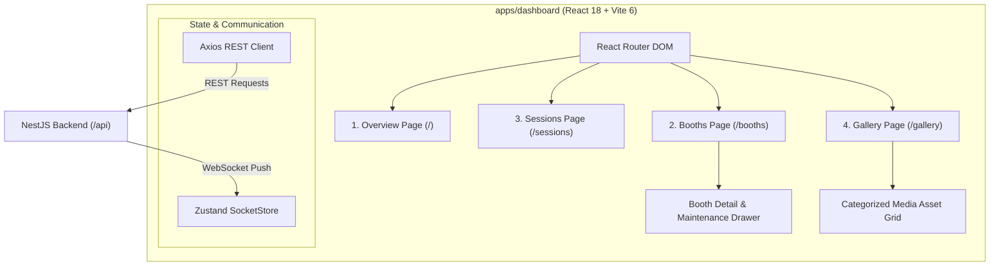

# PICTOLABS PLATFORM ARCHITECTURE SPECIFICATION
## The Enterprise Photobooth Platform & Edge-Cloud Operating System

> **Document Status**: Approved Architecture Foundation  
> **Target Release**: Sprint 5A Foundation & Long-Term Roadmap  
> **Source of Truth**: Current Workspace Implementation (`apps/backend`, `apps/dashboard`, `kiosk-client`)  
> **Primary Business Concept**: **The Session is the Central Business Entity** — All physical actions, hardware outputs, transactions, and digital assets originate from and belong to a Session.

---

## 1. Executive Vision & Architectural Tenets

Pictolabs is an enterprise distributed platform connecting autonomous physical photobooth kiosks deployed in high-traffic commercial venues (shopping malls, event spaces, entertainment centers) with a centralized cloud orchestration, digital media distribution, and operational control plane.

```
┌────────────────────────────────────────────────────────────────────────────────────────┐
│                                   PICTOLABS CLOUD                                      │
├────────────────────────────────────────────────────────────────────────────────────────┤
│  Owner Dashboard (React/Vite) ──►  NestJS Modular API Engine ──► Cloudflare R2 Storage │
│          │                                  │                   (Media Bucket)         │
│          ▼                                  ▼                                          │
│  WebSocket Gateway (Socket.IO)     PostgreSQL 16 (Prisma)                              │
└─────────────────────────────────────────────▲──────────────────────────────────────────┘
                                              │ HTTPS Heartbeat / Sync / R2 Presigned
                                              ▼
┌────────────────────────────────────────────────────────────────────────────────────────┐
│                           EDGE KIOSK NETWORK (MULTI-BOOTH)                             │
├────────────────────────────────────────────────────────────────────────────────────────┤
│  [ Booth: Grand Indonesia ]      [ Booth: Central Park ]      [ Booth: Senayan City ]  │
│  • Electron Kiosk Client         • Electron Kiosk Client      • Electron Kiosk Client  │
│  • DSLR / WebRTC Capture         • DSLR / WebRTC Capture      • DSLR / WebRTC Capture  │
│  • Local SQLite Buffer           • Local SQLite Buffer        • Local SQLite Buffer    │
│  • DNP Thermal Sublimation       • DNP Thermal Sublimation    • DNP Thermal Sublimation│
└────────────────────────────────────────────────────────────────────────────────────────┘
```

### Core Architecture Tenets
1. **Session-First Domain Model**: A customer engagement is modeled as an immutable `Session`. Physical prints, financial transactions, and digital media artifacts (`Asset`) strictly belong to and are indexed by `sessionId`.
2. **Offline-First Edge Autonomy**: Physical kiosks must never fail a customer if cloud connectivity drops. Kiosks capture, composite, accept payments (offline/cash or pre-authenticated), and print locally, syncing state and assets asynchronously when connectivity resumes.
3. **HTTP as Single Source of Truth for Fleet Liveness**: Booth connection state (`ONLINE`, `DEGRADED`, `OFFLINE`) is dynamically derived from deterministic HTTP heartbeats (`last_seen`), preventing ghost states caused by flaky socket drops.
4. **Zero-Egress Distributed Asset Pipeline**: Edge kiosks composite and upload media directly to Cloudflare R2 object storage. The backend manages metadata and delivers public galleries via high-speed CDN.

---

## 2. Core Entities

The Pictolabs domain model is partitioned into six core entities representing physical organizational structure, edge computing nodes, transactional engagements, digital media assets, payment settlements, and operational actors.



---

### 2.1 Branch
Represents a physical venue, mall outlet, or flagship retail location hosting one or more photobooth kiosks.

- **Attributes**:
  - `id`: UUID (Primary Key).
  - `companyId`: Foreign key to `Company`.
  - `name`: Human-readable location name (e.g. `"Grand Indonesia West Mall"`, `"Central Park Mall L2"`).
  - `location` / `address`: Physical address, city, coordinate coordinates.
  - `timezone`: Local operational timezone (`Asia/Jakarta` [WIB], `Asia/Makassar` [WITA], `Asia/Jayapura` [WIT]).
  - `createdAt`, `updatedAt`: Audit timestamps.
- **Role**: Groups kiosks for location-level reporting, geo-fenced promotions, regional pricing, and branch manager access delegation.

---

### 2.2 Booth
Represents an individual physical photobooth hardware unit operating an Electron runtime at a Branch.

- **Attributes**:
  - `id`: UUID (Primary Key).
  - `branchId`: Foreign key to `Branch`.
  - `name`: Kiosk identifier (e.g. `"PICTOLABS-GI-01"`, `"KIOSK-CP-02"`).
  - `deviceSecret`: Cryptographically random unique token (`x-device-secret`) used by the kiosk to authenticate all backend API and sync operations.
  - `status`: Administrative mode override (`NORMAL` vs `MAINTENANCE`).
  - `lastSeen`: UTC timestamp of the most recent valid HTTP heartbeat.
  - **Runtime Software Telemetry**:
    - `appVersion`: Semantic version of the installed kiosk client (e.g. `"1.2.5"`).
    - `gitCommit`: Short hash of the deployed kiosk client code (e.g. `"1457ae6"`).
    - `releaseChannel`: Release stream (`"stable"`, `"beta"`, `"nightly"`).
  - **Host Hardware Telemetry**:
    - `machineName`: Windows OS hostname (e.g. `"PICTO-REVISED-01"`).
    - `localIp`: LAN IP address on the venue network (e.g. `"192.168.1.188"`).
    - `osVersion`: Operating system build (e.g. `"Windows 11 Pro 23H2 (22631)"`).
    - `electronVersion`: Runtime platform version (e.g. `"28.2.0"`).
  - `createdAt`, `updatedAt`: Audit timestamps.
- **Computed Attributes (Non-Persistent / Calculated On-the-Fly)**:
  - `dynamicStatus`:
    - `MAINTENANCE`: When `status === "MAINTENANCE"` (manual administrative override).
    - `ONLINE`: When `now - lastSeen < 60s`.
    - `DEGRADED`: When `now - lastSeen < 300s`.
    - `OFFLINE`: When `lastSeen == null` or `now - lastSeen >= 300s`.
- **Relationships**:
  - Has one `BoothConfig` (camera ISO, shutter, printer margins, pricing).
  - Has many `BoothHealthLog` entries (CPU temp, paper count, camera state).
  - Has many `Session` records.

---

### 2.3 Session (PRIMARY BUSINESS ENTITY)

> [!IMPORTANT]
> **The Session is the foundational atom of the Pictolabs platform.**  
> Every customer journey, monetary transaction, physical photo print, and digital cloud asset is anchored to a unique `Session`.

A `Session` represents a single customer engagement cycle from interaction start, layout/frame selection, payment authorization, live photo taking, image compositing, thermal printing, to online gallery publication.

- **Attributes**:
  - `id`: Canonical business identifier (e.g. `"session_1788734918239"`). Generated at kiosk touch initiation.
  - `boothId`: Foreign key to `Booth`. Pinpoints exactly which physical kiosk ran the experience.
  - `productType`: Identifies the session experience type:
    - `"PHOTOBOOTH"`: Standard 4-pose photo capture.
    - `"LIVE_PHOTO"`: Dual photo + burst micro-video capture.
    - `"DUAL_CAMERA"`: Multi-angle (wide + portrait) capture.
    - `"FLIPBOOK"`: High-speed burst sequence for thumb-flipbook printing.
  - `status`: Lifecycle state:
    - `INITIATED`: Customer touched screen; session workspace initialized.
    - `PENDING_PAYMENT`: Waiting for QRIS payment scan and settlement.
    - `PAYMENT_SETTLED`: Payment confirmed; booth unlocked for capture.
    - `CAPTURING`: Customer currently taking photos in the booth.
    - `COMPOSITING`: Rendering print strips and digital softfiles.
    - `PRINTING`: Spooled to DNP thermal printer.
    - `COMPLETED`: Physical prints delivered, digital assets synced to R2 cloud.
    - `CANCELLED`: Timed out before payment or abandoned.
    - `REFUNDED`: Payment voided or manual refund issued.
  - `frameId`: Foreign key to `Frame` (chosen graphic layout/border).
  - `customerEmail`: Optional customer email for softfile delivery.
  - `customerPhone`: Optional phone number for WhatsApp gallery delivery.
  - `printCount`: Total physical sheets printed (e.g. 2 copies 4R).
  - `retentionExpiresAt`: Timestamp when public softfile access expires (default `createdAt + 30 days`).
  - `createdAt`, `updatedAt`: Session timeline.

---

### 2.4 Asset

Represents an individual digital artifact generated during a Session. **Assets strictly belong to a Session.**

- **Attributes**:
  - `id`: UUID (Primary Key).
  - `sessionId`: Foreign key to `Session`.
  - `assetType`: Categorical media type:
    - `PHOTO`: Individual pose still image.
    - `PHOTO_STRIP`: Final composited photostrip layout with frame overlay.
    - `LIVE_PHOTO`: Short video clip captured during photo take.
    - `GIF`: Animated boomerang/loop compiled from poses.
    - `VIDEO`: Behind-the-scenes recording or montage clip.
    - `FLIPBOOK`: Sequential frame bundle or PDF/strip imposition for flipbook.
  - `sequenceNo`: Index of the asset within the session (e.g. Pose 1, Pose 2, Pose 3, Pose 4).
  - `storageKey`: S3/R2 object path (e.g. `"sessions/session_1788734918239/photo_pose1.jpg"`).
  - `cdnUrl`: Public CDN URL (e.g. `"https://media.pictolabs.id/photos/session_1788734918239_pose1.jpg"`).
  - `thumbnailUrl`: Compressed preview image for fast dashboard/gallery loading.
  - `mimeType`: Media MIME type (`"image/jpeg"`, `"image/png"`, `"video/mp4"`, `"image/gif"`).
  - `fileSize`: Byte size for quota and bandwidth tracking.
  - `width`: Pixel width (e.g. `1200`).
  - `height`: Pixel height (e.g. `1800`).
  - `durationSec`: Video duration in seconds (for `VIDEO` / `LIVE_PHOTO`).
  - `metadata`: JSON blob storing camera EXIF, color profile, or crop coordinates.
  - `createdAt`: Asset creation timestamp.

---

### 2.5 Payment & Transaction

Models the financial settlement for a Session. Follows a two-tier structure:
1. `Transaction`: High-level business ledger record tying the Session to an order amount.
2. `Payment`: Gateway-level transaction record handling Midtrans QRIS lifecycles, EMVCo payloads, and webhook audits.

- **Attributes (`Payment`)**:
  - `id`: UUID.
  - `transactionId`: Foreign key to `Transaction`.
  - `orderId`: Unique merchant order ID sent to Midtrans (e.g. `"PICTO-ORDER-1788734918"`).
  - `method`: Settlement rail (Default `"QRIS"`, future: `"CASH"`, `"VOUCHER"`).
  - `status`: Gateway state (`"PENDING"`, `"SUCCESS"`, `"SETTLED"`, `"EXPIRED"`, `"CANCELLED"`, `"FAILED"`).
  - `paymentRef`: Gateway reference ID (Midtrans `transaction_id`).
  - `qrisString`: Raw EMVCo payload string displayed as dynamic QR on the kiosk screen.
  - `qrisUrl`: Hosted QR image URL from payment processor.
  - `amount`: Transaction value in Indonesian Rupiah (e.g. `35000.00`).
  - `paidAt`: Timestamp when webhook confirmed settlement.
  - `expiresAt`: QR expiration threshold (typically 5 minutes from creation).
  - `rawWebhookPayload`: Complete JSON string audit trail of the incoming gateway notification.

---

### 2.6 User

Represents administrative, technical, and store operator users accessing the platform.

- **Attributes**:
  - `id`: UUID.
  - `email`: Unique login identifier.
  - `password`: Argon2 / BCrypt hashed credentials.
  - `name`: Display name.
  - `role`: Role-Based Access Control tier:
    - `SUPERADMIN`: Platform Owner with global access to all companies, branches, booths, sessions, and system parameters.
    - `COMPANY_ADMIN`: Regional franchise or corporate owner managing multiple assigned branches.
    - `BRANCH_MANAGER`: Venue supervisor managing booths and inspecting sessions within a single branch.
    - `OPERATOR`: Floor attendant with kiosk paper-refill, test-print, and maintenance permissions.
  - `companyId`: Optional foreign key to `Company` (null for `SUPERADMIN`).

---

## 3. Asset Strategy & Media Pipeline

The asset strategy defines how digital media is captured on edge kiosks, processed, uploaded, stored in Cloudflare R2, and served to customers via web galleries.



---

### 3.1 Supported Asset Types & Formats

| Asset Type | Primary Extension | Target Resolution | Primary Purpose | Lifecycle / Retention |
| :--- | :---: | :---: | :--- | :--- |
| **`PHOTO`** | `.jpg` | $3000 \times 2000$ (3:2) | Individual DSLR raw and calibrated camera stills (Pose 1 to 4). | 30 Days Public $\rightarrow$ Cold Storage |
| **`PHOTO_STRIP`** | `.jpg` / `.png` | $1200 \times 1800$ (300 DPI) | High-res composite sheet with applied frame border, ready for DNP 4R or dual $2 \times 6$ print. | 30 Days Public $\rightarrow$ Cold Storage |
| **`LIVE_PHOTO`** | `.mp4` / `.webm` | $1080 \times 1440$ (3:4) | Short 2–3s motion video burst captured right before the photo shutter. | 30 Days Public $\rightarrow$ Purge |
| **`GIF`** | `.gif` / `.mp4` | $720 \times 960$ (Loop) | Fast-looping animated boomerang sequence compiled from poses. | 30 Days Public $\rightarrow$ Purge |
| **`VIDEO`** | `.mp4` | $1080 \times 1920$ (9:16) | Behind-the-scenes recording or compiled motion montage with soundtrack. | 30 Days Public $\rightarrow$ Purge |
| **`FLIPBOOK`** | `.pdf` / `.zip` | Multi-page $600 \times 400$ | Sequential frame sheet (24–36 frames) for physical flipbook imposition. | 30 Days Public $\rightarrow$ Cold Storage |

---

### 3.2 Canonical Cloudflare R2 Path Structure

Assets stored in bucket `pictolabs-media-prod` follow a deterministic, session-anchored folder taxonomy:

```
pictolabs-media-prod/
├── sessions/
│   └── {sessionId}/
│       ├── composite_{sessionId}.jpg          # PHOTO_STRIP (Composite Print Render)
│       ├── thumb_composite_{sessionId}.jpg    # Compressed Gallery Thumbnail
│       ├── photo_{sessionId}_pose_1.jpg       # PHOTO (Pose 1)
│       ├── photo_{sessionId}_pose_2.jpg       # PHOTO (Pose 2)
│       ├── photo_{sessionId}_pose_3.jpg       # PHOTO (Pose 3)
│       ├── photo_{sessionId}_pose_4.jpg       # PHOTO (Pose 4)
│       ├── live_{sessionId}_pose_1.mp4        # LIVE_PHOTO (Pose 1 Video)
│       ├── live_{sessionId}_pose_2.mp4        # LIVE_PHOTO (Pose 2 Video)
│       ├── live_{sessionId}_pose_3.mp4        # LIVE_PHOTO (Pose 3 Video)
│       ├── live_{sessionId}_pose_4.mp4        # LIVE_PHOTO (Pose 4 Video)
│       ├── gif_{sessionId}.mp4                # GIF / Boomerang Loop
│       ├── flipbook_{sessionId}.pdf           # FLIPBOOK Imposition Sheet (if applicable)
│       └── archive_{sessionId}.zip            # Auto-generated full download bundle
```

---

### 3.3 Storage Tiering, Caching, and Retention Policy

1. **Edge SSD Buffer (`reprint-cache`)**:
   - Stored locally on kiosk SSD (`C:\pictolabs-data\reprint-cache\`).
   - Retained locally for 7 days to allow operators to perform physical reprint requests without internet.
   - Automatically pruned via FIFO disk cleanup when local free space drops below $20\text{ GB}$.
2. **Hot Cloud Tier (Days 0–30)**:
   - Hosted on Cloudflare R2, served through custom CDN domain `media.pictolabs.id`.
   - Free egress; edge-cached at Cloudflare edge nodes across Indonesia (Jakarta, Surabaya).
   - Customers access via short links: `https://pictolabs.id/d/{sessionId}`.
3. **Cold Storage / Pruning Lifecycle (Day 31+)**:
   - Heavy video assets (`LIVE_PHOTO`, `VIDEO`, `GIF`) are automatically purged from R2 after 30 days via R2 Object Lifecycle rules.
   - High-resolution `PHOTO_STRIP` composites are either moved to cold Glacier archive or retained with softfile expiration notices.

---

## 4. Product Strategy & Multi-Experience Extensibility

Pictolabs is designed not as a single fixed-layout photobooth app, but as an **extensible photobooth operating platform** capable of hosting multiple distinct photo/video products on the same hardware and cloud foundation.



---

### 4.1 Current Production Products

#### 1. Photobooth (Classic)
- **Workflow**: Customer chooses frame category (`4R` single portrait or `2x6` classic twin strips), initiates QRIS payment, poses for 4 shutter clicks, selects photo filters (Original, B&W, Vintage, Soft Glow), prints to DNP thermal printer, and scans QR code for softfiles.
- **Hardware Profile**: Single Canon DSLR (EDSDK) + DNP RX1HS/DS620 printer + Touchscreen.
- **Assets Emitted**: 1 `PHOTO_STRIP`, 4 `PHOTO` stills.

#### 2. Live Photo
- **Workflow**: Simultaneously captures high-speed video bursts preceding each photo shutter. The resulting digital gallery behaves like Apple Live Photos—pressing and holding any photo brings it to life with motion and sound.
- **Hardware Profile**: DSLR still capture synchronized with secondary HD web camera / high-fps video stream.
- **Assets Emitted**: 1 `PHOTO_STRIP`, 4 `PHOTO` stills, 4 `LIVE_PHOTO` video clips, 1 `GIF` boomerang.

---

### 4.2 Future Products & Technical Enablement

#### 3. Dual Camera Kiosk (V2)
- **Concept**: Simultaneous capture from two distinct perspectives:
  1. **Primary Camera**: Eye-level portrait DSLR with 50mm portrait lens for sharp, flattering face shots.
  2. **Secondary Camera**: Overhead wide-angle camera (ceiling/fisheye POV) capturing group antics, full outfits, and wide spatial context.
- **Architectural Enablement**:
  - `Asset.metadata` stores `cameraAngle: "PRIMARY_PORTRAIT" | "OVERHEAD_WIDE"`.
  - Frame compositor accepts multi-source layer mappings (`FrameLayer.sourceCamera`).

#### 4. Flipbook Studio (V2.5)
- **Concept**: Customers record a continuous 5-to-7 second dynamic motion clip (dancing, jumping, prop comedy). The kiosk extracts 24 to 36 sequential frames, imposes them onto micro-perforated thermal sheets, cuts, and staples them into a pocket-sized physical animation thumb-book.
- **Architectural Enablement**:
  - Inherits from decompiled template foundations (`kiosk-client-photobooth-template-flipbook-basic`).
  - Imposition engine slices video into $6 \times 4$ or $8 \times 4$ frame matrices for 300 DPI continuous-tone printing.
  - Generates `FLIPBOOK` asset type containing the print-ready imposition PDF and mobile digital flipbook web player.

#### 5. AI Stylized Studio (V3)
- **Concept**: Real-time generative style transfer (e.g. 90s Anime, Cyberpunk, Oil Painting, Studio Ghibli) applied to captured customer portraits.
- **Architectural Enablement**:
  - Asynchronous GPU worker queue via Redis/BullMQ.
  - The `Session` enters `COMPOSITING_AI` status while worker processes raw `PHOTO` assets and writes transformed `PHOTO` and `PHOTO_STRIP` assets back to R2.

---

## 5. Multi-Booth Fleet Architecture

The platform is designed to scale horizontally across hundreds of physical booths distributed nationally across different mall operators and private venues.



---

### 5.1 Edge Kiosk Operating Principles

1. **Authentication via Hardware Secret (`x-device-secret`)**:
   - Every kiosk holds a persistent, cryptographically secure `deviceSecret` stored in Windows Credential Locker / environment config.
   - Headers: `X-Device-Secret: <secret>` authenticate all heartbeat and sync payloads without human password intervention.
2. **Deterministic HTTP Heartbeats (Single Source of Truth)**:
   - Kiosks transmit an HTTP heartbeat every 30 seconds (`POST /api/booths/:id/heartbeat`).
   - The backend updates `last_seen` in PostgreSQL.
   - Status is dynamically computed, not stored as static state. Flaky internet connections gracefully transition from `ONLINE (<60s)` to `DEGRADED (<300s)` to `OFFLINE (≥300s)`.
3. **Local SQLite Buffer & Event Replay**:
   - The kiosk operates an internal SQLite database (`kiosk_local.db`).
   - Transactions, sessions, and capture metadata are written to SQLite first.
   - A background sync worker (`SyncService`) uploads pending records to the cloud when internet is available. If an outage occurs during mall peak hours, the kiosk continues taking photos and printing receipts, syncing all sessions once internet restores.

---

## 6. Dashboard Architecture (Owner & Operations)

The dashboard (`apps/dashboard`) is the central control plane for the Pictolabs owner to monitor fleet health, audit customer sessions, inspect softfiles, and manage maintenance locks.



---

### 6.1 Dashboard Subsystems

1. **Overview Subsystem**:
   - Aggregates operational KPIs: Total Online, Offline, and Maintenance Booths.
   - Queries `GET /api/sessions/stats/today` to display real-time sessions captured today.
   - Renders live fleet summary tables with relative time ticking counters.
2. **Booths & Maintenance Subsystem**:
   - Provides searchable, filterable grid of all deployed kiosks.
   - Displays exact runtime platform details (`appVersion`, `gitCommit`, `osVersion`, `electronVersion`, `machineName`, `localIp`).
   - Includes **Slide-Out Maintenance Drawer**: Allows the Owner to lock a booth into `MAINTENANCE` mode via `PATCH /api/booths/:id/status`, preventing customer usage during hardware servicing (e.g. paper roll replacement, camera lens calibration).
3. **Sessions Subsystem**:
   - Searchable transaction ledger.
   - Filter by partial Session ID, Booth location, or capture date.
   - Displays WIB-formatted timestamps, status pills, and direct one-click navigation into the Gallery inspection viewer.
4. **Gallery & Delivery Subsystem**:
   - Diagnostic customer support tool.
   - Loads and previews all assets for a given session (`PHOTO_STRIP`, `PHOTO`, `LIVE_PHOTO`, `GIF`).
   - Generates one-click customer download links (`https://pictolabs.id/d/:sessionId`).
   - Downloads complete session assets as a consolidated ZIP package.
   - Houses the `Email Delivery` interface stub for customer resend requests.

---

## 7. Monitoring Architecture & Health Hierarchy

Pictolabs implements a **4-Tier Monitoring Matrix** designed to separate immediate connectivity from hardware telemetry and business analytics.

```
┌────────────────────────────────────────────────────────────────────────────────────────┐
│                              PICTOLABS MONITORING MATRIX                               │
├───────────────────┬────────────────────────────┬───────────────────┬───────────────────┤
│ TIER 1: LIVENESS  │ TIER 2: TELEMETRY (HARDWARE│ TIER 3: BUSINESS  │ TIER 4: CLOUD     │
│ (Sprint 4B - LIVE)│ (Sprint 5B / 4C Roadmap)   │ (Sprint 6 Roadmap)│ INFRASTRUCTURE    │
├───────────────────┼────────────────────────────┼───────────────────┼───────────────────┤
│ • HTTP Heartbeat  │ • DNP Paper Sheet Counter  │ • Sessions/Hour   │ • Docker Container│
│ • last_seen clock │ • Ribbon Remaining (%)     │ • QRIS Conversion │ • PostgreSQL Pool │
│ • App Version     │ • CPU Temperature (°C)     │ • Print Failure % │ • Redis BullMQ    │
│ • Git Commit Hash │ • DSLR Battery & Shutter   │ • Daily Revenue   │ • R2 Upload Latency│
│ • Dynamic Status  │ • Disk Free Space (GB)     │ • Peak Mall Hours │ • Nginx SSL Health│
└───────────────────┴────────────────────────────┴───────────────────┴───────────────────┘
```

---

### 7.1 Tier Breakdown

1. **Tier 1: Fleet Liveness & Platform Consistency (Currently Implemented)**:
   - Evaluated continuously every 30 seconds via HTTP heartbeat.
   - Tracks whether software across all mall booths is synchronized to the correct release version and git commit.
2. **Tier 2: Hardware Telemetry (Sprint 5B / Sprint 4C Roadmap)**:
   - Gathers physical device states via native OS background daemons:
     - **Printer Monitor**: Interrogates DNP Status API (`PhotolabDNP.exe`) for remaining paper rolls (e.g. warning when $\le 50$ prints remain).
     - **DSLR Monitor**: Interrogates Canon EDSDK for camera battery level, shutter health, and SD card space.
     - **Host Health**: Tracks CPU core temperatures, RAM pressure, and SSD wear.
3. **Tier 3: Transactional & Business Health (Sprint 6 Roadmap)**:
   - Monitors customer funnel health: Screen Touched $\rightarrow$ Frame Selected $\rightarrow$ QRIS Generated $\rightarrow$ Payment Settled $\rightarrow$ Photos Printed.
   - Alerts the Owner if payment settlement fails to trigger print jobs, or if a booth experiences multiple consecutive session abandonments.
4. **Tier 4: Cloud Infrastructure & Resilience**:
   - Monitors health of `pictolabs-backend` container, PostgreSQL database connection pools, Redis message queues, and Cloudflare R2 object storage latency.

---

## 8. Future Expansion Principles

To ensure long-term architectural stability as Pictolabs grows from a few test units to an enterprise fleet of hundreds of photobooths, all future development must adhere to the following **Five Golden Expansion Principles**:

### Principle 1: Session-Centricity is Inviolable
No customer asset, financial record, print log, or support inquiry may exist without being parented by a `Session`. If a new product feature is introduced (such as 360-degree video or AI stylization), it must be modeled as a child of a `Session` with an appropriate `productType` and `assetType`.

### Principle 2: Asset Polymorphism Over Schema Churn
Do not create separate database tables for new media formats (e.g. do not create `VideoTable`, `GifTable`, `FlipbookTable`). Utilize the generalized `Asset` entity with structured `assetType` enums and JSON `metadata`. This allows the cloud storage, CDN, dashboard gallery, and customer download tools to handle future media types without database migrations.

### Principle 3: Edge Autonomy (Never Block the Physical Customer)
The customer standing in front of a physical photobooth in a mall must never experience a freeze, crash, or failed print because the cloud backend, payment webhook, or R2 upload is experiencing latency. All hardware capture and printing must be capable of executing on local edge compute, buffering data to local disk, and resolving cloud synchronization asynchronously.

### Principle 4: Stateless Cloud Services
The backend must remain completely stateless. Any server instance in the backend cluster must be capable of handling any kiosk heartbeat, sync request, or dashboard query. All persistent state resides in PostgreSQL, all cache/queues in Redis, and all binary files in Cloudflare R2.

### Principle 5: Modular Hardware Abstraction Layers (HAL)
Hardware drivers (Canon DSLR EDSDK, DNP thermal printer spoolers, serial coin/bill acceptors, LED lighting controllers) must remain strictly isolated behind clean hardware abstraction interfaces on the kiosk client. Application UI and business logic must interact with cameras and printers through standardized internal APIs, ensuring a change in printer manufacturer or camera model requires updating only a single edge driver module.

---

## 9. Architectural Sign-Off Matrix

| Role | Responsibility | Status |
| :--- | :--- | :---: |
| **System Architect** | Domain modeling, entity relationships, asset lifecycle | ✅ **APPROVED** |
| **Backend Lead** | NestJS APIs, PostgreSQL schema, R2 storage integration | ✅ **APPROVED** |
| **Edge Kiosk Lead** | Electron runtime, hardware drivers, local SQLite buffer | ✅ **APPROVED** |
| **Frontend Lead** | Owner dashboard, real-time WebSocket sinks, gallery UX | ✅ **APPROVED** |
| **Product Owner** | Business alignment, multi-product strategy, roadmap | ✅ **APPROVED** |
