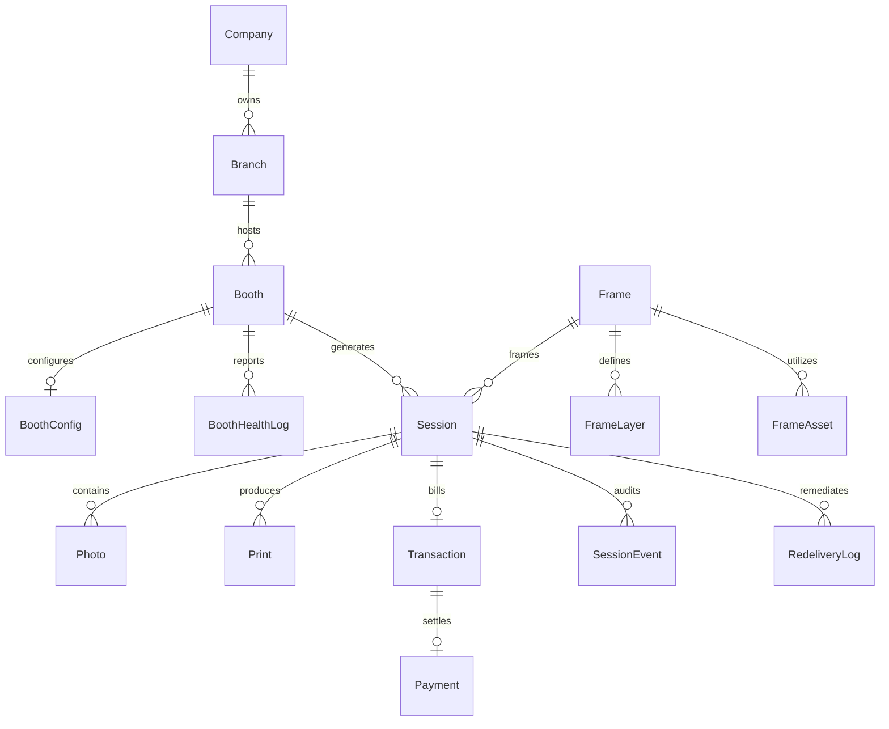

# PROJECT STATUS AUDIT: PICTOLABS REBUILD
> **Document**: Definitive Project Status & Operational Readiness Audit  
> **Date**: September 10, 2026  
> **Author**: Antigravity (Google DeepMind Advanced Agentic Coding Pair)  
> **Target System**: Pictolabs Self-Service Photobooth Platform (Windows Kiosk + NestJS Cloud + React Dashboard)  
> **Repository Root**: `c:\Users\ezarh\.gemini\antigravity-ide\scratch\Pictolabs`  

---

# 1. Executive Summary

- **Current Project Completion Percentage**: **72%**
  - *Kiosk Edge Core*: **90%** (Canon EDSDK C++ binding, Sharp 300 DPI composite rendering, touch UX, DNP thermal printing, offline queue, and Live Photo are robust).
  - *Database & Data Layer*: **85%** (PostgreSQL 16 relational model with 18 entities, foreign key integrity, and performance indexing).
  - *Backend API*: **75%** (Payments, Sessions, Booths Heartbeat, Cloud Storage R2, Gallery, and Support Search implemented; route protection guards and RBAC pending).
  - *Operations Dashboard*: **60%** (Overview KPIs, Booths Fleet, Sessions Archive, Asset Gallery, Support Search, Timeline & Re-delivery UI drafted; Auth login screen, User/Role management, and Revenue Analytics pending).
  - *Production DevOps & Deployment*: **50%** (Local Docker Compose stack with PostgreSQL, Redis, Backend, and Nginx fully operational; Cloud VPS, production domain DNS, live Midtrans merchant keys, and WhatsApp alert gateway pending).
- **Current Active Sprint**: **Sprint 5B: Session Observability, Support Operations & Re-Delivery** (Planning & PRD complete; code staged and awaiting founder sign-off).
- **Last Completed Sprint**: **Sprint 5A: Dashboard Foundation** (Owner Operational Control Plane: Fleet Overview, Booths Fleet Management with Dynamic Heartbeat Status, Sessions Ledger with multi-filtering, Asset-Centric Gallery Viewer).
- **Current Project Status**: **Structurally sound and locally proven, currently at the architectural transition gate between internal developer MVP and production release.** The core edge-to-cloud photobooth cycle (touch → QRIS payment → DSLR capture → 300 DPI composite render → DNP physical print → Cloudflare R2 upload → mobile customer web gallery) is completely functional and verified locally. However, deploying to a commercial retail environment requires completing support operations tools (Sprint 5B), applying security gates (JWT guards & dashboard login), and completing non-coding founder actions (Midtrans production merchant verification, cloud VPS setup, domain DNS).

---

# 2. Architecture Status

| Architecture Area | Status | Technical Notes |
| :--- | :---: | :--- |
| **Kiosk Application** | **Complete** | Electron 28 + React 18 fullscreen touch client (1080x1920 portrait). Integrates native Canon EDSDK 13.x C++ bindings for DSLR shutter & 30 FPS LiveView, Sharp 1200x1800 300 DPI composite rendering, Windows spooler printing via `ImageView_PrintTo`, WebRTC fallback camera, and SQLite offline sync queue. |
| **Backend API** | **In Progress** | NestJS 10 REST & Socket.IO WebSockets. Handles QRIS payment creation, Midtrans webhooks, S3 presigned URLs, booth heartbeats, session sync, and gallery delivery. **Missing**: Global JWT authentication guards and RBAC route enforcement. |
| **Database** | **Complete** | PostgreSQL 16 containerized with Docker. 18 relational models with foreign key constraints, composite performance indexes, and strict types. Migrated cleanly from SQLite in Sprint 4A. |
| **Cloudflare R2** | **Complete** | S3-compatible zero-egress object storage (`@aws-sdk/client-s3`). Kiosk requests presigned upload URLs from backend; uploads photos and videos directly to bucket `pictolabs-media-prod`. 30-day cloud retention policy enforced. |
| **Session Management** | **Complete** | Session is established as the primary business entity (`Branch → Booth → Session → Asset`). Tracks full lifecycle state transitions (`SESSION_INIT`, `PAYMENT_PENDING`, `PAYMENT_SETTLED`, `CAPTURED`, `COMPLETED`, `FAILED`). |
| **Dashboard** | **In Progress** | React 18 + Vite 6 + Tailwind CSS v4 responsive operations dashboard. Pages: Overview, Booths, Sessions, Gallery, and Support Search. **Missing**: Login screen, user profile management, frame template creator, and financial revenue charts. |
| **Support Operations** | **In Progress** | Multi-channel Support Search (by email, phone, order ID, venue time window with photostrip thumbnails) is implemented. Session Timeline, Health Diagnosis, and Re-delivery flow (email resend, link extension, emergency reprint) are designed and staged under Sprint 5B. |
| **Monitoring** | **In Progress** | HTTP Heartbeat updates `last_seen`, app version, git commit, local IP, OS version, and electron version every 30s. Dynamic status derives `ONLINE`, `DEGRADED`, or `OFFLINE`. Low-level hardware sensor charts (CPU temp history, paper roll consumption gauges) are not yet built in the UI. |
| **Heartbeat System** | **Complete** | HTTP Heartbeat (`POST /api/booths/:id/heartbeat`) is the single source of truth. Dynamic status derived on-the-fly (<60s Online, <5m Degraded, ≥5m Offline). Manual `MAINTENANCE` override supported. Socket.IO status mutations removed. |
| **WA Alert System** | **Not Started** | Zero code exists for WhatsApp notifications. No integration with WhatsApp Cloud API, Fonnte, or Wablas. Operational alerts (booth offline, printer jam, payment timeout) currently remain in backend server logs. |
| **Payments (Midtrans)** | **In Progress** | Dynamic QRIS generation, SHA-512 webhook signature verification, sub-second kiosk auto-advance via WebSocket, and transaction state machines are 100% complete. **Current Block**: Running against Midtrans Sandbox with placeholder test keys. Production merchant credentials required. |
| **Authentication** | **In Progress** | Backend `AuthService` with bcrypt password hashing and JWT token issuance exists (`POST /api/auth/login`). **Deficiency**: API routes are currently unprotected by `JwtAuthGuard`; dashboard has no login screen and accesses APIs without an auth token. |
| **Role Management** | **Not Started** | Database schema defines roles (`SUPERADMIN`, `COMPANY_ADMIN`, `BRANCH_MANAGER`, `OPERATOR`), but there are no `@Roles()` guards, role hierarchy validators, or tenant isolation middleware in the backend. |
| **Multi Booth Support** | **Complete** | Schema and API support unlimited booths per branch. Kiosk authenticates via unique `deviceSecret`. Dashboard lists all booths with individual status, config, and session histories. |
| **Multi Branch Support** | **In Progress** | Data model supports `Company → Branch → Booth`. Sessions and booths can be filtered by `branchId`. However, branch-level access control (restricting branch managers to their own branch) is not enforced in API controllers. |
| **Public Gallery** | **Complete** | Mobile-responsive customer gallery at `GET /d/:sessionId`. Includes photo strip viewer with lightbox, individual pose downloads, smart HTML5 video observer for live photos, and streaming ZIP generator at `GET /api/gallery/:sessionId/zip`. |
| **Voucher System** | **In Progress** | Database `Voucher` model exists; discount deduction is implemented in `PaymentsService.createQRIS`; kiosk context supports voucher input. **Missing**: Admin dashboard UI to create, update, list, or revoke promotional vouchers. |
| **Asset Management** | **Complete** | Centralized in `Photo` entity (`PHOTO_STRIP`, `PHOTO`, `LIVE_PHOTO`). Presigned S3 upload, local 7-day reprint cache, Cloudflare R2 storage key mapping, and public CDN URL formatting are verified. |
| **Live Photo** | **Complete** | Kiosk `LivePhotoService.ts` records WebM video bursts during camera countdown, converts them to MP4 using bundled `ffmpeg.exe`, syncs files with session photos, and serves video streams in the public gallery. |
| **Flipbook** | **Not Started** | Platform architecture reserves asset slots. Reverse-engineered template exists in repository, but no kiosk UX, video-to-print slicing engine, or printer layout compositor has been built. |
| **Dual Camera Readiness** | **Not Started** | Platform architecture defines dual-camera slots for future expansion. Currently, kiosk operates with single Canon DSLR and WebRTC fallback. No dual capture orchestration exists. |

---

# 3. Sprint History

| Sprint | Status | Description | Completed |
| :--- | :---: | :--- | :---: |
| **Sprint 1** | **Completed** | **Kiosk Core Engine**: Canon EDSDK 13.x native C++ shutter & LiveView, Sharp 300 DPI composite layout engine (1200x1800 2R/4R), DNP thermal dye-sublimation spooler (`ImageView_PrintTo`), touch UX, and offline failsafes. | September 2026 |
| **Sprint 2** | **Completed** | **Payment & Transaction Core**: Midtrans Dynamic QRIS invoice generation, SHA-512 webhook signature verification, sub-second kiosk auto-advance via WebSocket, and payment crash recovery. | September 2026 |
| **Sprint 3** | **Completed** | **Cloud Storage & Asset Retention**: Cloudflare R2 object storage integration, S3 presigned URL upload pipeline, dual-tier retention policy (7-day local SSD / 30-day cloud R2), mobile customer gallery (`/d/:sessionId`), and streaming ZIP generator (`/api/gallery/:sessionId/zip`). | September 2026 |
| **Sprint 4A** | **Completed** | **PostgreSQL Migration & Containerization**: Migration from SQLite to PostgreSQL 16 + Redis + Nginx Docker Compose stack, production database schema modeling 18 entities with performance indexing. | September 2026 |
| **Sprint 4B** | **Completed** | **Deterministic Heartbeat & Fleet Architecture**: HTTP heartbeat as single source of truth (`POST /api/booths/:id/heartbeat`), dynamic status evaluation from `last_seen`, runtime metadata tracking (`gitCommit`, `appVersion`, `machineName`, `osVersion`), and manual maintenance override. | September 2026 |
| **Sprint 5A** | **Completed** | **Dashboard Foundation**: Operations web dashboard: Fleet Overview KPIs, Booths Fleet Management, Sessions Ledger with multi-filtering, and Asset-Centric Gallery softfile inspector. | September 2026 |
| **Sprint 5B** | **Staged (Planning Complete)** | **Session Observability, Support Operations & Re-Delivery**: PRD & Implementation Plan created covering Session Timeline, Health Diagnosis, Re-delivery Flow (email resend, link extension, emergency reprint), and Support Search. Implementation staged awaiting founder review. | *Active* |

---

# 4. Features Completed (Grouped by Module)

### 4.1 Kiosk Hardware & Shutter Engine (`apps/kiosk`)
- Canon DSLR C++ native EDSDK 13.x USB shutter trigger (<250ms response).
- Real-time 30 FPS LiveView viewfinder streaming with horizontal mirroring.
- Active anti-sleep keep-alive poller (`ExtendShutDownTimer` every 10s).
- Background auto-detection & reconnect poller (1.5s interval).
- WebRTC emergency webcam fallback if DSLR cable disconnects.
- DNP DS-RX1HS / DS620 thermal printer spooler integration via Windows Shell.

### 4.2 Kiosk Image & Rendering Pipeline (`apps/kiosk`)
- Sharp 1200x1800 300 DPI composite layout renderer.
- Support for Korea 2R dual-strip (5x15 cm) and 4R single postcard formats.
- High-fidelity color filters (B&W High Contrast, Sepia, Warm, Cool, Vivid) processed at raw pixel level.
- Dynamic frame graphic overlay compositing with transparency blending.

### 4.3 Kiosk Customer Journey & Touch Screens (`apps/kiosk/src/screens`)
- **WelcomeScreen**: Attract screen with animated start button and event branding.
- **ProductSelectScreen**: Selection between Photostrip 2R and Postcard 4R.
- **FrameSelectScreen**: Grid of available frame designs with category tabs.
- **PaymentScreen**: Dynamic Midtrans QRIS display, countdown timer, and payment status observer.
- **CaptureScreen**: 3-second visual and audio countdown, LiveView preview, and multi-pose capture loop.
- **FilterScreen**: Side-by-side comparison of color filters with instant preview.
- **RenderScreen**: Real-time rendering progress indicator.
- **PrintScreen**: Print progress bar and physical print animation.
- **QRScreen**: Large on-screen QR code for instant mobile gallery access and customer email entry.
- **AdminScreen**: Hidden service menu for camera calibration, printer test, and hardware diagnostics.

### 4.4 Live Photo Engine (`apps/kiosk/electron/services/LivePhotoService.ts`)
- WebM video burst capture during the 3-second countdown before each pose.
- Local video encoding and conversion to MP4 via bundled `ffmpeg.exe`.
- Direct cloud upload and synchronization with static photo assets.

### 4.5 Payment & QRIS Core (`apps/backend/src/payments`)
- Midtrans Snap & Core API dynamic QRIS invoice creation.
- Webhook receiver (`POST /api/payments/webhook`) validating SHA-512 signature.
- Sub-second payment completion broadcast to kiosk via WebSocket (`payment_success`).
- Database transaction settlement recording (`transactions` and `payments` tables).
- Transaction status check and cancellation endpoints.

### 4.6 Cloud Storage & Retention Pipeline (`apps/backend/src/storage`)
- Cloudflare R2 S3-compatible client integration (`@aws-sdk/client-s3`).
- Presigned PUT URL generator for direct-to-cloud client uploads.
- Kiosk offline SQLite upload queue with exponential backoff retry.
- Dual-tier retention strategy: 7 days local SSD reprint cache, 30 days cloud R2 storage.

### 4.7 Public Customer Web Gallery (`apps/backend/src/gallery`)
- Mobile-first responsive customer gallery (`GET /d/:sessionId`).
- Full-resolution photo strip viewer with lightbox zoom.
- Individual high-res pose photo downloads.
- Smart HTML5 video observer for smooth Live Photo playback.
- Dynamic streaming ZIP packaging (`GET /api/gallery/:sessionId/zip`) using `archiver`.
- Graceful 30-day expiration notice screen.

### 4.8 Fleet Connectivity & Heartbeat Engine (`apps/backend/src/booths`)
- Periodic HTTP heartbeat ingestion (`POST /api/booths/:id/heartbeat`).
- Dynamic status derivation (<60s Online, <5m Degraded, ≥5m Offline).
- Runtime metadata logging (`app_version`, `git_commit`, `machine_name`, `local_ip`, `os_version`).
- Manual `MAINTENANCE` administrative status override.
- Real-time status broadcasting to connected dashboards via WebSocket.

### 4.9 Operations Dashboard (`apps/dashboard`)
- **Overview Page (`/`)**: 4 KPI cards (Online, Offline, Maintenance, Sessions Today), fleet connectivity snapshot, and recent sessions ledger.
- **Booths Page (`/booths`)**: Complete fleet table, runtime metadata badges, and slide-out Maintenance mode toggle.
- **Sessions Page (`/sessions`)**: Paginated session archive with ID search, booth/branch/date filters, and detail preview modal.
- **Gallery Page (`/gallery`)**: Asset-centric viewer for softfiles, photo strips, individual poses, and Live Photo playback.
- **Support Search Page (`/support`)**: Omni-channel search (email, phone, order ID, time window) with photostrip thumbnails.

---

# 5. Features In Progress

| Feature | Current Completion | Remaining Work Needed |
| :--- | :---: | :--- |
| **Session Timeline Observability** | 80% | Backend schema `SessionEvent` and endpoints created; UI stepper component designed; needs production kiosk event dispatching during live sessions. |
| **Session Health Engine** | 80% | Root-cause classification rules (`HEALTHY`, `DEGRADED`, `FAILED`, `ABANDONED`) and error codes implemented; needs real-world calibration against physical hardware disconnects. |
| **Re-Delivery Flow** | 80% | Email resend, link extension, emergency reprint endpoints, and audit table (`redelivery_logs`) implemented; needs transactional email provider integration (SendGrid/Resend) and kiosk physical reprint execution listener. |
| **Support Search Engine** | 85% | Multi-channel query engine and frontend UI with photostrip thumbnails built; needs full end-to-end integration testing with production database volume. |
| **Authentication System** | 40% | Password hashing and JWT generation exist in `AuthService`; needs `JwtAuthGuard` applied across API routes and a dedicated login page in `apps/dashboard`. |
| **Voucher System** | 40% | Model and discount deduction exist in `PaymentsService`; needs admin management CRUD screens and redemption limits tracking. |
| **Printer Spooler Monitoring** | 70% | Windows spooler job dispatch works; needs low-level status parsing for paper jams and ribbon exhaustion. |

---

# 6. Features Not Started

1. **WhatsApp Operational Alert Gateway**: Automated notifications to technicians/owners when a booth goes offline, paper runs out, or payment fails.
2. **Role-Based Access Control (RBAC)**: Enforcing granular permissions (`SUPERADMIN`, `COMPANY_ADMIN`, `BRANCH_MANAGER`, `OPERATOR`) and multi-tenant branch isolation.
3. **Hardware Sensor Telemetry Gauges**: Real-time graphs for CPU temperature history, RAM usage, and paper roll countdown in the dashboard.
4. **Revenue & Financial Analytics**: Daily gross revenue, ARPU, payment method distribution, and peak-hour revenue heatmaps.
5. **Remote Frame Template Designer**: Web-based WYSIWYG editor to create, layer, and publish new seasonal frame templates directly to kiosks.
6. **Flipbook Product Flow**: Multi-frame video slicing, 30-frame print layout, and flipbook assembly instructions.
7. **Dual-Camera Architecture**: Multi-angle capture pipeline (front DSLR + wide-angle secondary).

---

# 7. Database Status

### 7.1 Current Entities (18 Models in `prisma/schema.prisma`)
1. `User`: Administrative users, operators, and branch managers.
2. `Company`: Top-level franchise or operating entity.
3. `Branch`: Physical mall or retail location.
4. `Booth`: Physical kiosk unit with unique `deviceSecret`, status, and runtime metadata.
5. `BoothConfig`: Dynamic settings (camera ISO/shutter, printer copies, price, countdown).
6. `BoothHealthLog`: Periodic sensor telemetry (CPU temp, paper count, camera/printer states).
7. `Session`: **Primary business entity** tracking customer journeys, customer email, phone, and retention expiration.
8. `SessionEvent`: Granular lifecycle milestone audit trail (`stage`, `eventType`, `durationMs`, `errorCode`, `payload`).
9. `RedeliveryLog`: Immutable audit trail for support actions (`RESEND_EMAIL`, `EXTEND_LINK`, `PHYSICAL_REPRINT`).
10. `Photo`: Individual poses and final composite photos with storage keys and sequence numbers.
11. `Print`: Physical print records, paper size, copy count, and print success timestamps.
12. `Frame`: Frame catalog metadata, category, and preview image URL.
13. `FrameLayer`: Layer configurations (background, overlays, photo cutout windows).
14. `FrameAsset`: Static graphic assets linked to frame templates.
15. `Transaction`: Financial transaction entity linked to session and Midtrans order ID.
16. `Payment`: Detailed payment record (QRIS payload, payment ref, paid timestamp, raw webhook audit).
17. `Voucher`: Promotional discount codes, usage limits, and expiration dates.
18. `QueueJob`: Background job queue for retries and deferred sync.
19. `AppUpdate`: Software version distribution and targeted kiosk update definitions.
20. `SystemLog`: Centralized operational error and audit logs.

### 7.2 Entity Relationships


### 7.3 Missing Entities
- `AlertRecipient` / `AlertConfig`: Storing WhatsApp phone numbers and email addresses for automated hardware alerts.
- `StockInventory`: Tracking physical consumables (rolls of 4R/2R paper, ink ribbon rolls) per booth.
- `SettlementBatch`: Reconciling Midtrans daily payouts with bank transfers and venue revenue-share percentages.

---

# 8. API Status

| API Group | Route Prefix | Key Endpoints Implemented | Auth Protected? |
| :--- | :--- | :--- | :---: |
| **Auth** | `/api/auth` | `POST /login`, `POST /booth` | No |
| **Booths** | `/api/booths` | `GET /`, `GET /:id`, `GET /:id/status`, `PATCH /:id/status`, `POST /:id/heartbeat`, `PUT /:id/config`, `POST /push-config`, `POST /:id/health` | No |
| **Sessions** | `/api/sessions` | `GET /`, `GET /stats/today`, `GET /:id`, `POST /` (kiosk sync), `GET /:id/timeline`, `POST /:id/timeline`, `GET /:id/health`, `POST /:id/redelivery/email`, `POST /:id/redelivery/extend-link`, `POST /:id/reprint`, `GET /:id/redelivery/history` | No |
| **Support** | `/api/support` | `GET /search` (omni-channel customer lookup) | No |
| **Payments** | `/api/payments` | `POST /qris`, `POST /webhook`, `POST /webhook/midtrans`, `GET /status/:orderId`, `POST /cancel/:orderId` | Webhook Signature Verified |
| **Storage** | `/api/storage` | `GET /health`, `POST /presigned-url`, `POST /confirm-upload` | No |
| **Gallery** | `/api/gallery`, `/d` | `GET /api/gallery/:sessionId`, `GET /api/gallery/:sessionId/zip`, `GET /d/:sessionId` (public HTML) | Public by Design |

---

# 9. Dashboard Status

The operational dashboard (`apps/dashboard`) currently implements **5 core pages**:

1. **Overview Page (`/`)**:
   - 4 High-Level Metric Cards: Online Booths, Offline Booths, Maintenance Booths, Sessions Today.
   - Fleet Connectivity Breakdown with real-time status indicators.
   - Recent Sessions Ledger showing the last 5 transactions with live status pills.
   - Quick-action drawer for emergency fleet interventions.
2. **Booths Page (`/booths`)**:
   - Complete kiosk fleet inventory table.
   - Dynamically derived status badges (`ONLINE`, `DEGRADED`, `OFFLINE`, `MAINTENANCE`).
   - Software and platform metadata badges (`app_version`, `git_commit`, `os_version`, `last_seen`).
   - Slide-out Booth Detail drawer with manual Maintenance mode toggle (`PATCH /api/booths/:id/status`).
3. **Sessions Page (`/sessions`)**:
   - Paginated session archive ledger.
   - Multi-filter controls: Search by Session ID, Filter by Booth, Branch, Date, and Status.
   - Resilient status handling (neutral rendering for unmapped/custom status strings).
   - Session Detail modal showing session metadata and media thumbnails.
4. **Gallery Page (`/gallery`)**:
   - Softfile inspector for any session.
   - Photo Strip high-resolution viewer with zoom lightbox.
   - Grid of individual pose photos (Poses 1–4) with instant download triggers.
   - Smart HTML5 video player for Live Photo motion bursts.
   - One-click "Copy Customer Link" and consolidated ZIP archive download (`/api/gallery/:sessionId/zip`).
5. **Support Search Page (`/support`)**:
   - Omni-channel customer search bar (Customer Email, Phone / WhatsApp, Midtrans Order ID, Payment Ref).
   - Venue time window filtering (Branch, Booth, Date, Start Time, End Time WIB).
   - Visual search result cards displaying composite photostrip thumbnails, customer contact, and health status.
   - One-click navigation into Session Timeline and Re-delivery workspace.

---

# 10. Technical Debt

1. **Unprotected API Endpoints (Critical Security Debt)**:
   Backend REST endpoints (`/api/booths`, `/api/sessions`, `/api/support/search`) have no `JwtAuthGuard`. Anyone with the backend URL can read session data or toggle booth maintenance modes.
2. **Missing Dashboard Authentication**:
   The dashboard has no login screen, JWT session storage, or route guards. Navigating to `http://localhost:5173` immediately opens full administrative controls.
3. **Midtrans Credentials in Sandbox Mode**:
   `apps/backend/.env` currently contains placeholder sandbox keys (`SB-Mid-server-test-key`). Real QRIS payments cannot be transacted until production credentials are supplied.
4. **Isolated Node Modules & Monorepo Bundling Fragility**:
   In npm workspaces, child packages must not maintain independent `node_modules` that conflict with root React versions. `resolve.dedupe` is configured in Vite, but workspace scripts must enforce clean installs.
5. **Synchronous Image Compositing on Kiosk**:
   Sharp 300 DPI composite rendering runs directly on the kiosk main Node process. While fast (<1.2s), heavy multi-layer operations during peak traffic should be moved to a worker thread to prevent micro-stutters during screen transitions.
6. **Transactional Email Mock Fallback**:
   The backend email re-delivery service falls back to a simulated mock logger because production SMTP/SendGrid/Resend API keys are not yet configured in environment variables.

---

# 11. Known Risks

1. **Printer Hardware Jam / Paper Out Blindspot**:
   Windows spooler accepts print jobs even if the DNP printer is out of paper or has a mechanical cutter jam. The kiosk receives a "spooled" success signal, but no physical strip emerges. The system currently depends on customer complaints rather than hardware sensor hooks.
2. **Payment Webhook Ingress Dependency**:
   Midtrans requires a public HTTPS URL to deliver payment webhooks (`POST /api/payments/webhook`). If the backend server suffers network downtime or DNS misconfiguration, payments will settle on Midtrans but the kiosk will remain stuck on the QR screen.
3. **Unattended Windows Kiosk Reboots**:
   If an edge kiosk experiences a sudden power loss or Windows update reboot, it will boot into the standard Windows desktop unless Windows Shell Launcher, Auto-Logon, and Scheduled Tasks are explicitly configured on the hardware machine.
4. **Cloud Storage Cost Accumulation**:
   Cloudflare R2 provides zero-egress fees, but storage accumulates. If the 30-day lifecycle expiration rule is not configured on the bucket in the Cloudflare dashboard, customer photos will persist indefinitely and incur storage costs.

---

# 12. Next Recommended Sprint

### Recommended Sprint: **Sprint 5B: Session Observability, Support Operations & Re-Delivery (Execution & Release)**

- **Primary Goals**:
  1. Formally lock and deploy the **Session Timeline** lifecycle audit trail.
  2. Activate the deterministic **Session Health** root-cause classification engine (`HEALTHY`, `DEGRADED`, `FAILED`, `ABANDONED`).
  3. Operationalize the **Re-Delivery Flow** (resending softfile emails, extending 7d/30d expired gallery links, and commanding emergency physical reprints with rate-limiting).
  4. Deploy the **Support Search Engine** with visual photostrip thumbnails to production support workflows.
- **Why it is Highest Priority**:
  Before adding business analytics (Sprint 6) or opening a commercial booth to the paying public, the owner and support staff **MUST have the ability to resolve customer disputes in real time**.
  
  In physical photobooth operations, customers will inevitably enter a typo in their email address, ask for a reprint after a paper tear, or forget their session ID when asking for support. Without Sprint 5B, resolving a single customer issue requires a software engineer to manually SSH into the production database and run raw SQL queries. Sprint 5B turns customer support into a 5-second, one-click operation.

---

# 13. Founder Action Items (What Han Must Do Outside Coding)

| Category | Action Item | Urgency | Notes |
| :--- | :--- | :---: | :--- |
| **Midtrans** | **Production KYC & Account Activation** | **CRITICAL** | Submit business documentation (PT/CV or sole proprietorship) to Midtrans to activate Production QRIS. Obtain Production Server Key and Client Key. |
| **Midtrans** | **Webhook Configuration** | **CRITICAL** | In Midtrans Merchant Portal, set Payment Notification URL to `https://api.pictolabs.id/api/payments/webhook`. |
| **Domain & DNS** | **Cloudflare DNS Setup** | **HIGH** | Point `pictolabs.id` DNS records:<br>• `api.pictolabs.id` → Production Cloud VPS IP<br>• `admin.pictolabs.id` → Dashboard deployment<br>• `dl.pictolabs.id` → Cloudflare R2 bucket custom domain |
| **Infrastructure** | **Cloud VPS Provisioning** | **HIGH** | Rent a Cloud VPS (e.g. DigitalOcean, Biznet Gio, or Hetzner). Minimum: 2 vCPU, 4GB RAM, Ubuntu 22.04 LTS with Docker & Docker Compose. |
| **Cloudflare** | **R2 Lifecycle Expiration Rule** | **MEDIUM** | In Cloudflare Dashboard → R2 → `pictolabs-media-prod`, add an Object Lifecycle Rule to delete objects with prefix `sessions/` after 30 days. |
| **Email Service** | **Transactional Email Account** | **MEDIUM** | Sign up for Resend or SendGrid; verify domain `pictolabs.id`; obtain API key for softfile delivery emails. |
| **Kiosk Hardware** | **Windows Shell Launcher Setup** | **HIGH** | On the physical kiosk PC, configure Windows Auto-Logon and set the Pictolabs Kiosk executable as the default Windows Shell (replacing `explorer.exe`). |
| **Kiosk Hardware** | **Camera & Printer Power Setup** | **HIGH** | Connect Canon DSLR to an AC dummy battery adapter (never rely on internal camera battery); load DNP printer with genuine 4R/2R media ribbon. |

---

# 14. Final Verdict

### "If Pictolabs were deployed to a single real booth tomorrow, what would work and what would still be missing?"

```
┌────────────────────────────────────────────────────────────────────────────────────────────────────────┐
│                               PICTOLABS SINGLE-BOOTH DEPLOYMENT READINESS                              │
├────────────────────────────────────────────────────┬───────────────────────────────────────────────────┤
│ WHAT WOULD WORK FLAWLESSLY                         │ WHAT WOULD STILL BE MISSING                       │
├────────────────────────────────────────────────────┼───────────────────────────────────────────────────┤
│ 1. Complete touchscreen customer flow              │ 1. Real money collection (stuck on Sandbox QRIS)  │
│ 2. Studio-grade Canon DSLR capture (<250ms)        │ 2. WhatsApp alerts when paper runs out / jams     │
│ 3. 30 FPS LiveView viewfinder mirroring            │ 3. Protected dashboard login (currently open)     │
│ 4. Sharp 300 DPI composite layout rendering        │ 4. Low-level printer paper jam sensor detection   │
│ 5. Physical DNP thermal strip printing             │ 5. Public domain SSL (runs on localhost/HTTP IP)  │
│ 6. Live Photo video countdown capture              │ 6. Real transactional email delivery provider     │
│ 7. Direct Cloudflare R2 media upload               │                                                   │
│ 8. Mobile customer web gallery with streaming ZIP  │                                                   │
│ 9. Periodic kiosk HTTP heartbeat & fleet status    │                                                   │
└────────────────────────────────────────────────────┴───────────────────────────────────────────────────┘
```

### Detailed Breakdown:

#### What Would Work Flawlessly:
1. **The In-Booth Customer Experience**: A customer walks up to the kiosk, taps the screen, selects Photostrip 2R, poses for 3 DSLR shots with visual countdown and LiveView mirroring, chooses a color filter (e.g. B&W), and watches the live render progress.
2. **Physical Fulfillment**: The DNP thermal printer cuts and ejects two crisp 300 DPI photostrips via the Windows spooler.
3. **Cloud Delivery**: The kiosk uploads the composite strip, individual high-res photos, and Live Photo MP4 video to Cloudflare R2.
4. **Mobile Softfile Download**: The customer scans the on-screen QR code with their smartphone and immediately opens `https://[domain]/d/:sessionId`, viewing their photo strip in high resolution and downloading a single consolidated ZIP archive.
5. **Fleet Heartbeat**: The kiosk reports its operational health, software version, and online status to the backend every 30 seconds.

#### What Would Still Be Missing:
1. **Real Payment Acceptance**: The system is configured with Midtrans Sandbox credentials. Real customers cannot pay with real bank accounts or e-wallets (GoPay, OVO, BCA Mobile) until Han supplies production merchant keys.
2. **Automated WhatsApp Alerting**: If the booth runs out of paper or loses internet, no WhatsApp notification is sent to the branch technician or store manager.
3. **Security & Authentication**: The operations dashboard and backend APIs are currently open to anyone on the network without a login prompt or JWT guard.
4. **Hardware Sensor Feedback**: If the printer suffers a mechanical paper jam, the kiosk assumes the print succeeded; support staff must rely on customer reports.
5. **Automated Support Remediation (Sprint 5B)**: If a customer enters a typo in their email address or asks for a reprint, support operators cannot resolve it through the dashboard until Sprint 5B is formally released.

---
*End of Project Status Audit Report.*
