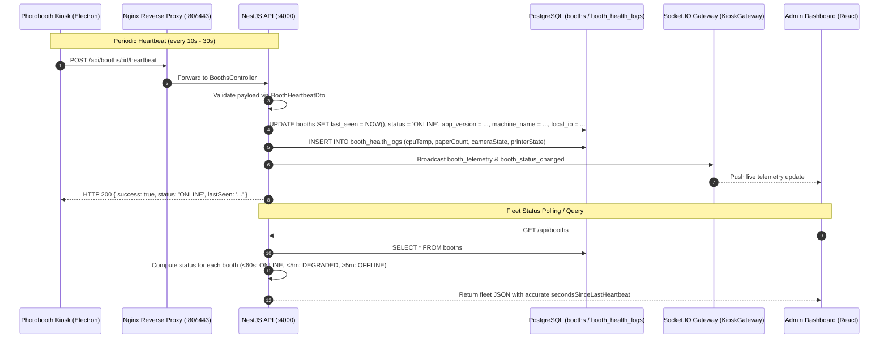

# SPRINT 4B IMPLEMENTATION PLAN: BOOTH MONITORING FOUNDATION
**Operational Readiness & Real-Time Fleet Telemetry**
*Document Version: 1.0.0*
*Target Subsystem: `apps/backend` (NestJS 10, Prisma 6, PostgreSQL 16)*
*Related Sprints: Sprint 4A (Production Setup & Cloudflare R2) $\rightarrow$ Sprint 4B (Operational Readiness)*

---

## 1. Objectives & Scope

Sprint 4B establishes the production operational monitoring foundation for the Pictolabs Photobooth network. It provides automated, resilient heartbeat tracking, hardware telemetry persistence, dynamic online/offline/degraded state evaluation, and interactive Swagger OpenAPI documentation.

### Core Deliverables:
1. **Heartbeat Endpoint**: `POST /api/booths/:id/heartbeat`
2. **Tracked Attributes**:
   - `booth_id` (UUID)
   - `last_seen` (`TIMESTAMP(3)`)
   - `app_version` (`TEXT`, e.g., `"1.0.0"`)
   - `machine_name` (`TEXT`, e.g., `"BOOTH-GI-01"`)
   - `local_ip` (`TEXT`, e.g., `"192.168.1.105"`)
   - `status` (Computed: `ONLINE`, `DEGRADED`, `OFFLINE`)
3. **Automated Status State Machine**:
   - **`ONLINE`**: Heartbeat received within the last 60 seconds (`< 60s`).
   - **`DEGRADED`**: Heartbeat received between 60 seconds and 5 minutes ago (`60s <= age < 300s`).
   - **`OFFLINE`**: No heartbeat received for more than 5 minutes (`>= 300s`) or null.
4. **Database Schema Enhancements**: Add columns `last_seen`, `app_version`, `machine_name`, and `local_ip` to the PostgreSQL `booths` table via Prisma migration.
5. **API Endpoints**:
   - `POST /api/booths/:id/heartbeat`
   - `GET /api/booths`
   - `GET /api/booths/:id/status`
   - *(Backward-compatible routes preserved: `/booths`, `/booths/:id`, `/booths/push-config`)*
6. **Service Layer**: Implement dynamic status calculation, heartbeat recording, and WebSocket broadcast integration.
7. **DTO Layer**: Implement `BoothHeartbeatDto` with `class-validator` rules.
8. **OpenAPI / Swagger Documentation**: Install `@nestjs/swagger` and expose interactive API explorer at `/api/docs`.

---

## 2. Architecture & Data Flow



---

## 3. Database Schema Changes

### 3.1 Prisma Schema (`prisma/schema.prisma`)
Update the `Booth` model in `apps/backend/prisma/schema.prisma`:

```prisma
model Booth {
  id           String           @id @default(uuid())
  name         String
  deviceSecret String           @unique
  branchId     String
  branch       Branch           @relation(fields: [branchId], references: [id])
  status       String           @default("OFFLINE") // ONLINE, DEGRADED, OFFLINE, MAINTENANCE, CAPTURING, PRINTING
  lastSeen     DateTime?        @map("last_seen")
  appVersion   String?          @map("app_version")
  machineName  String?          @map("machine_name")
  localIp      String?          @map("local_ip")
  config       BoothConfig?
  healthLogs   BoothHealthLog[]
  sessions     Session[]
  createdAt    DateTime         @default(now())
  updatedAt    DateTime         @updatedAt

  @@map("booths")
}
```

### 3.2 SQL Migration (`prisma/migrations/20260909010000_add_booth_monitoring_fields/migration.sql`)
```sql
-- AlterTable
ALTER TABLE "booths" ADD COLUMN IF NOT EXISTS "last_seen" TIMESTAMP(3);
ALTER TABLE "booths" ADD COLUMN IF NOT EXISTS "app_version" TEXT;
ALTER TABLE "booths" ADD COLUMN IF NOT EXISTS "machine_name" TEXT;
ALTER TABLE "booths" ADD COLUMN IF NOT EXISTS "local_ip" TEXT;
```

---

## 4. Automatic Status State Machine

The status of any booth is evaluated dynamically according to the following rules:

```typescript
export type ComputedBoothStatus = 'ONLINE' | 'DEGRADED' | 'OFFLINE';

export function calculateBoothStatus(lastSeen?: Date | null): {
  status: ComputedBoothStatus;
  secondsSinceLastHeartbeat: number | null;
} {
  if (!lastSeen) {
    return { status: 'OFFLINE', secondsSinceLastHeartbeat: null };
  }

  const ageSeconds = Math.max(0, Math.floor((Date.now() - new Date(lastSeen).getTime()) / 1000));

  if (ageSeconds < 60) {
    return { status: 'ONLINE', secondsSinceLastHeartbeat: ageSeconds };
  }
  if (ageSeconds < 300) {
    return { status: 'DEGRADED', secondsSinceLastHeartbeat: ageSeconds };
  }
  return { status: 'OFFLINE', secondsSinceLastHeartbeat: ageSeconds };
}
```

### State Transition Thresholds:
| Age Since Last Heartbeat | Status | Dashboard Badge Color | Description |
| :--- | :---: | :---: | :--- |
| **$0 \le t < 60\text{ seconds}$** | `ONLINE` | 🟢 Green | Booth is actively transmitting heartbeats. |
| **$60\text{s} \le t < 300\text{ seconds}$** | `DEGRADED` | 🟡 Amber | Booth missed heartbeats (possible high latency, Wi-Fi packet drop, or heavy CPU load). |
| **$t \ge 300\text{ seconds}$** ($>5\text{ min}$) | `OFFLINE` | 🔴 Red | Booth is considered disconnected, powered off, or app crashed. |

---

## 5. API Endpoints Specification

### 5.1 `POST /api/booths/:id/heartbeat`
Ingests an operational heartbeat from a physical kiosk.

- **URL**: `/api/booths/:id/heartbeat`
- **Method**: `POST`
- **Headers**: `Content-Type: application/json`
- **Request Body (DTO)**:
```json
{
  "appVersion": "1.0.0",
  "machineName": "PICTO-BOOTH-01",
  "localIp": "192.168.1.105",
  "cpuTemp": 44.5,
  "paperCount": 350,
  "cameraState": "OK",
  "printerState": "READY"
}
```
- **Response (`200 OK`)**:
```json
{
  "success": true,
  "boothId": "8f8b8d91-5f2b-4e67-bf12-9c98bc01d512",
  "status": "ONLINE",
  "lastSeen": "2026-09-09T02:45:00.000Z",
  "secondsSinceLastHeartbeat": 0,
  "acknowledged": true
}
```

---

### 5.2 `GET /api/booths`
Retrieves all registered booths with their dynamically computed operational status.

- **URL**: `/api/booths` (and `/booths` for dashboard compatibility)
- **Method**: `GET`
- **Response (`200 OK`)**:
```json
[
  {
    "id": "8f8b8d91-5f2b-4e67-bf12-9c98bc01d512",
    "name": "Grand Indonesia - Booth 1",
    "branchId": "c3e981f2-7711-4cb5-b481-912a7d48c091",
    "branch": {
      "id": "c3e981f2-7711-4cb5-b481-912a7d48c091",
      "name": "Grand Indonesia",
      "location": "West Mall Level 2"
    },
    "status": "ONLINE",
    "computedStatus": "ONLINE",
    "lastSeen": "2026-09-09T02:44:45.000Z",
    "secondsSinceLastHeartbeat": 15,
    "appVersion": "1.0.0",
    "machineName": "PICTO-BOOTH-01",
    "localIp": "192.168.1.105",
    "paperRemaining": 350,
    "cpuTemp": 44.5
  }
]
```

---

### 5.3 `GET /api/booths/:id/status`
Returns in-depth operational status and telemetry diagnosis for an individual booth.

- **URL**: `/api/booths/:id/status`
- **Method**: `GET`
- **Response (`200 OK`)**:
```json
{
  "boothId": "8f8b8d91-5f2b-4e67-bf12-9c98bc01d512",
  "name": "Grand Indonesia - Booth 1",
  "status": "ONLINE",
  "computedStatus": "ONLINE",
  "lastSeen": "2026-09-09T02:44:45.000Z",
  "secondsSinceLastHeartbeat": 15,
  "thresholds": {
    "onlineUnderSeconds": 60,
    "degradedUnderSeconds": 300,
    "offlineOverSeconds": 300
  },
  "appVersion": "1.0.0",
  "machineName": "PICTO-BOOTH-01",
  "localIp": "192.168.1.105",
  "health": {
    "cpuTemp": 44.5,
    "paperRemaining": 350,
    "cameraState": "OK",
    "printerState": "READY",
    "lastLogAt": "2026-09-09T02:44:45.000Z"
  }
}
```

---

## 6. Swagger OpenAPI Documentation Setup

Install `@nestjs/swagger` and `swagger-ui-express` in `apps/backend`:
```bash
npm install --workspace=@pictolabs/backend @nestjs/swagger swagger-ui-express
```

In `apps/backend/src/main.ts`:
```typescript
import { DocumentBuilder, SwaggerModule } from '@nestjs/swagger';

const swaggerConfig = new DocumentBuilder()
  .setTitle('Pictolabs Photobooth Cloud API')
  .setDescription('Operational monitoring, fleet telemetry, storage ingestion, and payment gateway APIs')
  .setVersion('1.0.0')
  .addTag('Booths', 'Fleet heartbeat, dynamic status tracking, and configuration push')
  .addTag('Storage', 'Cloudflare R2 object storage and presigned upload ingestion')
  .addTag('Payments', 'Midtrans QRIS dynamic payment integration')
  .build();

const document = SwaggerModule.createDocument(app, swaggerConfig);
SwaggerModule.setup('api/docs', app, document);
```

Swagger UI will be interactively accessible at:
- **`http://localhost:4000/api/docs`** (Interactive UI)
- **`http://localhost:4000/api/docs-json`** (Raw OpenAPI 3.0 specification)

---

## 7. Implementation Steps

1. **Step 1: Install Dependencies**:
   Install `@nestjs/swagger` and `swagger-ui-express` in `@pictolabs/backend`.
2. **Step 2: Update Prisma Schema**:
   Add `last_seen`, `app_version`, `machine_name`, and `local_ip` to `schema.prisma`.
3. **Step 3: Generate and Run Migration**:
   Execute SQL migration on local PostgreSQL and run `prisma generate`.
4. **Step 4: Create DTOs**:
   Implement `BoothHeartbeatDto` with `class-validator` and Swagger decorators.
5. **Step 5: Enhance Service Layer**:
   Implement `recordHeartbeat`, `computeBoothStatus`, `getBoothStatus`, and `findAllWithComputedStatus` in `BoothsService`.
6. **Step 6: Update Controller**:
   Add `POST :id/heartbeat`, `GET :id/status`, and `GET /api/booths` in `BoothsController` while preserving `/booths` multi-prefix routing.
7. **Step 7: Configure Swagger in `main.ts`**:
   Bootstrap Swagger documentation explorer.
8. **Step 8: Execute Automated Validation**:
   Run integration test suite against running container and verify all endpoints, status transitions, and Swagger UI.

---

## 8. Verification Strategy

An automated test suite `scratch_test_sprint4b_heartbeat.js` will verify:
1. `POST /api/booths/:id/heartbeat`: Ingests payload and returns `status: "ONLINE"`.
2. `GET /api/booths/:id/status`:
   - Immediately after heartbeat (<60s) $\rightarrow$ verifies `ONLINE`.
   - After simulated 90s age $\rightarrow$ verifies transition to `DEGRADED`.
   - After simulated 360s age $\rightarrow$ verifies transition to `OFFLINE`.
3. `GET /api/booths`: Returns fleet with computed status, `lastSeen`, `appVersion`, `machineName`, `localIp`.
4. `GET /api/docs`: Confirms HTTP 200 OK serving Swagger UI HTML.
