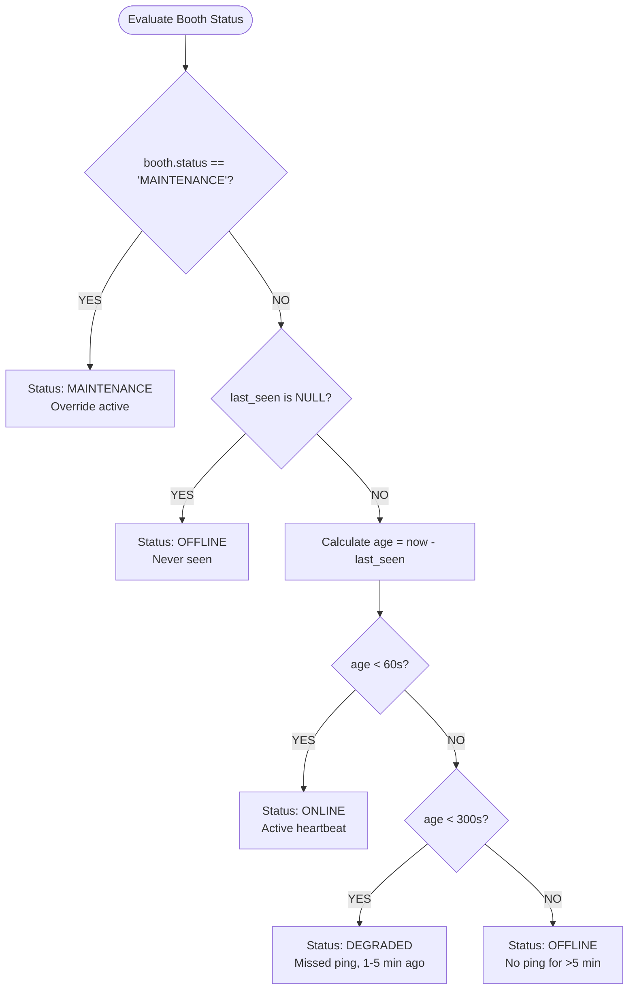

# SPRINT 4B REVISED IMPLEMENTATION PLAN: BOOTH MONITORING FOUNDATION
**Dynamic State Machine, Runtime Telemetry & Manual Maintenance Mode**
*Document Version: 2.0.0 (Revised)*
*Target Subsystem: `apps/backend` (NestJS 10, Prisma 6, PostgreSQL 16)*
*Scope Revision: Purely computed status from `last_seen`, addition of `osVersion`/`electronVersion`/`releaseChannel`, manual `MAINTENANCE` override via `PATCH`, and deferral of hardware telemetry to Sprint 4C.*

---

## 1. Revision Rationale & Architectural Principles

In accordance with architectural review, Sprint 4B has been revised to enforce strict separation of concerns between **persistent configuration/overrides** and **transient network availability states**:

1. **No Database State Pollution (`ONLINE`/`DEGRADED`/`OFFLINE` are NEVER stored as truth)**:
   - Network availability is a transient, time-dependent fact. Storing `'ONLINE'` or `'OFFLINE'` directly in a database row leads to "ghost online" bugs when a server crashes, networks partition, or processes freeze without updating the database.
   - **Resolution**: Network availability status is **strictly computed on read** from the delta between current server time and the booth's `last_seen` timestamp.
2. **Dedicated Manual `MAINTENANCE` Mode via `PATCH /api/booths/:id/status`**:
   - Operators and booth attendants need the ability to lock a booth for service (cleaning lens, refilling paper, replacing lighting).
   - When set to `MAINTENANCE`, this state is persisted in `booths.status` and takes absolute precedence over network availability.
3. **Runtime Platform Tracking**:
   - Adds `osVersion` (OS name & build), `electronVersion` (Electron runtime version), and `releaseChannel` (`stable` | `beta` | `canary`) to understand fleet software fragmentation.
4. **Hardware Telemetry Deferral to Sprint 4C**:
   - `cpuTemp`, `paperCount`, `cameraState`, and `printerState` are removed from the Sprint 4B heartbeat scope and will be implemented in a dedicated **Sprint 4C Hardware Diagnostics & Telemetry** sprint.

---

## 2. Updated State Machine & Status Precedence



### Precedence Matrix:
| Manual Mode (`booths.status`) | Heartbeat Age (`now - last_seen`) | Effective Computed Status | Meaning |
| :--- | :--- | :---: | :--- |
| **`MAINTENANCE`** | Any ($<60\text{s}$, $120\text{s}$, or $>5\text{min}$) | **`MAINTENANCE`** | Booth is administratively locked for servicing. |
| **`NORMAL`** | $< 60\text{ seconds}$ | **`ONLINE`** | Actively communicating, healthy network link. |
| **`NORMAL`** | $60\text{ seconds} \le \text{age} < 300\text{ seconds}$ | **`DEGRADED`** | Transient packet loss, Wi-Fi latency, or delayed ping. |
| **`NORMAL`** | $\ge 300\text{ seconds}$ ($>5\text{ min}$) or null | **`OFFLINE`** | Kiosk disconnected, power outage, or OS shutdown. |

---

## 3. Database Schema Modifications

### 3.1 Model Definition (`prisma/schema.prisma`)
```prisma
model Booth {
  id              String           @id @default(uuid())
  name            String
  deviceSecret    String           @unique
  branchId        String
  branch          Branch           @relation(fields: [branchId], references: [id])
  status          String           @default("NORMAL") // Admin override: NORMAL or MAINTENANCE
  lastSeen        DateTime?        @map("last_seen")
  appVersion      String?          @map("app_version")
  machineName     String?          @map("machine_name")
  localIp         String?          @map("local_ip")
  osVersion       String?          @map("os_version")
  electronVersion String?          @map("electron_version")
  releaseChannel  String?          @default("stable") @map("release_channel")
  config          BoothConfig?
  healthLogs      BoothHealthLog[]
  sessions        Session[]
  createdAt       DateTime         @default(now())
  updatedAt       DateTime         @updatedAt

  @@map("booths")
}
```

### 3.2 Database Migration SQL
File: `prisma/migrations/20260909020000_add_sprint4b_runtime_fields/migration.sql`
```sql
-- AlterTable: Add runtime environment attributes and normalize status default
ALTER TABLE "booths" ADD COLUMN IF NOT EXISTS "os_version" TEXT;
ALTER TABLE "booths" ADD COLUMN IF NOT EXISTS "electron_version" TEXT;
ALTER TABLE "booths" ADD COLUMN IF NOT EXISTS "release_channel" TEXT DEFAULT 'stable';
ALTER TABLE "booths" ALTER COLUMN "status" SET DEFAULT 'NORMAL';
```

---

## 4. API Endpoints Specification

### 4.1 `POST /api/booths/:id/heartbeat`
Ingests the operational heartbeat from a physical kiosk. Updates `last_seen` timestamp and host runtime telemetry.

- **Request Headers**: `Content-Type: application/json`
- **Request Body (DTO)**:
```json
{
  "appVersion": "1.2.0",
  "machineName": "PICTO-BOOTH-01",
  "localIp": "192.168.1.105",
  "osVersion": "Windows 11 Pro 23H2 (Build 22631)",
  "electronVersion": "28.2.0",
  "releaseChannel": "stable"
}
```
- **Database Action**:
  - Updates `last_seen = NOW()`
  - Updates `app_version`, `machine_name`, `local_ip`, `os_version`, `electron_version`, `release_channel`.
  - **Does NOT overwrite `status`** (preserves `NORMAL` or `MAINTENANCE`).
- **Response (`200 OK`)**:
```json
{
  "success": true,
  "boothId": "80e05c47-50f9-4d8a-a6f5-a958f1be5df3",
  "status": "ONLINE",
  "lastSeen": "2026-09-09T02:55:00.000Z",
  "secondsSinceLastHeartbeat": 0,
  "isMaintenance": false,
  "acknowledged": true
}
```

---

### 4.2 `PATCH /api/booths/:id/status` (New: Manual Maintenance Mode)
Allows administrators or technicians to toggle maintenance mode on a booth.

- **Request Body (DTO)**:
```json
{
  "status": "MAINTENANCE",
  "reason": "Replacing DNP RX1HS photo paper roll and cleaning sensor"
}
```
*(To resume normal automatic monitoring, send `status: "NORMAL"`).*
- **Response (`200 OK`)**:
```json
{
  "success": true,
  "boothId": "80e05c47-50f9-4d8a-a6f5-a958f1be5df3",
  "name": "Grand Indonesia Kiosk",
  "status": "MAINTENANCE",
  "isMaintenance": true,
  "reason": "Replacing DNP RX1HS photo paper roll and cleaning sensor",
  "updatedAt": "2026-09-09T02:55:10.000Z"
}
```
- **Side Effect**: Emits WebSocket event `booth_status_changed` (`{ boothId, status: 'MAINTENANCE' }`) to all kiosks and dashboards.

---

### 4.3 `GET /api/booths`
Fleet query endpoint returning all booths with dynamic status evaluation.

- **Response (`200 OK`)**:
```json
[
  {
    "id": "80e05c47-50f9-4d8a-a6f5-a958f1be5df3",
    "name": "Grand Indonesia Kiosk",
    "status": "ONLINE",
    "isMaintenance": false,
    "lastSeen": "2026-09-09T02:54:45.000Z",
    "secondsSinceLastHeartbeat": 15,
    "appVersion": "1.2.0",
    "electronVersion": "28.2.0",
    "osVersion": "Windows 11 Pro 23H2",
    "releaseChannel": "stable",
    "machineName": "PICTO-BOOTH-01",
    "localIp": "192.168.1.105",
    "branch": { "name": "Grand Indonesia", "location": "Jakarta" }
  }
]
```

---

### 4.4 `GET /api/booths/:id/status`
Detailed single-booth diagnostic inspection.

- **Response (`200 OK`)**:
```json
{
  "boothId": "80e05c47-50f9-4d8a-a6f5-a958f1be5df3",
  "name": "Grand Indonesia Kiosk",
  "status": "ONLINE",
  "isMaintenance": false,
  "lastSeen": "2026-09-09T02:54:45.000Z",
  "secondsSinceLastHeartbeat": 15,
  "thresholds": {
    "onlineUnderSeconds": 60,
    "degradedUnderSeconds": 300,
    "offlineOverSeconds": 300
  },
  "runtime": {
    "appVersion": "1.2.0",
    "electronVersion": "28.2.0",
    "osVersion": "Windows 11 Pro 23H2",
    "releaseChannel": "stable",
    "machineName": "PICTO-BOOTH-01",
    "localIp": "192.168.1.105"
  }
}
```

---

## 5. Scope Boundary: Sprint 4B vs. Sprint 4C

| Attribute / Feature | Sprint 4B (This Sprint) | Sprint 4C (Future Sprint) |
| :--- | :---: | :---: |
| **Heartbeat Ingestion (`/api/booths/:id/heartbeat`)** | ✅ **Included** | — |
| **`last_seen` Tracking & Dynamic Status Evaluation** | ✅ **Included** | — |
| **`osVersion`, `electronVersion`, `releaseChannel`** | ✅ **Included** | — |
| **Manual Maintenance Mode (`PATCH /api/booths/:id/status`)** | ✅ **Included** | — |
| **`machine_name`, `local_ip`, `app_version`** | ✅ **Included** | — |
| **CPU Temperature (`cpuTemp`)** | ❌ **Excluded (Moved)** | ✅ **Sprint 4C** |
| **Paper Roll Count (`paperCount`)** | ❌ **Excluded (Moved)** | ✅ **Sprint 4C** |
| **Camera Hardware State (`cameraState`)** | ❌ **Excluded (Moved)** | ✅ **Sprint 4C** |
| **Printer Hardware State (`printerState`)** | ❌ **Excluded (Moved)** | ✅ **Sprint 4C** |
| **Hardware Health Alerts & Low-Paper Thresholds** | ❌ **Excluded (Moved)** | ✅ **Sprint 4C** |

---

## 6. Implementation Sequence

1. **Step 1: Update Prisma Schema & Run Migration**:
   Add `osVersion`, `electronVersion`, `releaseChannel` to `Booth`, set default `status` to `'NORMAL'`, and run migration in PostgreSQL.
2. **Step 2: Update DTOs**:
   - Revise `BoothHeartbeatDto` (add platform fields, remove hardware telemetry).
   - Create `UpdateBoothStatusDto` (`status: 'MAINTENANCE' | 'NORMAL'`, `reason?: string`).
   - Revise `BoothStatusResponseDto` to reflect runtime platform metadata and maintenance state.
3. **Step 3: Update `BoothsService`**:
   - Implement `computeEffectiveStatus` with `MAINTENANCE` override priority.
   - Refactor `recordHeartbeat` to strictly update `last_seen` and platform fields without writing `'ONLINE'` to `booths.status`.
   - Implement `setManualStatus(boothId, dto)`.
4. **Step 4: Update `BoothsController`**:
   - Add `PATCH :id/status` endpoint with Swagger documentation.
   - Update `POST :id/heartbeat`, `GET :id/status`, and `GET /`.
5. **Step 5: Automated Test Suite Execution**:
   - Run `scratch_test_sprint4b_revised.js` verifying dynamic computation, maintenance mode toggle, platform tracking, and OpenAPI specs.
