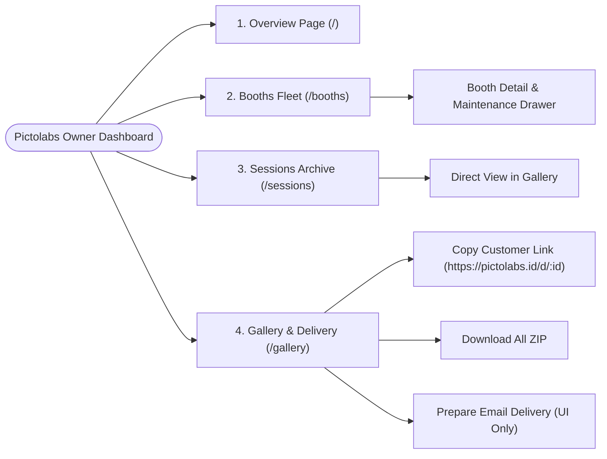
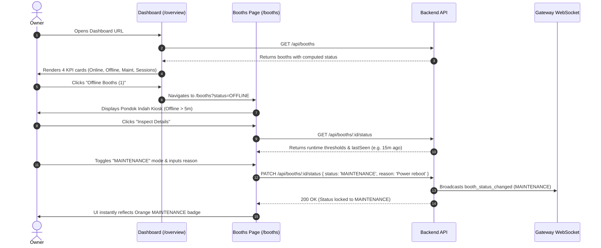
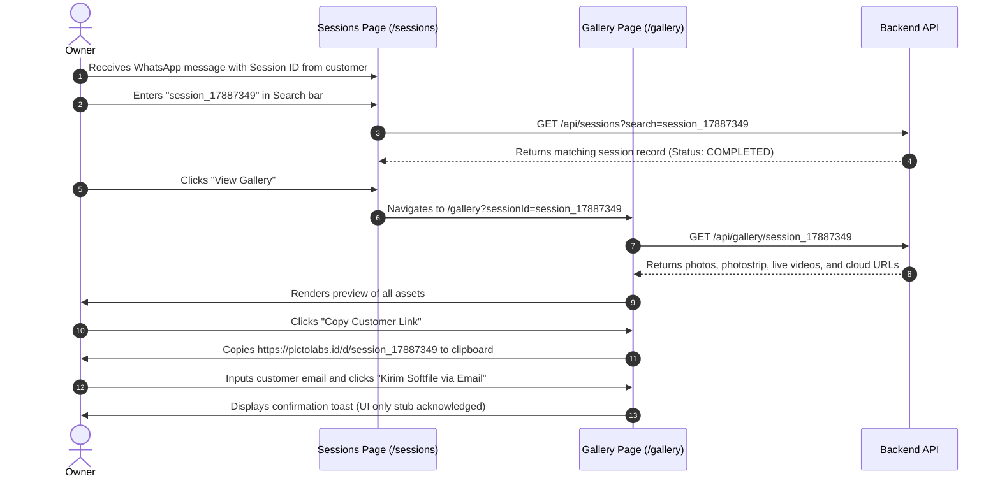

# PRODUCT REQUIREMENTS DOCUMENT (PRD)
## SPRINT 5A: OPERATIONAL DASHBOARD FOUNDATION
**Target Audience**: Single Owner / Superadmin  
**Target Application**: `apps/dashboard` (React 18, Vite 6, Tailwind CSS v4, Lucide Icons, Socket.IO)  
**Backend Subsystem**: `apps/backend` (NestJS 10, Prisma 6, PostgreSQL 16)  
**Document Version**: 1.0.0  
**Status**: Ready for Implementation  

---

## 1. Executive Summary & Product Objective

The objective of **Sprint 5A** is to build the first comprehensive, real-time operational dashboard for the Pictolabs owner. 

Currently, monitoring fleet health across physical kiosks located in malls requires manual server logs or direct database queries. Customer service inquiries (e.g. lost softfile download links, print verification) require engineering intervention.

Sprint 5A provides a **single pane of glass** enabling the owner to:
1. Instantly gauge fleet health (**Overview Page** with Online, Offline, and Maintenance metrics).
2. Monitor real-time kiosk statuses, runtime versions, and toggle maintenance locks (**Booths Page**).
3. Search and audit customer photo sessions across all locations (**Sessions Page**).
4. Inspect customer media assets, copy public gallery download links, and trigger email delivery stubs (**Gallery Page**).

### Explicit Scope Boundaries
- ✅ **In Scope**: Fleet operational liveness, manual maintenance toggles, customer session search, softfile gallery viewer, download link generation, email delivery UI stub.
- ❌ **Strictly Excluded**: Revenue/financial reports, payment gateway settlement metrics, analytics/trendlines, and hardware telemetry gauges (CPU temperature, paper counts, camera shutter counts — deferred to Sprint 5B/Sprint 4C).

---

## 2. Information Architecture & Navigation

The dashboard uses a modern desktop-first responsive sidebar layout with a persistent top navigation bar:



### Navigation Structure
- **Sidebar (Left, Fixed 260px)**:
  - Brand Header: `PICTOLABS` with `OPERATIONS` sub-badge.
  - Navigation Links:
    - 📊 **Overview** (`/` or `/overview`)
    - 🖥️ **Booths** (`/booths`)
    - 🎞️ **Sessions** (`/sessions`)
    - 🖼️ **Gallery** (`/gallery`)
  - Footer Widget: Owner Avatar (`Owner Admin`) and Backend API Connection Status Pill (`🟢 Cloud Connected`).
- **Top Header Bar (Sticky)**:
  - Breadcrumbs indicating active page and sub-view.
  - Real-time Gateway Pulse: Pulsing indicator showing active Socket.IO connection to the backend.
  - Quick Refresh Button: Forces re-fetch of current page data.

---

## 3. Page Specifications & ASCII Wireframes

---

### 3.1 Overview Page (`/` or `/overview`)

#### Purpose
Gives the owner an immediate 3-second operational pulse check on the entire photobooth network.

#### Key Performance Metrics (KPI Cards)
1. **Online Booths**: Total booths with fresh heartbeat within 60s (`🟢 Active & Ready`).
2. **Offline Booths**: Total booths with no heartbeat for $\ge 300\text{s}$ (`🔴 Disconnected`).
3. **Maintenance Booths**: Total booths locked in manual `MAINTENANCE` mode (`🟠 In Service`).
4. **Sessions Today**: Total customer sessions captured/printed today since `00:00:00` local time (`📸 Captured Today`).

#### Wireframe: Overview Page
```
+----------------------------------------------------------------------------------------------------+
|  PICTOLABS OPS                                                 [🟢 Gateway Connected] [Refresh]   |
+----------------------------------------------------------------------------------------------------+
|  [Sidebar]    |  FLEET OVERVIEW                                                                    |
|  - Overview * |  Operational status across all registered photobooths                              |
|  - Booths     |                                                                                    |
|  - Sessions   |  +----------------+  +----------------+  +----------------+  +------------------+  |
|  - Gallery    |  | ONLINE BOOTHS  |  | OFFLINE BOOTHS |  | IN MAINTENANCE |  | SESSIONS TODAY   |  |
|               |  |  4 Active      |  |  1 Inactive    |  |  1 Servicing   |  |  142 Captured    |  |
|               |  |  🟢 < 60s ping |  |  🔴 > 5m silent|  |  🟠 Locked     |  |  📸 Since 00:00  |  |
|               |  +----------------+  +----------------+  +----------------+  +------------------+  |
|               |                                                                                    |
|               |  FLEET STATUS SNAPSHOT                            [View All Booths ->]             |
|               |  +------------------------------------------------------------------------------+  |
|               |  | BOOTH NAME        | BRANCH          | STATUS      | APP VER | LAST SEEN      |  |
|               |  +-------------------+-----------------+-------------+---------+----------------+  |
|               |  | Grand Indonesia 1 | Grand Indonesia | 🟢 ONLINE   | v1.2.5  | 14s ago        |  |
|               |  | Central Park 01   | Central Park    | 🟢 ONLINE   | v1.2.5  | 28s ago        |  |
|               |  | Senayan City 02   | Senayan City    | 🟡 DEGRADED | v1.2.4  | 140s ago       |  |
|               |  | Pondok Indah 01   | Pondok Indah    | 🟠 MAINT    | v1.2.5  | In Service     |  |
|               |  | Kota Kasablanka   | Kota Kasablanka | 🔴 OFFLINE  | v1.2.0  | 12m ago        |  |
|               |  +------------------------------------------------------------------------------+  |
|               |                                                                                    |
|               |  RECENT SESSIONS TODAY                            [View All Sessions ->]           |
|               |  +------------------------------------------------------------------------------+  |
|               |  | SESSION ID            | BOOTH           | TIME        | STATUS     | ACTION  |  |
|               |  +-----------------------+-----------------+-------------+------------+---------+  |
|               |  | session_17887349_a8f  | Grand Indonesia | 14:22:10    | COMPLETED  | [Open]  |  |
|               |  | session_17887341_9c2  | Central Park    | 14:18:05    | COMPLETED  | [Open]  |  |
|               |  | session_17887330_3d1  | Grand Indonesia | 14:02:44    | COMPLETED  | [Open]  |  |
|               |  +------------------------------------------------------------------------------+  |
+---------------+------------------------------------------------------------------------------------+
```

---

### 3.2 Booths Page (`/booths`)

#### Purpose
Central management console to inspect booth connectivity, runtime platform software, and toggle maintenance mode.

#### Features
- **Filtering & Search**:
  - Filter tabs: `All`, `Online`, `Degraded`, `Offline`, `Maintenance`.
  - Search field: by Booth Name, Branch, or Machine Hostname.
- **Booth Grid & Table**:
  - Displays dynamic status badge derived from `now - last_seen` (or manual maintenance).
  - Displays software release metadata (`appVersion`, `gitCommit`, `releaseChannel`).
  - Displays host runtime metadata (`osVersion`, `electronVersion`, `machineName`, `localIp`).
  - Relative time with live ticking countdown (e.g. `12s ago`).
- **Booth Detail & Maintenance Drawer (Slide-out Modal)**:
  - Opens on row click or "Inspect" action.
  - Displays complete JSON/field breakdown of thresholds and runtime platform specs.
  - **Manual Maintenance Mode Form**:
    - Mode toggle: Switch between `NORMAL` (automatic network monitoring) and `MAINTENANCE` (locked).
    - Maintenance reason input: Reason string sent to API (e.g., `"Replacing paper roll and calibrating DSLR"`).
    - Save action executing `PATCH /api/booths/:id/status`.
    - Instant real-time UI status reflection with zero reload.

#### Wireframe: Booths Page & Maintenance Drawer
```
+----------------------------------------------------------------------------------------------------+
|  BOOTHS FLEET MANAGEMENT                                            [Filter: All (6)] [Search...] |
+----------------------------------------------------------------------------------------------------+
|  [Tabs: ALL (6) | ONLINE (4) | DEGRADED (1) | OFFLINE (1) | MAINTENANCE (1)]                       |
|                                                                                                    |
|  +----------------------------------------------------------------------------------------------+  |
|  | BOOTH & LOCATION     | STATUS      | VERSION        | HOST RUNTIME       | LAST SEEN | ACTION|  |
|  +----------------------+-------------+----------------+--------------------+-----------+-------+  |
|  | PICTOLABS-DEV-01     | 🟢 ONLINE   | v1.2.5         | PICTO-REVISED-01   | 12s ago   | [View]|  |
|  | Grand Indonesia W-L3 |             | Git: 1457ae6   | 192.168.1.188      |           | [Mntn]|  |
|  |                      |             | Channel: stable| Win 11 Pro (22631) |           |       |  |
|  +----------------------+-------------+----------------+--------------------+-----------+-------+  |
|  | KIOSK-CP-02          | 🟠 MAINT    | v1.2.5         | CP-KIOSK-HOST      | 45s ago   | [View]|  |
|  | Central Park Mall L2 |             | Git: 1457ae6   | 192.168.1.102      | In Service| [Mntn]|  |
|  +----------------------+-------------+----------------+--------------------+-----------+-------+  |
|                                                                                                    |
|  ==================== SLIDE-OUT DRAWER: BOOTH DETAILS & MAINTENANCE =============================  |
|  | Booth: PICTOLABS-DEV-01 (ID: 80e05c47-50f9-4d8a-a6f5-a958f1be5df3)                          |  |
|  | Branch: Grand Indonesia, Jakarta • DeviceSecret: dev-secret-booth-01                          |  |
|  |                                                                                              |  |
|  | [STATUS BADGE: 🟢 ONLINE]  •  Last Heartbeat: 12 seconds ago (2026-09-09 03:11:18 WIB)       |  |
|  |                                                                                              |  |
|  | RUNTIME SPECIFICATIONS:                                                                      |  |
|  | • Kiosk App Version: 1.2.5            • Git Commit Hash: 1457ae6                             |  |
|  | • Electron Runtime: 28.2.0            • Release Channel: stable                              |  |
|  | • Host Machine: PICTO-REVISED-01      • Local IP: 192.168.1.188                             |  |
|  | • OS Platform: Windows 11 Pro 23H2 (Build 22631)                                             |  |
|  |                                                                                              |  |
|  | ADMINISTRATIVE MAINTENANCE MODE:                                                             |  |
|  | [ Toggle Switch: [ON / OFF] ] Mode: MAINTENANCE                                              |  |
|  | Reason: [ Replacing DNP RX1HS photo paper roll and cleaning sensor                         ] |  |
|  | [ BUTTON: Save Status Override (PATCH /api/booths/:id/status) ]                              |  |
|  +----------------------------------------------------------------------------------------------+  |
+----------------------------------------------------------------------------------------------------+
```

---

### 3.3 Sessions Page (`/sessions`)

#### Purpose
Enables the owner to audit customer photobooth sessions, investigate failed prints, and find sessions by ID or date.

#### Features
- **Search & Filters**:
  - Search by Session ID (instant partial match).
  - Filter by Booth dropdown.
  - Date Filter: Quick presets (`Today`, `Yesterday`, `Last 7 Days`) or date picker.
  - Status Filter: `All`, `COMPLETED`, `CAPTURED`, `PENDING_PAYMENT`.
- **Sessions Table**:
  - Session ID with one-tap copy button.
  - Booth Name and Branch location.
  - Creation timestamp formatted in local Indonesia time (`WIB`).
  - Status Pill with distinct semantic colors.
  - Actions:
    - "Inspect Gallery" $\rightarrow$ Navigates directly to Gallery viewer for this session.
    - "Copy Public URL" $\rightarrow$ Copies `https://pictolabs.id/d/:sessionId`.

#### Wireframe: Sessions Page
```
+----------------------------------------------------------------------------------------------------+
|  CUSTOMER SESSIONS ARCHIVE                                                                         |
+----------------------------------------------------------------------------------------------------+
|  [Search Session ID...]   [Filter Booth: All Booths v]   [Date: Today (2026-09-09) v]   [Filter v]  |
|                                                                                                    |
|  Showing 142 session(s) today                                                                      |
|  +----------------------------------------------------------------------------------------------+  |
|  | SESSION ID            | BOOTH           | TIMESTAMP        | STATUS     | PRINTS | ACTIONS   |  |
|  +-----------------------+-----------------+------------------+------------+--------+-----------+  |
|  | session_1788734918239 | Grand Indonesia | 09/09/2026 03:15 | COMPLETED  | 1 (4R) | [Gallery] |  |
|  |                       | PICTOLABS-DEV-01|                  |            | OK     | [Copy Link|  |
|  +-----------------------+-----------------+------------------+------------+--------+-----------+  |
|  | session_1788734120911 | Central Park    | 09/09/2026 02:48 | COMPLETED  | 2 (4R) | [Gallery] |  |
|  |                       | KIOSK-CP-02     |                  |            | OK     | [Copy Link|  |
|  +-----------------------+-----------------+------------------+------------+--------+-----------+  |
|  | session_1788732918804 | Grand Indonesia | 09/09/2026 02:11 | COMPLETED  | 1 (4R) | [Gallery] |  |
|  +-----------------------+-----------------+------------------+------------+--------+-----------+  |
|  [<< Previous]  Page 1 of 8  [Next >>]                                                             |
+----------------------------------------------------------------------------------------------------+
```

---

### 3.4 Gallery Page (`/gallery`)

#### Purpose
Customer support hub to preview captured digital softfiles, verify outputs, generate customer download links, and trigger email delivery stubs.

#### Features
- **Search Header**:
  - Search input for Session ID with auto-fill from `/sessions` query params (`/gallery?sessionId=...`).
  - One-click Load button.
- **Session Header & Status Banner**:
  - Session ID, Booth origin, capture date.
  - Retention notice pill: `Active (30-Day Cloud Storage)` vs `Expired (Purged)`.
  - Quick Action Buttons:
    - `Copy Customer Link` (copies `https://pictolabs.id/d/:sessionId` to clipboard).
    - `Download ZIP` (downloads `01_photostrip`, photos, videos directly).
- **Categorized Media Asset Grid**:
  - **Photo Strip Composite**: High-resolution composite preview with modal zoom.
  - **Individual Pose Photos**: Grid of individual DSLR shots with preview thumbnails.
  - **Live Photo Videos**: Video clips with HTML5 playback and download buttons.
  - **Boomerang GIF / MP4**: Looping animation preview.
- **Email Delivery Action (UI Only)**:
  - Customer Email Input: `customer@example.com`.
  - Customer Name Input.
  - Action Button: `Kirim Softfile via Email`.
  - Informative Notification Toast: *"Email delivery provider stub ready. Email service integration scheduled for future release."*

#### Wireframe: Gallery Page
```
+----------------------------------------------------------------------------------------------------+
|  GALLERY & DIGITAL DELIVERY                                                                        |
+----------------------------------------------------------------------------------------------------+
|  [ Enter Session ID: session_1788734918239                     ] [ Load Gallery Assets ]           |
|                                                                                                    |
|  +----------------------------------------------------------------------------------------------+  |
|  | SESI: session_1788734918239                                [Copy Customer Link] [Download ZIP] |  |
|  | Booth: Grand Indonesia (PICTOLABS-DEV-01) • 09 Sep 2026, 03:15 WIB • [🟢 30-Day Retention OK]|  |
|  +----------------------------------------------------------------------------------------------+  |
|                                                                                                    |
|  DIGITAL ASSETS PREVIEW:                                                                           |
|  +------------------------+  +------------------------------------------------------------------+  |
|  | PHOTOSTRIP COMPOSITE   |  | INDIVIDUAL POSE PHOTOS (4)                                       |  |
|  | +--------------------+ |  | [Photo 1 - Pose 1]   [Photo 2 - Pose 2]                          |  |
|  | |                    | |  | [Photo 3 - Pose 3]   [Photo 4 - Pose 4]                          |  |
|  | |  [ Photostrip ]    | |  +------------------------------------------------------------------+  |
|  | |   (300 DPI HD)     | |  | LIVE PHOTO VIDEOS (4)                                            |  |
|  | |                    | |  | [Video Pose 1 ▶]    [Video Pose 2 ▶]                             |  |
|  | +--------------------+ |  +------------------------------------------------------------------+  |
|  | [View Full / Zoom]     |  | BOOMERANG ANIMATION                                              |  |
|  | [Download Composite]   |  | [Animated Loop GIF/MP4 ▶]                                        |  |
|  +------------------------+  +------------------------------------------------------------------+  |
|                                                                                                    |
|  ==================== CUSTOMER EMAIL DELIVERY (UI ONLY) =========================================  |
|  | Send digital gallery directly to customer email:                                              |  |
|  | Customer Email: [ customer@gmail.com                           ]                              |  |
|  | Customer Name:  [ Sarah Jenkins                                ]                              |  |
|  | [ BUTTON: Kirim Softfile via Email ]                                                          |  |
|  | Notice: Email provider integration stub ready. Delivery provider scheduled in future sprint.   |  |
|  +----------------------------------------------------------------------------------------------+  |
+----------------------------------------------------------------------------------------------------+
```

---

## 4. User Flows

### Flow 1: Owner Audits Fleet Health & Resolves Offline Booth


---

### Flow 2: Owner Investigates Session & Re-delivers Softfile to Customer


---

## 5. UI Component Hierarchy & Architecture

```
apps/dashboard/src/
├── components/
│   ├── layout/
│   │   ├── Sidebar.tsx             # Collapsible left navigation bar
│   │   ├── Header.tsx              # Top sticky header with gateway pulse & breadcrumbs
│   │   └── AppShell.tsx            # Main responsive layout container
│   ├── common/
│   │   ├── StatusBadge.tsx         # Semantic pill (ONLINE, DEGRADED, OFFLINE, MAINTENANCE)
│   │   ├── MetricCard.tsx          # KPI metric card with icon and delta
│   │   ├── SearchInput.tsx         # Debounced search bar with clear button
│   │   ├── CopyButton.tsx          # One-tap clipboard copy with toast feedback
│   │   └── Modal.tsx / Drawer.tsx  # Accessible slide-out drawer container
│   ├── booths/
│   │   ├── BoothsTable.tsx         # Fleet table with live ticking relative times
│   │   ├── BoothDetailDrawer.tsx   # Detailed runtime specs & maintenance form
│   │   └── MaintenanceToggle.tsx   # Switch component with confirmation guard
│   ├── sessions/
│   │   ├── SessionsTable.tsx       # Paginated customer sessions table
│   │   └── SessionFilterBar.tsx    # Booth selector, date picker, status dropdown
│   └── gallery/
│       ├── MediaAssetGrid.tsx      # Composite, raw photos, and videos preview
│       ├── MediaZoomModal.tsx      # High-res image modal viewer
│       └── EmailDeliveryStub.tsx   # Customer email dispatch action panel
├── pages/
│   ├── OverviewPage.tsx            # KPI cards, fleet snapshot, recent sessions
│   ├── BoothsPage.tsx              # Full booth fleet management & maintenance
│   ├── SessionsPage.tsx            # Filterable sessions audit table
│   └── GalleryPage.tsx             # Digital delivery & softfile asset inspection
├── services/
│   ├── api.ts                      # Axios client with interceptors & base URL config
│   ├── boothsApi.ts                # Booth list, status breakdown, and PATCH maintenance
│   ├── sessionsApi.ts              # Session search and listing queries
│   └── galleryApi.ts               # Gallery asset metadata & ZIP stream download
└── stores/
    └── socketStore.ts              # Zustand store for real-time WebSocket events
```

---

## 6. Backend API Mapping & Integration

All dashboard views strictly reuse the existing backend endpoints formalized in **Sprint 4A** and **Sprint 4B**, with targeted extensions for session queries:

| Page / Feature | Action | Endpoint | Method | Backend Handler |
| :--- | :--- | :--- | :---: | :--- |
| **Overview & Booths** | List all booths | `/api/booths` or `/booths` | `GET` | `BoothsController.listAll` |
| **Booths** | Diagnostic breakdown | `/api/booths/:id/status` | `GET` | `BoothsController.getStatus` |
| **Booths** | Toggle Maintenance | `/api/booths/:id/status` | `PATCH` | `BoothsController.updateStatus` |
| **Sessions** | Query & search sessions | `/api/sessions` | `GET` | `SessionsController.findAll` *(New query endpoint)* |
| **Sessions** | Count sessions today | `/api/sessions/stats/today` | `GET` | `SessionsController.getTodayStats` *(New query endpoint)* |
| **Gallery** | Fetch softfile assets | `/api/gallery/:sessionId` | `GET` | `GalleryController.getGalleryData` |
| **Gallery** | Download ZIP archive | `/api/gallery/:sessionId/zip` | `GET` | `GalleryController.downloadSessionZip` |
| **Real-Time** | Real-time status update | WebSocket Event `booth_status_changed` | WS | `KioskGateway` $\rightarrow$ `SocketStore` |

### New Backend Query Endpoints Required in `SessionsController`:
1. `GET /api/sessions`:
   - Query Parameters: `search` (session ID), `boothId`, `date` (YYYY-MM-DD), `page`, `limit`.
   - Returns paginated `{ sessions: Session[], total: number, page: number, totalPages: number }`.
2. `GET /api/sessions/stats/today`:
   - Returns `{ totalToday: number, completedToday: number }`.

---

## 7. UI/UX Style & Design Tokens (`ui-ux-pro-max` Guidelines)

Following the **UI/UX Pro Max** design intelligence:
- **Theme**: Ultra-clean, modern dark mode (Obsidian / Slate / Electric Indigo).
- **Colors**:
  - Background Canvas: `#070b14` to `#0d1326` radial gradient.
  - Surface Cards: `rgba(15, 23, 42, 0.75)` with `1px solid rgba(255, 255, 255, 0.1)`.
  - Brand Primary: `#6366f1` (Indigo), Hover: `#4f46e5`.
  - Semantic Status:
    - `ONLINE`: `#10b981` (Emerald), background `rgba(16, 185, 129, 0.15)`.
    - `DEGRADED`: `#f59e0b` (Amber), background `rgba(245, 158, 11, 0.15)`.
    - `OFFLINE`: `#f43f5e` (Rose), background `rgba(244, 63, 94, 0.15)`.
    - `MAINTENANCE`: `#f97316` (Orange), background `rgba(249, 115, 22, 0.15)`.
- **Typography**:
  - Headings & KPI Numbers: `'Outfit', sans-serif` (Bold 700/800).
  - Body & UI Text: `'Inter', sans-serif` (Medium 500, Regular 400).
  - Technical Data (IDs, Hashes, IPs): `'JetBrains Mono', monospace` (Regular 400).

---

## 8. Future Expansion Roadmap (Beyond Sprint 5A)

The foundation built in Sprint 5A is explicitly architected to accommodate subsequent milestones:
1. **Sprint 5B: Telemetry & Alerting Dashboard**:
   - Hardware sensor cards (CPU temperature gauge, paper remaining progress bar, camera connectivity indicator).
   - Low-paper notification banners ($\le 50$ prints remaining).
2. **Sprint 6: Financial & Business Analytics**:
   - Total Gross Merchandise Value (GMV).
   - QRIS settlement status breakdown and hourly revenue curves.
3. **Sprint 7: Automated Delivery Integration**:
   - Active transactional email provider integration (Resend / AWS SES) to replace the email UI stub.
   - WhatsApp digital delivery notification dispatch.
