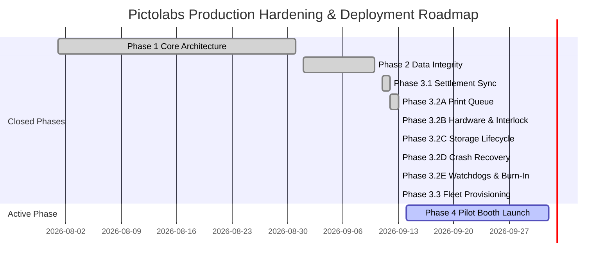

# Pictolabs Master Project Timeline & Engineering Roadmap

**Document Version:** 1.0.0  
**Last Updated:** September 13, 2026  
**Status:** Definitive Engineering Single Source of Truth (SSOT)  
**Target Milestone:** Pilot Booth #1 Commercial Deployment  

---

## 1. Executive Summary & Phase Status

| Phase | Description | Status | Verification Gate |
|---|---|---|---|
| **Phase 1** | Foundation & Core Loop (DSLR, Render, QRIS, Cloud) | **CLOSED** | Sprint 1–5E UAT Passed |
| **Phase 2** | Data Integrity & Upload Queue Settlement | **CLOSED** | E2E Tests 11/11 Passed (`v0.9.2-phase2-integrity`) |
| **Phase 3.1** | Session Settlement & Pre-Flight Upload Confirmation | **CLOSED** | Ghost Session Fallback Eliminated |
| **Phase 3.2A** | Persistent Print Queue & Crash-Resilient Spooler | **CLOSED** | 9/9 Capability Tests Passed |
| **Phase 3.2B** | **Printer Hardware Monitoring & Low-Paper Interlock** | **CLOSED** | 6/6 Validation Tests Passed (`2026-09-10_PHASE_3_2B_VALIDATION.md`) |
| **Phase 3.2C** | **Storage Lifecycle & Dual-Tier Retention Engine** | **CLOSED** | 6/6 Validation Tests Passed (`2026-09-10_PHASE_3_2C_FINAL_AUDIT.md`) |
| **Phase 3.2D** | **Crash Recovery Ledger & Mid-Capture Resiliency** | **CLOSED** | 31/31 Assertions Passed (`apps/kiosk/electron/services/crash-recovery.spec.ts`) |
| **Phase 3.2E** | **Watchdog Supervision & Burn-In Testing** | **CLOSED** | 35/35 Burn-In Assertions Passed (`docs/2026-09-13_PHASE_3_2E_COMPLETION.md`) |
| **Phase 3.3** | **Fleet Provisioning & Booth Activation** | **CLOSED** | 11/11 Assertions Passed (`docs/2026-09-13_PHASE_3_3_COMPLETION.md`) |
| **Phase 4** | Commercial Deployment & Multi-Tenant Fleet Scale | **NEXT ACTIVE** | Pilot Booth Deployment Readiness |

---

## 2. Chronological Milestones Detail

### Phase 1 — Foundation & Reverse-Engineering (Sprint 1 to 5E)
- **Status**: **CLOSED**
- **Achievements**:
  - Canon DSLR 30 FPS LiveView capture engine via native C++ EDSDK 13.x binding.
  - Sharp 300 DPI composite rendering engine (1200x1800 px) with 2R, 4R, 6R photo strips.
  - Midtrans Dynamic QRIS payment gateway with WebSocket notification hooks.
  - Cloudflare R2 direct media uploads and PostgreSQL Prisma backend.
  - Initial touch interface for self-service kiosk workflow.

### Phase 2 — Data Integrity & Upload Queue Settlement
- **Status**: **CLOSED** (`v0.9.2-phase2-integrity`)
- **Achievements**:
  - **Fix #1 (Session ID Fracture)**: Single immutable session ID generated at payment initiation and preserved across all screens (`PaymentScreen -> CaptureScreen -> RenderScreen -> QRScreen`).
  - **Fix #2 (Photo Loss Race Condition)**: Eager synchronization before photo upload; queue worker executes pre-flight check guaranteeing parent session exists in cloud database before uploading media.
  - **Fix #3 (Ghost Session Prevention)**: Removal of unauthenticated fallback sessions in `storage.controller.ts`; unauthenticated or missing sessions rejected with HTTP 404.
  - **Fix #4 (Upload Confirmation Validation)**: Strict HTTP status verification on `/confirm-upload`; files remain in retry queue until cloud confirmation returns 200 OK.

### Phase 3.1 — Session Settlement & Cloud Ledger Alignment
- **Status**: **CLOSED**
- **Achievements**:
  - `syncSingleSessionToCloud()` eager execution upon QRIS settlement.
  - Device secret header verification (`x-device-secret`) on all edge-to-cloud API endpoints.
  - Clean TypeScript compilation with zero type errors.

### Phase 3.2A — Persistent Print Queue & Spooler Reliability
- **Status**: **CLOSED** (Ref: `/docs/2026-09-10_PHASE_3_2A_COMPLETED.md`)
- **Achievements**:
  - SQLite persistent table `print_queue` replacing fire-and-forget print execution.
  - Event-driven worker execution (`triggerQueueProcessing()`) with 5s watchdog safety net.
  - Idempotency safeguard preventing accidental duplicate paper prints:
    - Application layer checks existing `COMPLETED` / `PRINTING` jobs.
    - Database layer: `idx_print_queue_active` on `(session_id, file_path) WHERE status IN ('PENDING', 'PRINTING')`.
  - Startup Crash Recovery: `UPDATE print_queue SET status='PENDING' WHERE status='PRINTING'` on boot.
  - Exponential retry backoff: 5s, 10s, 20s, 40s, 80s for 5 attempts.
  - `DEAD_LETTER` state preservation: zero hard-delete for unrecoverable errors.
  - Management & Monitoring APIs: `getAllPrintJobs()`, `getPrintJob()`, `getPendingPrintJobs()`, `getFailedPrintJobs()`, `retryPrintJob()`, `reprintSession()`, `cancelPrintJob()`, and `getQueueMetrics()`.

### Phase 3.2B — Printer Hardware Monitoring & Low-Paper Interlock
- **Status**: **CLOSED** (Ref: `/docs/2026-09-10_PHASE_3_2B_VALIDATION.md`)
- **Achievements**:
  - Win32 Spooler & WMI hardware monitoring (`PrinterMonitorService`) with 3-second debounce hysteresis preventing false alarms on USB voltage drops.
  - Atomic SQLite roll tracker (`PaperTrackerService`) recording consumption on `COMPLETED` prints.
  - Hard interlock on `WelcomeScreen` and `PaymentScreen` blocking session start and QRIS generation when `paperRemaining <= 2` or printer offline.
  - PIN-secured operator roll reset routine restoring capacity to 700 sheets.
  - Fleet heartbeat telemetry reporting `paperRemaining` and hardware error codes every 30 seconds.
  - 6/6 deterministic validation tests passed (100% success).

---

## 3. Phase 3.2E — Watchdog Supervision & Burn-In Testing
- **Status**: **CLOSED** (Ref: [`docs/2026-09-13_PHASE_3_2E_COMPLETION.md`](file:///c:/Users/ezarh/.gemini/antigravity-ide/scratch/Pictolabs/docs/2026-09-13_PHASE_3_2E_COMPLETION.md))
- **Achievements**:
  1. **Upload Watchdog**: Injected 30s/60s `AbortSignal.timeout()` into all fetch routines, automated stuck upload rescue (>60s) with Dead Letter queueing after 5 attempts, and auto-clearing upload mutex deadlocks.
  2. **Print Watchdog**: Terminating hung Windows spooler child processes (`rundll32.exe`), rescuing jobs stuck in `PRINTING` (>120s), and preventing duplicate physical print jobs on reboot.
  3. **Session Watchdog**: 120s / 180s inactivity timeout resetting kiosk UI to `welcome` while safely preserving active customer session progress in SQLite for 15 minutes, halting DSLR LiveView streaming.
  4. **Disk Space Watchdog**: 3GB hysteresis buffer with Critical lockout (<2GB), emergency waterfall purge (<5GB), and auto-unlocking at $\ge 5$GB free disk space.
  5. **Memory Watchdog & Master Supervisor**: Central 15-second supervisor daemon, proactive GC / Sharp cache purge at >500MB, graceful idle soft-restart at >800MB heap across 3 checks.
  6. **Burn-In Validation Suite**: 35/35 assertions passed across Scenarios A through J (100 sessions soak simulation, crash under upload/print, disk full lockout, 30m network offline).

---

## 4. Phase 3.3 — Deployment Readiness & Fleet Provisioning
- **Status**: **CLOSED** (Ref: [`docs/2026-09-13_PHASE_3_3_COMPLETION.md`](file:///c:/Users/ezarh/.gemini/antigravity-ide/scratch/Pictolabs/docs/2026-09-13_PHASE_3_3_COMPLETION.md))
- **Achievements**:
  1. **Decoupled Identity Model**: Introduced `Device` and `ActivationToken` Prisma models, separating physical hardware machines from logical retail locations (`Booth`).
  2. **DPAPI Encrypted Local Storage**: System-wide `%ProgramData%\Pictolabs\identity.json` with Windows DPAPI encryption via Electron `safeStorage` and synchronous SQLite mirror table `kiosk_identity`.
  3. **Pairing Handshake & On-Screen Wizard**: Touch-friendly `ActivationScreen` with non-ambiguous Base32 tokens (`ACT-XXXX-XXXX`), 15m TTL, 256-bit `deviceSecret` issuance, and brute-force rate limiting (5 attempts lockout).
  4. **Fleet Telemetry & Single-Socket Gateway Policy**: Multi-booth gateway isolation terminating duplicate socket connections (`DUPLICATE_DEVICE_SESSION`) and reporting dual-tier telemetry (`Booth.lastSeen` and `Device.lastSeenAt`).
  5. **Backward-Compatibility Auto-Migration**: Transparent self-seeding for legacy Pilot Booth #1 (`dev-secret-booth-01`) without breaking running units or requiring manual DB edits.
  6. **Automated Verification**: 11/11 automated assertions passed across backend provisioning and kiosk storage suites.

---

## 5. Current Active Phase: Phase 4 — Pilot Booth Launch & Fleet Deployment
- **Status**: **ACTIVE**
- **Objective**: Execute single-booth pilot retail deployment, finalize Windows OS lockdown policies, and connect kiosk heartbeat to centralized monitoring.

---

## 6. Upcoming Phases Roadmap

---

## 7. Engineering Governance & Quality Standards
1. **Zero Data Loss**: Raw captures and settled transactions must never be deleted without verified cloud sync.
2. **Deterministic Interlocks**: Hardware faults must disable payment *before* transaction initiation, never mid-flight without automatic refund/voucher fallback.
3. **No Unhandled Crashes**: External watchdog (NSSM) and internal startup recovery must guarantee automatic resurrection in under 4.5 seconds.
