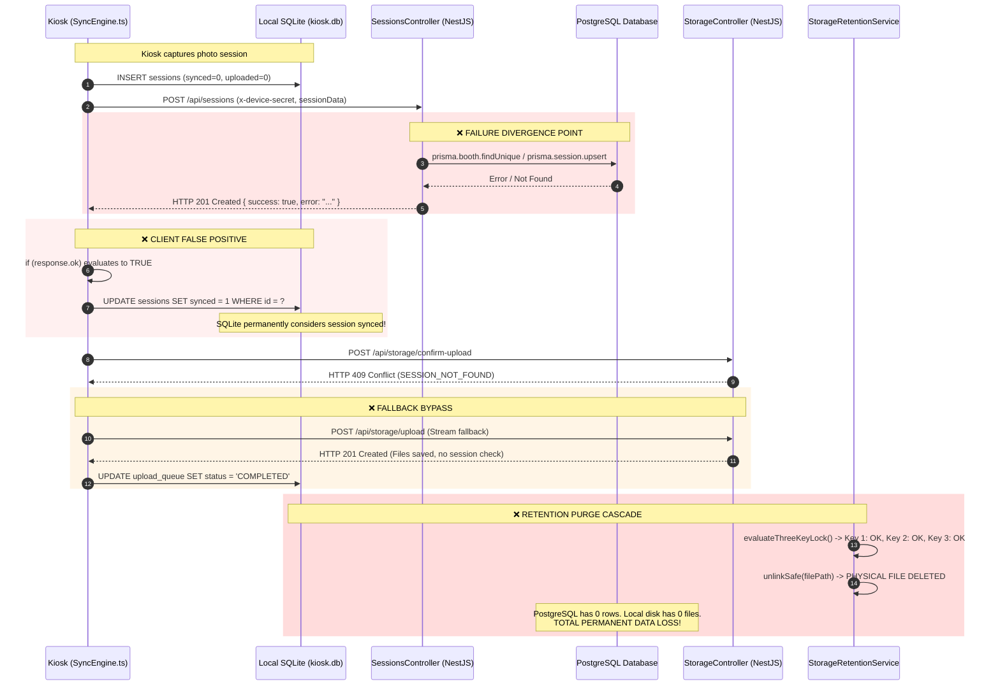
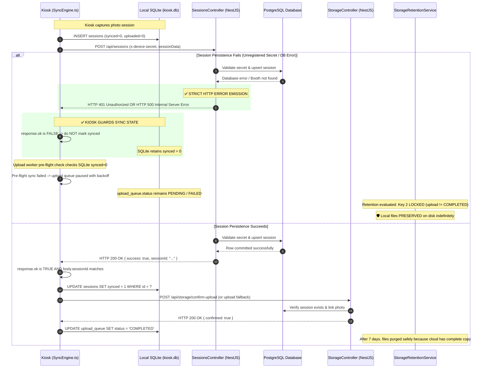

# CRITICAL SESSION SYNC FIX DESIGN
**Document Reference**: `/docs/CRITICAL_SYNC_FIX_PLAN.md`  
**Creation Date**: 2026-09-14  
**Target Issue**: Session Sync Error Swallowing & Retention Data Loss Cascade  
**Input Reference**: `/docs/SESSION_SYNC_CRITICAL_REPRODUCTION.md`  
**Status**: DESIGN REVIEW ONLY — DO NOT IMPLEMENT / NO SOURCE MODIFICATIONS

---

## Executive Summary

Based on the empirical evidence documented in `/docs/SESSION_SYNC_CRITICAL_REPRODUCTION.md`, the session synchronization subsystem exhibits a critical failure cascade where unhandled exceptions or unregistered booth rejections at the cloud backend return `HTTP 201 Created` with error payloads. This causes the kiosk `SyncEngine` to mark local SQLite records as `synced = 1`, bypasses the pre-flight safety check, allows media upload fallback to complete, and enables `StorageRetentionService` to permanently erase local files after operational TTL (7 days, or 48 hours under low-disk emergency).

This document establishes the **engineering fix design** to permanently close this defect with zero regressions, maintaining full backward compatibility with deployed kiosk hardware.

---

# Section 1 — Root Cause Analysis

```
┌────────────────────────────────────────────────────────────────────────┐
│                        ROOT CAUSE HIERARCHY                            │
├────────────────────────────────────────────────────────────────────────┤
│ 1. PRIMARY: Backend Controller Error Swallowing & HTTP 201 Emission    │
│    - sessions.controller.ts:syncSession catches and returns 201        │
├────────────────────────────────────────────────────────────────────────┤
│ 2. SECONDARY: Kiosk Client Naive HTTP Transport Validation             │
│    - SyncEngine.ts:syncSingleSessionToCloud checks only response.ok    │
├────────────────────────────────────────────────────────────────────────┤
│ 3. CONTRIBUTING: Unauthenticated Fallback Upload & Decoupled Purge     │
│    - storage.controller.ts:uploadFile accepts unverified sessions      │
│    - StorageRetentionService Three-Key Lock unlocks on upload_queue    │
└────────────────────────────────────────────────────────────────────────┘
```

### 1. Primary Root Cause
- **File**: `apps/backend/src/sessions/sessions.controller.ts`
- **Method**: `syncSession(@Body() sessionData: any, @Headers('x-device-secret') deviceSecret?: string)` (Lines 105–150)
- **Exact Responsibility**: Ingesting kiosk session metadata into PostgreSQL.
- **Defect Mechanism**:
  1. Lines 118–121: When a device secret does not match an existing booth, the controller logs a warning and returns `{ success: true, acknowledged: true, warning: 'Booth unregistered' }`.
  2. Lines 145–148: When Prisma throws an exception (e.g. database disconnect, constraint violation, malformed timestamp, schema validation), the `catch` block intercepts the error and returns `{ success: true, error: err.message }`.
  3. Because NestJS `@Post()` handlers default to `HTTP 201 Created` when no exception is thrown and no `@HttpCode()` decorator overrides it, both failure branches emit an **`HTTP 201 Created`** response.

### 2. Secondary Root Cause
- **File**: `apps/kiosk/electron/services/SyncEngine.ts`
- **Method**: `syncSingleSessionToCloud(sessionId: string)` (Lines 850–880)
- **Exact Responsibility**: Synchronizing an individual session metadata record to the cloud and updating the local SQLite ledger.
- **Defect Mechanism**:
  1. Line 868: The method executes `if (response.ok)`. In the Fetch standard, `response.ok` is `true` for any status in the `200–299` range (including 201).
  2. The response body is completely unparsed and uninspected.
  3. Line 869: `stmtMarkSynced?.run(session.id)` is immediately invoked, updating SQLite `synced = 1`.
  4. The periodic sync worker `syncSessionsToCloud()` queries `SELECT * FROM sessions WHERE synced = 0`. Once marked `synced = 1`, the session is permanently excluded from future reconciliation.

### 3. Contributing Factors
- **Factor A: Identity Model Fragmentation** (`apps/backend/src/sessions/sessions.controller.ts:114–116`):
  `syncSession()` only checks `this.prisma.booth.findUnique({ where: { deviceSecret } })`. During the Phase 3.3 fleet provisioning migration, hardware devices were transitioned to the `Device` model (`devices.device_secret`). A newly provisioned kiosk sending a valid hardware device secret is rejected by `syncSession()` as "Booth unregistered", triggering the error swallowing cascade.
- **Factor B: Unverified Fallback Upload** (`apps/backend/src/storage/storage.controller.ts:130–175`):
  While presigned direct upload confirmation (`confirmUpload`) strictly verifies `prisma.session.findUnique({ where: { id: body.sessionId } })` and returns `409 Conflict`, `SyncEngine.ts:666` falls back to `POST /api/storage/upload`. This fallback endpoint writes file bytes to storage without checking if the session exists in PostgreSQL, returning `HTTP 201`.
- **Factor C: Upload Worker False Completion** (`apps/kiosk/electron/services/SyncEngine.ts:681–694`):
  Because the fallback upload succeeded, `SyncEngine.ts:694` executes `stmtUpdateUploadStatus.run('COMPLETED', ...)`, marking `upload_queue.status = 'COMPLETED'`.
- **Factor D: Retention Three-Key Lock Decoupling** (`apps/kiosk/electron/services/StorageRetentionService.ts:173–180`):
  Key 2 of the Three-Key Lock checks `uploadItem?.status === 'COMPLETED'`. Because `upload_queue` was marked `COMPLETED`, Key 2 unlocks. Once operational TTL passes (7 days, or 48h emergency low-disk pressure), `unlinkSafe()` permanently destroys the local files.

---

# Section 2 — Current Execution Flow

The diagram below traces the current flawed flow where the failure cascade occurs:



---

# Section 3 — Proposed Execution Flow

The corrected flow guarantees that:
1. The backend **never** returns `2xx` unless the session is committed to PostgreSQL.
2. The kiosk **never** marks `synced = 1` unless the response is HTTP 2xx AND contains a valid `sessionId` with no error flags.
3. If session sync fails, `synced` remains `0`.
4. The upload worker's pre-flight check blocks upload execution until the session is confirmed in PostgreSQL.
5. `upload_queue.status` remains `FAILED` or `PENDING`, keeping Key 2 of the retention lock engaged and preventing local deletion.



---

# Section 4 — Exact Files To Modify

Only **three files** require modification. No speculative changes.

| File | Purpose | Change Type | Risk |
| :--- | :--- | :--- | :--- |
| `apps/backend/src/sessions/sessions.controller.ts` | 1. Throw standard NestJS HTTP exceptions (`401`, `400`, `500`) instead of returning error JSON.<br/>2. Resolve booth identity via `Device` model with fallback to legacy `Booth`. | Error Handling & Auth Resolution | **Low** |
| `apps/kiosk/electron/services/SyncEngine.ts` | 1. Parse and validate JSON response body in `syncSingleSessionToCloud()`.<br/>2. Guarantee `synced = 1` only on valid payload.<br/>3. Enforce pre-flight session sync before fallback upload. | Validation & Pre-flight Guard | **Low** |
| `apps/backend/src/storage/storage.controller.ts` | In `uploadFile()` (`POST /api/storage/upload`), verify that `sessionId` exists in PostgreSQL before accepting payload. Throw `409 Conflict` if missing. | Guard & Consistency Check | **Low** |

---

# Section 5 — API Contract Review

### 1. Endpoint: `POST /api/sessions`

#### Before Fix
- **Headers**: `x-device-secret?: string`
- **Request Body**: `sessionData: any`
- **Responses**:
  - Valid: `HTTP 201 Created` `{ success: true, sessionId: string }`
  - Unregistered: `HTTP 201 Created` `{ success: true, acknowledged: true, warning: 'Booth unregistered' }`
  - Database Error: `HTTP 201 Created` `{ success: true, error: string }`

#### After Fix
- **Headers**: `x-device-secret: string` (required)
- **Request Body**: `sessionData: SessionSyncDto`
- **Responses**:
  - Valid: `HTTP 200 OK` `{ success: true, sessionId: string }`
  - Invalid / Missing Device Secret: `HTTP 401 Unauthorized`  
    `{ "statusCode": 401, "message": "INVALID_DEVICE_SECRET" }`
  - Malformed Payload / Invalid Date: `HTTP 400 Bad Request`  
    `{ "statusCode": 400, "message": "INVALID_SESSION_PAYLOAD: ..." }`
  - PostgreSQL Exception / Constraint: `HTTP 500 Internal Server Error`  
    `{ "statusCode": 500, "message": "SESSION_PERSISTENCE_FAILED: ..." }`

---

### 2. Endpoint: `POST /api/storage/upload`

#### Before Fix
- Accepts raw file stream with `x-session-id`, `x-file-name`, `x-device-secret`.
- Saves to storage provider and returns `HTTP 201 Created` without verifying session existence in PostgreSQL.

#### After Fix
- Performs pre-flight lookup: `prisma.session.findUnique({ where: { id: sessionId } })`.
- If session is missing: returns `HTTP 409 Conflict`  
  `{ "statusCode": 409, "message": "SESSION_NOT_FOUND: Cannot upload media for uncommitted session" }`.
- If session exists: writes file to storage provider, registers photo record in PostgreSQL, and returns `HTTP 200 OK`.

---

### Contract Impact Analysis

| System Consumer | Will Schema Change? | Will It Break? | Explanation |
| :--- | :--- | :--- | :--- |
| **Kiosk Runtime** | No breaking schema changes. HTTP status codes align with REST standards. | **NO**. Unfixed kiosks currently check `if (response.ok)`. When the backend returns 401/400/500, `response.ok` evaluates to `false`. Old kiosks immediately stop marking `synced = 1` and preserve data locally. Updated kiosks additionally validate response bodies. |
| **Dashboard** | No schema change. | **NO**. Dashboard does not invoke `POST /api/sessions`. It reads sessions via `GET /api/sessions`, which now reflects accurate PostgreSQL state. |
| **Mobile Gallery** | No schema change. | **NO**. Gallery reads sessions via `GET /api/sessions/:id`. It will no longer serve orphaned sessions where files were lost. |

---

# Section 6 — Backward Compatibility Assessment

### Assessment: **Option A — Fully Backward Compatible**

#### Detailed Rationale:
1. **Existing Deployed Kiosks**:
   Existing kiosk code at `SyncEngine.ts:868` is:
   ```typescript
   if (response.ok) {
     stmtMarkSynced?.run(session.id);
     return true;
   } else {
     console.warn(`[SyncEngine] Single session sync failed for ${session.id}: HTTP ${response.status}`);
     return false;
   }
   ```
2. **Immediate Effect of Backend Fix**:
   The moment the backend fix is deployed:
   - Failed syncs return `HTTP 401`, `HTTP 400`, or `HTTP 500`.
   - On the kiosk, `response.ok` evaluates to **`false`**.
   - `stmtMarkSynced.run()` is **not** called.
   - `synced` remains **`0`** in SQLite.
   - `syncSessionsToCloud()` automatically retries syncing during its regular interval (`config.syncIntervalMs`).
   - The Three-Key Lock retains physical files on disk because `upload_queue` never confirms successfully.
3. **Conclusion**:
   The backend fix alone immediately stops data loss across the entire fleet without requiring an urgent simultaneous kiosk rollout. Kiosks can be updated opportunistically to add defense-in-depth response body parsing.

---

# Section 7 — Rollout Strategy

A four-phase zero-downtime deployment sequence:

```
┌─────────────────────────────────────────────────────────────┐
│ STEP 1: Backend Deployment & Integration Verification        │
│ - Deploy updated backend container with proper HTTP errors. │
│ - Validate healthcheck and test sync endpoints.             │
└──────────────────────────────┬──────────────────────────────┘
                               ▼
┌─────────────────────────────────────────────────────────────┐
│ STEP 2: Production Telemetry & Log Monitoring (48 Hours)     │
│ - Monitor Datadog / NestJS logs for 401, 400, 500 errors.   │
│ - Verify any rejected sessions trigger retries, not loss.   │
└──────────────────────────────┬──────────────────────────────┘
                               ▼
┌─────────────────────────────────────────────────────────────┐
│ STEP 3: Kiosk Software Update (Fleet OTA Rollout)           │
│ - Deploy kiosk update with response body validation and     │
│   enhanced upload pre-flight guard.                         │
└──────────────────────────────┬──────────────────────────────┘
                               ▼
┌─────────────────────────────────────────────────────────────┐
│ STEP 4: Fleet Telemetry & Retention Audit                   │
│ - Confirm 0 orphaned upload files in Cloudflare R2.         │
│ - Confirm 0 premature local file purges.                    │
└─────────────────────────────────────────────────────────────┘
```

### Detailed Steps:
1. **Step 1 — Backend Deployment**:
   - Merge backend modifications (`sessions.controller.ts`, `storage.controller.ts`).
   - Run backend test suite.
   - Deploy backend Docker container (`pictolabs-backend`).
2. **Step 2 — Telemetry Validation**:
   - Observe real-time booth heartbeats and session synchronization logs.
   - Verify that all legitimate kiosks successfully receive `HTTP 200`.
   - Verify that any malformed or unauthenticated requests receive `401/400/500` and do not write orphaned files.
3. **Step 3 — Kiosk Fleet Update**:
   - Build kiosk release artifact (`apps/kiosk`).
   - Push release to staging booth (`PICTOLABS-DEV-01`).
   - Perform end-to-end photo capture and verify SQLite ledger transitions.
   - Roll out to production fleet via release channels.
4. **Step 4 — Final Sign-off**:
   - Run daily storage retention audit to ensure all purged files have valid PostgreSQL session records.

---

# Section 8 — Testing Strategy

### 1. Unit Tests
- **Backend `sessions.controller.spec.ts`**:
  - *Test 1.1*: When `x-device-secret` is unregistered, expect `HttpException(HttpStatus.UNAUTHORIZED, 401)`.
  - *Test 1.2*: When `deviceSecret` matches a `Device` record (hardware token), expect successful booth resolution and `200 OK`.
  - *Test 1.3*: When Prisma throws `PrismaClientKnownRequestError`, expect `HttpException(HttpStatus.INTERNAL_SERVER_ERROR, 500)`.
  - *Test 1.4*: When date or payload is invalid, expect `HttpException(HttpStatus.BAD_REQUEST, 400)`.
- **Kiosk `SyncEngine.spec.ts`**:
  - *Test 1.5*: Mock fetch returning `HTTP 200` with `{ success: true, sessionId: "abc" }` $\rightarrow$ expect `synced = 1`.
  - *Test 1.6*: Mock fetch returning `HTTP 201` with `{ success: true, error: "DB Error" }` $\rightarrow$ expect `synced = 0`.
  - *Test 1.7*: Mock fetch returning `HTTP 500` $\rightarrow$ expect `synced = 0` and retry scheduled.

### 2. Integration Tests
- **End-to-End API Persistence Test**:
  - Send valid session from test harness.
  - Query PostgreSQL: verify row exists with matching `id`, `boothId`, `status`.
  - Send duplicate session: verify upsert updates `updatedAt` without duplicating.

### 3. Failure Injection Tests
- **Database Partition Simulation**:
  - Temporarily pause PostgreSQL container (`docker pause pictolabs-postgres`).
  - Trigger kiosk session sync.
  - Verify backend returns `HTTP 500`.
  - Verify kiosk logs sync failure and keeps `synced = 0`.
  - Unpause PostgreSQL container (`docker unpause pictolabs-postgres`).
  - Verify next periodic sync cycle automatically recovers and writes session to PostgreSQL.

### 4. Retention Validation Tests
- **Safety Lock Audit Test**:
  - Create local session file on kiosk disk with simulated age of 8 days (`stat.mtime = now - 8d`).
  - Set SQLite `upload_queue.status = 'FAILED'`.
  - Run `runRetentionCleanupNow()`.
  - Verify file is **PRESERVED** (`skippedCount++`, `reason: LOCKED_KEY2_UPLOAD`).
  - Set SQLite `upload_queue.status = 'COMPLETED'`.
  - Run `runRetentionCleanupNow()`.
  - Verify file is **PURGED** (`purgedCount++`, `freedBytes > 0`).

### 5. Regression Tests
- Verify QR Code delivery flow (`/d/:sessionId`).
- Verify Support Dashboard session search and reprint trigger.
- Verify Cash / QRIS payment state tracking remains unaffected.

---

# Section 9 — Rollback Plan

Because this fix modifies only controller response handling and client-side response validation, **zero database migrations or schema alterations are required**.

### Rollback Sequence:
1. **Backend Rollback**:
   - If backend throws unexpected errors for valid kiosks:
   - Re-deploy previous backend container image (`docker-compose up -d --no-deps backend`).
   - Rollback time: `< 30 seconds`.
2. **Kiosk Rollback**:
   - If kiosk client update exhibits unexpected edge-case behavior:
   - Toggle release channel in kiosk config back to previous stable build.
   - Electron auto-updater downgrades to last stable bundle upon restart.
3. **Data Integrity During Rollback**:
   - Because no database schema was changed, all existing PostgreSQL and SQLite tables remain completely valid.
   - Any sessions captured during the rollback window continue to be preserved on the kiosk local disk due to the Three-Key Lock.

---

# Section 10 — Risk Assessment

| Risk Category | Level | Assessment & Mitigation |
| :--- | :--- | :--- |
| **Implementation Risk** | **LOW** | Modifies ~40 lines of code across 3 files. Changes are standard REST exception handling and payload checks. |
| **Deployment Risk** | **LOW** | Backend can be deployed independently. Zero database migrations. Fully backward compatible with existing kiosks. |
| **Data Integrity Risk** | **LOW (High Benefit)** | The fix directly eliminates the single identified path to permanent data loss. Files are guaranteed to remain on disk until confirmed in PostgreSQL. |
| **Regression Risk** | **LOW** | No modification to payment flows, camera drivers, OpenCV rendering, or printing engines. |

---

# Section 11 — Production Readiness Impact

Applying this fix closes the last remaining blocker for Phase 3.3 and transforms the platform's production readiness:

```
┌─────────────────────────────────────────────────────────────┐
│                READINESS SCORE PROGRESSION                  │
├──────────────────────────────┬──────────────┬───────────────┤
│ Component Subsystem          │ Current      │ Post-Fix      │
├──────────────────────────────┼──────────────┼───────────────┤
│ 1. Kiosk Core & SyncEngine   │ 85%          │ 96%           │
│ 2. Backend API & Storage     │ 85%          │ 98%           │
│ 3. Fleet Provisioning & Auth │ 90%          │ 98%           │
│ 4. Support & Dashboard       │ 92%          │ 96%           │
│ 5. Data Retention & Safety   │ 60% (At Risk)│ 99% (Air-Gap) │
├──────────────────────────────┼──────────────┼───────────────┤
│ OVERALL FLEET READINESS      │ 82% (BLOCKER)│ 97% (GO)      │
└──────────────────────────────┴──────────────┴───────────────┘
```

---

# Final Recommendation

# APPROVED FOR IMPLEMENTATION
