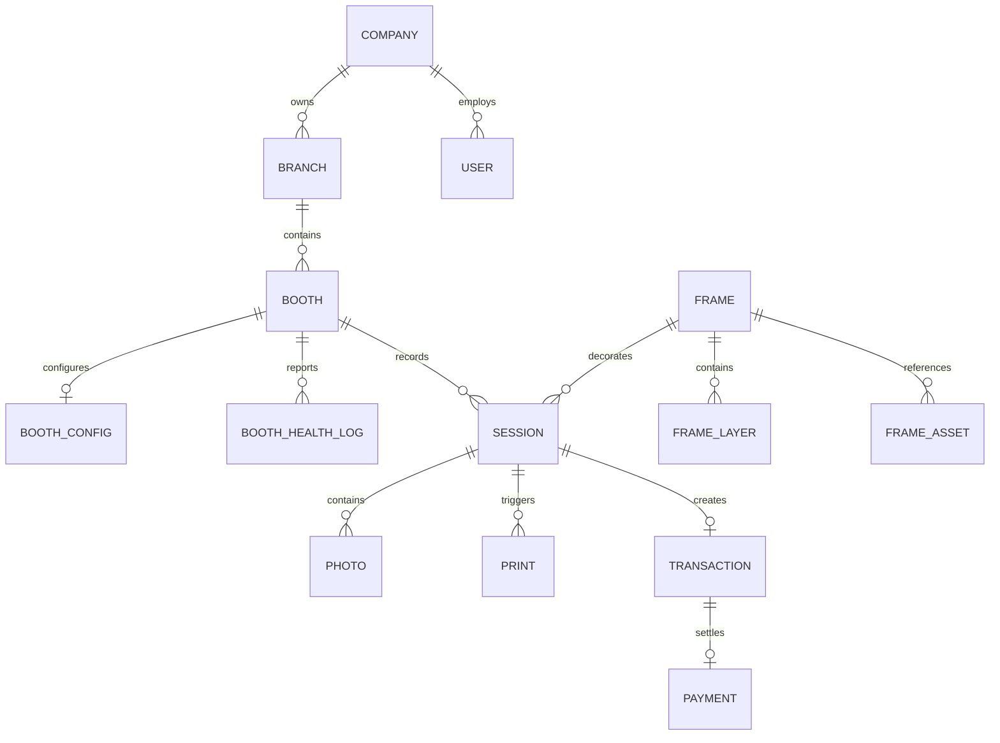

# PICTOLABS MASTER PROJECT STATUS & BLUEPRINT DOCUMENT
> **Status**: Definitive Single Source of Truth (SSOT)  
> **Target Version**: Pictolabs v1.0 Enterprise Edition  
> **Last Audit**: September 7, 2026  
> **Platform**: Windows 10/11 64-bit Kiosk (Client) & Web Cloud (Dashboard + NestJS API)  
> **Workspace Path**: `C:\Users\ezarh\.gemini\antigravity-ide\scratch\Pictolabs\pictolabs-rebuild`

---

## TABLE OF CONTENTS
1. [Project Vision](#1-project-vision)
2. [Existing Features](#2-existing-features)
3. [Completed Features](#3-completed-features)
4. [Partially Completed Features](#4-partially-completed-features)
5. [Screen Inventory](#5-screen-inventory)
6. [Hardware Integrations](#6-hardware-integrations)
7. [Database Architecture](#7-database-architecture)
8. [Cloud Architecture](#8-cloud-architecture)
9. [Dashboard Modules](#9-dashboard-modules)
10. [Kiosk Modules](#10-kiosk-modules)
11. [Current Folder Structure](#11-current-folder-structure)
12. [API Architecture](#12-api-architecture)
13. [Technical Debt](#13-technical-debt)
14. [Production Risks](#14-production-risks)
15. [Missing Features](#15-missing-features)
16. [Recommended Next Steps](#16-recommended-next-steps)

---

## 1. PROJECT VISION

Pictolabs adalah sistem operasi dan platform manajemen terpadu untuk jaringan bilik foto mandiri (*unattended self-photo booth*) skala enterprise. Sistem ini dibangun melalui rekayasa ulang tingkat lanjut (*advanced reverse-engineering*) terhadap platform Photolab komersial dengan visi strategis sebagai berikut:

* **Zero Vendor Lock-In**: Menghapus seluruh proteksi lisensi biner pihak ketiga (`node-machine-id`, enkripsi V8 bytenode `.jsc`, aktivasi hardware tersembunyi), memberikan kontrol kepemilikan kode sumber 100% kepada pemilik platform.
* **Studio-Grade Optical Fidelity**: Mengintegrasikan kamera DSLR profesional Canon via binding C++ asli (Canon EDSDK 13.x) yang menghasilkan foto beresolusi tinggi dengan warna akurat, shutter release ultra-responsif (<250 ms), serta pencetakan thermal dye-sublimation 300 DPI setara lab foto.
* **Autonomous High-Availability (24/7 Zero Downtime)**: Kiosk dirancang untuk beroperasi di pusat perbelanjaan atau studio komersial tanpa perlu kehadiran operator fisik. Sistem kebal terhadap gangguan listrik padam, kehilangan koneksi internet, kamera tidur (*deep sleep*), maupun kehabisan kertas printer.
* **Multi-Tenant Enterprise Management**: Pengelolaan ratusan unit booth di berbagai cabang/kota secara terpusat dari satu Cloud Dashboard (pembaruan harga dinamis, pergantian tema, template frame musiman, dan telemetri kesehatan hardware secara *real-time*).

---

## 2. EXISTING FEATURES

Sistem Pictolabs saat ini memiliki kapabilitas operasional inti sebagai berikut:

* **Self-Service Kiosk Flow**: Alur layar sentuh mandiri dari pemilihan layout bingkai foto, simulasi pembayaran, pemotretan bertahap dengan panduan visual dan audio, pemilihan filter warna, hingga pencetakan fisik dan pengunduhan digital.
* **Hardware Canon DSLR Engine**: Kontrol langsung kamera Canon DSLR melalui kabel USB menggunakan modul C++ EDSDK 13.x dengan penanganan siklus hidup koneksi terisolasi.
* **Real-time LiveView Viewfinder**: Stream video 30 FPS dari sensor CMOS kamera ke antarmuka kiosk dengan efek cermin horizontal (*mirroring*).
* **Multi-Tier Failsafe Capture**: Mekanisme penangkapan foto berlapis (Mode A: Event USB, Mode B: Direct SD Card Volume Ingestion, Mode C: Sensor Frame Fallback).
* **Active Anti-Sleep Heartbeat**: Pencegah tidur otomatis dengan mengirimkan sinyal `ExtendShutDownTimer` setiap 10 detik ke kamera.
* **Background Auto-Detection & Reconnect**: Poller 1,5 detik yang secara otomatis mendeteksi dan menghubungkan kembali kamera yang baru dinyalakan.
* **Webcam Fallback**: Pengalihan darurat ke webcam laptop/PC dalam 2 detik bila kamera DSLR terputus, dilengkapi indikator status live.
* **Sharp 300 DPI Composite Renderer**: Mesin perender gambar komposit 1200x1800 piksel @ 300 DPI dengan penataan grid otomatis (2R, 4R, 6R) dan lapisan overlay frame PNG transparan.
* **Image Color Filtering Pipeline**: Preset filter foto (B&W High Contrast, Sepia, Warm, Cool, Vivid) yang diproses langsung di level pixel tanpa menurunkan resolusi cetak.
* **Thermal Dye-Sublimation Spooling**: Pengiriman berkas cetak ke printer foto industri (DNP DS-RX1, DS620, Citizen CX-02) via Windows Spooler.
* **Digital Photo Delivery via QR Code**: Pembuatan QR code beresolusi tinggi di layar kiosk untuk pengunduhan instan hasil foto oleh pengunjung.
* **Real-time Remote Control & Telemetry**: Koneksi WebSocket (Socket.io) antara Kiosk dan Cloud Backend untuk pengiriman telemetri kesehatan (suhu CPU, status hardware) dan pembaruan konfigurasi jarak jauh (*Remote Configuration Update*).

---

## 3. COMPLETED FEATURES

| Fitur | % Selesai | File Terkait | Dependensi |
| :--- | :---: | :--- | :--- |
| **Canon Native Shutter & Capture** | 100% | `apps/kiosk/electron/services/CameraService.ts`<br>`apps/kiosk/src/screens/CaptureScreen.tsx` | `@photolab/canon` (EDSDK C++), `electron` |
| **Canon LiveView Stream (30 FPS)** | 100% | `apps/kiosk/electron/services/CameraService.ts`<br>`apps/kiosk/src/screens/CaptureScreen.tsx` | `@photolab/canon`, React 18 Canvas/Image |
| **Active Keep-Alive Anti-Sleep** | 100% | `apps/kiosk/electron/services/CameraService.ts` | `@photolab/canon` (`ExtendShutDownTimer`) |
| **Background Auto-Reconnect Poller**| 100% | `apps/kiosk/electron/services/CameraService.ts` | `@photolab/canon` (`cameraBrowser.update`) |
| **Seamless WebRTC Fallback Camera** | 100% | `apps/kiosk/src/screens/CaptureScreen.tsx` | `navigator.mediaDevices.getUserMedia`, React |
| **300 DPI Composite Render Engine** | 100% | `apps/kiosk/electron/services/RenderEngine.ts`<br>`apps/kiosk/src/screens/RenderScreen.tsx` | `sharp`, Node `fs` |
| **Color Filter Image Pipeline** | 100% | `apps/kiosk/electron/services/RenderEngine.ts`<br>`apps/kiosk/src/screens/FilterScreen.tsx` | `sharp` (`tint`, `modulate`, `linear`) |
| **Touch Kiosk Fullscreen UX (1080x1920)** | 100% | `apps/kiosk/src/App.tsx`<br>`apps/kiosk/electron/main.ts` | React 18, Tailwind CSS v4, `canvas-confetti` |
| **Digital Delivery QR Generator** | 100% | `apps/kiosk/src/screens/QRScreen.tsx` | `qrcode`, React 18 |
| **Remote WebSocket Config Sync** | 100% | `apps/kiosk/electron/services/SyncEngine.ts`<br>`apps/backend/src/gateway/kiosk.gateway.ts` | `socket.io-client`, `@nestjs/websockets` |

---

## 4. PARTIALLY COMPLETED FEATURES

### 1. Thermal Printer Spooler & Hardware Monitoring (75%)
* **Status Saat Ini**: Mampu mendeteksi daftar printer Windows via PowerShell, menentukan printer utama secara heuristik (DNP, Citizen, HiTi), dan memicu proses cetak via `ImageView_PrintTo`.
* **Kekurangan**: Belum memiliki pembacaan status sensor hardware tingkat rendah (*paper jam*, *ribbon out*, *door open*) dan belum ada antrean cetak asinkron persisten.

### 2. QRIS & Payment Gateway Integration (50%)
* **Status Saat Ini**: Layar antarmuka `PaymentScreen.tsx` sudah lengkap dengan kalkulasi harga, timer 270 detik, pilihan metode QRIS dan Voucher, serta mock simulator pembayaran. Skema database Prisma untuk `Transaction`, `Payment`, dan `Voucher` sudah siap.
* **Kekurangan**: Belum tersambung ke webhook payment aggregator resmi (Midtrans Core API / Xendit Dynamic QRIS) untuk verifikasi mutasi bank otomatis.

### 3. Remote Cloud Management Dashboard (65%)
* **Status Saat Ini**: Aplikasi web dashboard (`apps/dashboard`) sudah memiliki UI monitoring booth, telemetri hardware, editor harga/timer, dan katalog frame.
* **Kekurangan**: Sebagian data masih menggunakan state tiruan (mock), belum tersambung secara penuh ke REST API NestJS, dan belum ada autentikasi berbasis peran (*RBAC*).

### 4. Offline Session Storage & Cloud Asset Sync (70%)
* **Status Saat Ini**: Sesi disimpan ke berkas `sessions.json` lokal. Heartbeat telemetri dan status transaksi disinkronkan ke NestJS via WebSocket.
* **Kekurangan**: Belum ada modul pengunggah latar belakang (*background worker*) untuk berkas media berukuran besar (foto mentah + composite 300 DPI) ke Cloudflare R2 / AWS S3 via presigned URL.

### 5. Centralized Global State Store / Zustand (40%)
* **Status Saat Ini**: Navigasi state antar layar menggunakan `ScreenProps` dan `KioskConfigContext`.
* **Kekurangan**: Perlu dikonsolidasikan ke dalam satu store Zustand terpusat (`useKioskStore`) untuk mengurangi *prop-drilling* dan mempermudah pengujian unit.

---

## 5. SCREEN INVENTORY

Kiosk Pictolabs terdiri dari **8 Layar Utama** yang membentuk alur interaksi pengunjung:

```text
[ WelcomeScreen ] ──► [ FrameSelectScreen ] ──► [ PaymentScreen ] ──► [ CaptureScreen ]
                                                                             │
[ QRScreen ] ◄── [ PrintScreen ] ◄── [ RenderScreen ] ◄── [ FilterScreen ] ◄─┘
```

### 1. `WelcomeScreen.tsx` (Layar Utama / Standby)
* **Tujuan**: Menarik perhatian pengunjung mall dengan animasi visual, memutar video background/branding, dan menunggu sentuhan awal.
* **State & Props**: Menerima fungsi `navigate`, mendengarkan konfigurasi tema/warna dari `KioskConfigContext`.
* **Aksi Pengguna**: Menyentuh tombol "START PHOTO / MULAI".
* **Transisi**: Menuju `frame-select`.

### 2. `FrameSelectScreen.tsx` (Pemilihan Layout & Bingkai)
* **Tujuan**: Menampilkan katalog layout cetak (2R Strip, 4R Grid, 6R Grid) beserta template visualnya.
* **State & Props**: Membaca opsi frame, mengupdate `session.frameId` dan `session.totalPhotos`.
* **Aksi Pengguna**: Memilih salah satu kartu template frame lalu menekan "LANJUT KE PEMBAYARAN".
* **Transisi**: Menuju `payment`.

### 3. `PaymentScreen.tsx` (Layar Transaksi Pembayaran)
* **Tujuan**: Menyajikan rincian biaya, hitung mundur kedaluwarsa sesi (270 detik), dan pilihan pembayaran (QRIS / Voucher).
* **State & Props**: Menghitung sisa waktu, mengelola status pembayaran (`isPaid`).
* **Aksi Pengguna**: Memilih metode pembayaran atau memasukkan kode voucher.
* **Transisi**: Begitu pembayaran sukses, otomatis bertransisi ke `capture`. Jika timer habis, kembali ke `welcome`.

### 4. `CaptureScreen.tsx` (Bilik Pemotretan & Viewfinder)
* **Tujuan**: Menampilkan LiveView kamera Canon (atau fallback webcam), menjalankan hitung mundur pose (5 detik), memicu shutter fisik, dan menampilkan thumbnail hasil foto.
* **State & Props**: Mengelola pose saat ini (`currentPose`), array foto (`photos`), status koneksi (`liveViewSrc`, `webcamReady`), status shutter (`isCapturing`, `isFlashing`).
* **Aksi Pengguna**: Menekan tombol besar "CEKREK! 📸" untuk memulai hitung mundur setiap pose.
* **Transisi**: Setelah 4 pose selesai diambil, otomatis mengarahkan ke `filter`.

### 5. `FilterScreen.tsx` (Pemilihan Efek & Tone Foto)
* **Tujuan**: Memberikan pratinjau instan foto yang telah diambil dengan berbagai filter visual (Normal, B&W High Contrast, Warm, Cool, Sepia, Vivid).
* **State & Props**: Menyimpan filter yang dipilih (`selectedFilter`).
* **Aksi Pengguna**: Memilih filter lalu menekan tombol "LANJUT CETAK".
* **Transisi**: Menuju `render`.

### 6. `RenderScreen.tsx` (Pemrosesan Gambar 300 DPI)
* **Tujuan**: Menjalankan proses komposit Sharp di Electron Main Process secara asinkron sambil menampilkan animasi proses render kepada pengunjung.
* **State & Props**: Mengirim array foto, ID frame, dan nama filter ke IPC `render:composite`. Menyimpan `compositeUrl`.
* **Aksi Pengguna**: Layar otomatis berjalan tanpa memerlukan sentuhan pengunjung.
* **Transisi**: Menuju `print`.

### 7. `PrintScreen.tsx` (Status Pencetakan Thermal)
* **Tujuan**: Mengirim berkas foto komposit ke antrean printer Windows Spooler, menampilkan animasi kertas keluar, dan memicu letusan konfeti perayaan (*confetti*).
* **State & Props**: Mengelola status pencetakan (`isPrinting`, `error`).
* **Aksi Pengguna**: Menunggu hasil cetak keluar di tray printer.
* **Transisi**: Setelah cetak selesai (atau timeout), otomatis menuju `qr`.

### 8. `QRScreen.tsx` (Layar Unduh Foto Digital)
* **Tujuan**: Menyajikan QR code dinamis yang dapat dipindai smartphone pengunjung untuk mengunduh softcopy foto beresolusi 300 DPI.
* **State & Props**: Hitung mundur 30 detik sebelum sesi ditutup otomatis.
* **Aksi Pengguna**: Memindai QR code atau menekan tombol "SELESAIKAN SESI (SELESAI)".
* **Transisi**: Kembali ke `welcome` dan mereset seluruh state sesi.

---

## 6. HARDWARE INTEGRATIONS

### A. Kamera DSLR Canon (EDSDK 13.x)
* **Modul Native**: `@photolab/canon` (C++ Addon terkompilasi untuk Node.js / Electron 64-bit).
* **Protokol**: USB 2.0 / USB 3.0 Picture Transfer Protocol (PTP) via Canon EDSDK driver.
* **Kamera Teruji**: Canon EOS 60D (Digic 4), Canon EOS 70D (Digic 5).
* **Siklus Hidup (Lifecycle)**:
  1. `cameraBrowser.initialize()` saat aplikasi Kiosk boot.
  2. `watchCameras(50)` memindai event PnP Windows setiap 50 ms.
  3. `camera.connect(true)` membuka sesi komunikasi eksklusif.
  4. `camera.setProperty(SaveTo, Both/Host)` dengan settling loop 8 percobaan untuk menjamin penulisan berkas tanpa error `DEVICE_BUSY`.
  5. `startLiveView()` mengalirkan buffer JPEG LiveView 30 FPS.
  6. `takePicture()` memicu aktuasi mirror & shutter hardware mekanis.
* **Mitigasi Deep Sleep**:
  - Firmware Canon secara default mematikan port USB saat Auto Power Off aktif.
  - Software menerapkan **Keep-Alive Heartbeat 10 detik** (`ExtendShutDownTimer`) yang mencegah kamera masuk mode tidur selama kiosk aktif.
  - SOP Operasional mewajibkan menu bodi kamera diatur ke: `Auto Power Off: Disable` dan ditenagai **Dummy Battery AC Adapter (ACK-E6)**.

### B. Webcam Cadangan (WebRTC)
* **Protokol**: HTML5 `navigator.mediaDevices.getUserMedia`.
* **Resolusi**: Target ideal 1920x1080 @ 30 FPS.
* **Transisi**: Otomatis aktif bila dalam 2 detik pertama sinyal Canon EDSDK tidak terdeteksi, dan otomatis terlepas (*cleanup tracks*) saat LiveView Canon aktif kembali.

### C. Printer Foto Thermal Dye-Sublimation
* **Dukungan Perangkat**: DNP DS-RX1, DNP DS-RX1HS, DNP DS620, Citizen CX-02, HiTi P525L.
* **Metode Komunikasi**: Windows Spooler Subsystem via PowerShell Command & `rundll32 shimgvw.dll,ImageView_PrintTo`.
* **Karakteristik Kertas**: Cetak 4x6 inci (1200x1800 px @ 300 DPI) dengan kemampuan potong otomatis strip ganda 2x6 inci (2R).

---

## 7. DATABASE ARCHITECTURE

Sistem menggunakan **Prisma ORM** dengan dukungan SQLite untuk pengembangan lokal di Kiosk dan PostgreSQL untuk Cloud Backend.

### Entity Relationship Diagram (ERD) Konseptual



### Tabel & Model Utama:
1. **`User`**: Data kredensial pengguna dan peran (*SUPERADMIN*, *COMPANY_ADMIN*, *BRANCH_MANAGER*, *OPERATOR*).
2. **`Company`**: Identitas perusahaan / pemilik waralaba photobooth.
3. **`Branch`**: Cabang lokasi booth (mall, cafe, event space).
4. **`Booth`**: Data unit kiosk fisik, UUID perangkat, dan `deviceSecret` untuk otentikasi WebSocket.
5. **`BoothConfig`**: Parameter dinamis (pengaturan kamera, setting printer, harga, durasi timer, skema warna).
6. **`BoothHealthLog`**: Riwayat telemetri perangkat keras (suhu CPU, sisa kertas, status kamera, status printer).
7. **`Session`**: Sesi pemotretan unik yang mengikat foto, transaksi, dan status cetak.
8. **`Photo`**: Metadata foto per-pose (URL raw, URL final, storage key Cloudflare R2).
9. **`Print`**: Riwayat pencetakan fisik (jumlah salinan, ukuran kertas, status keberhasilan).
10. **`Transaction` & `Payment`**: Pencatatan nilai transaksi finansial, status settlement, dan metode pembayaran (QRIS/Voucher).
11. **`Frame` & `FrameLayer`**: Master data katalog template bingkai foto dan konfigurasi layer grafisnya.

---

## 8. CLOUD ARCHITECTURE

```text
┌───────────────────────────────────────────────────────────────────────┐
│                           PICTOLABS CLOUD                             │
├───────────────────────────────────────────────────────────────────────┤
│  Next.js 14 / Vite Dashboard           NestJS API Server (Port 4000)  │
│  (Tailwind + Lucide UI)                 ├── Auth & Booth Controller   │
│                                         ├── WebSocket Kiosk Gateway   │
│                                         └── Prisma Database Service   │
│                                                     │                 │
│                                                     ▼                 │
│                                           PostgreSQL Database         │
└───────────────────────────────────▲───────────────────────────────────┘
                                    │  WebSocket (Socket.io)
                                    │  & REST API Calls
┌───────────────────────────────────▼───────────────────────────────────┐
│                           PICTOLABS KIOSK                             │
├───────────────────────────────────────────────────────────────────────┤
│  Electron Main Process                                                │
│  ├── CameraService (Canon EDSDK C++)                                  │
│  ├── PrintService (Windows Spooler)                                   │
│  ├── RenderEngine (Sharp 300 DPI)                                     │
│  └── SyncEngine (Socket.io Client + Local Storage)                    │
│                                                                       │
│  React 18 Touch Renderer (Vite on Port 3030)                          │
│  └── 8-Screen Touch Flow (1080x1920 Portrait)                         │
└───────────────────────────────────────────────────────────────────────┘
```

* **Protokol Komunikasi**:
  - **WebSocket (Socket.io)**: Komunikasi persisten dua arah untuk health telemetry ping (setiap 10 detik) dan broadcast perubahan konfigurasi (*push notification* dari Dashboard ke Kiosk tanpa jeda).
  - **REST API**: Pengambilan data frame, pelaporan transaksi batch saat kembali online, dan otentikasi admin.

---

## 9. DASHBOARD MODULES

Aplikasi Dashboard (`apps/dashboard`) terdiri dari modul-modul manajemen operasional:

1. **Live Booth Telemetry Monitor**: Kartu status real-time setiap unit kiosk (Online, Capturing, Printing, Offline, Maintenance) lengkap dengan indikator suhu prosesor, konektivitas Canon, dan status printer.
2. **Remote Configuration Editor**: Formulir pengubahan konfigurasi jarak jauh (harga tiket foto, durasi countdown, durasi timeout sesi, serta warna tema Kiosk) yang langsung ter-update di booth dalam waktu nyata.
3. **Template & Frame Manager**: Galeri pratinjau bingkai foto aktif dengan metadata resolusi dan jumlah slot pose.
4. **Transaction & Revenue Analytics**: Grafik ringkasan omzet harian, rasio keberhasilan cetak, dan volume transaksi per cabang.
5. **System Health & Audit Logs**: Daftar log anomali operasional untuk mempermudah investigasi teknis jarak jauh.

---

## 10. KIOSK MODULES

Aplikasi Kiosk (`apps/kiosk`) terbagi menjadi 3 lapisan independen (*Decoupled 3-Tier Layer*):

### A. Electron Main Process & Services (`electron/`)
* **`main.ts`**: Bootstrap jendela Kiosk fullscreen, inisialisasi context bridge, pencegah multi-instance (`requestSingleInstanceLock`), dan registrasi service.
* **`services/CameraService.ts`**: Pengendali native Canon EDSDK, streaming LiveView 30 FPS, keep-alive heartbeat 10 detik, dan multi-tier capture.
* **`services/PrintService.ts`**: Pengendali pencetakan foto Windows Spooler dan auto-detect printer foto.
* **`services/RenderEngine.ts`**: Pipeline komposit Sharp 300 DPI untuk penggabungan foto dan frame.
* **`services/SyncEngine.ts`**: Pengendali koneksi WebSocket ke cloud, penyimpanan database lokal, dan broadcast config update ke UI.

### B. IPC Bridge (`src/ipc/bridge.ts`)
* Jembatan komunikasi aman (`contextBridge`) antara Node.js Main Process dengan React Renderer. Menyediakan API typed: `kiosk.camera`, `kiosk.printer`, `kiosk.render`, `kiosk.config`, dan `kiosk.system`.
* Menyediakan *browser mock implementation* agar antarmuka React dapat dikembangkan di browser biasa tanpa membuka Electron.

### C. React UI Layer (`src/`)
* **Context**: `KioskConfigContext.tsx` mengelola konfigurasi dinamis (warna tema, harga, timer) yang diperbarui secara langsung dari cloud.
* **Screens**: 8 komponen layar sentuh modular dengan animasi berbasis Tailwind CSS v4.

---

## 11. CURRENT FOLDER STRUCTURE

```text
pictolabs-rebuild/
├── apps/
│   ├── backend/                     # NestJS Cloud API & WebSocket Server
│   │   ├── prisma/
│   │   │   ├── schema.prisma        # 14 Model Skema Database Lengkap
│   │   │   └── dev.db               # SQLite Dev Database
│   │   ├── src/
│   │   │   ├── auth/                # Modul Autentikasi JWT & Guard
│   │   │   ├── booths/              # Modul Manajemen Booth & Controller
│   │   │   ├── gateway/             # Kiosk WebSocket Gateway (Socket.io)
│   │   │   ├── prisma/              # Prisma Client Service
│   │   │   ├── app.module.ts
│   │   │   └── main.ts              # Port 4000
│   │   ├── package.json
│   │   └── tsconfig.json
│   │
│   ├── dashboard/                   # Next.js / Vite React Ops Dashboard
│   │   ├── src/
│   │   │   ├── App.tsx              # Single-Page Enterprise Dashboard UI
│   │   │   ├── App.css
│   │   │   ├── index.css
│   │   │   └── main.tsx
│   │   ├── package.json
│   │   ├── tsconfig.json
│   │   └── vite.config.ts           # Port 5173
│   │
│   └── kiosk/                       # Electron + React Client App
│       ├── electron/                # Electron Main Process (Node.js/C++)
│       │   ├── services/
│       │   │   ├── CameraService.ts # Canon EDSDK 13 Integration
│       │   │   ├── PrintService.ts  # Windows Spooler & DNP Integration
│       │   │   ├── RenderEngine.ts  # Sharp 300 DPI Composite Pipeline
│       │   │   └── SyncEngine.ts    # WebSocket Telemetry & Sync Queue
│       │   ├── main.ts              # Kiosk Window Bootstrap
│       │   ├── preload.ts           # Context Bridge Exposer
│       │   └── tsconfig.electron.json
│       ├── src/                     # React 18 UI Renderer (Touch Flow)
│       │   ├── context/
│       │   │   └── KioskConfigContext.tsx
│       │   ├── ipc/
│       │   │   └── bridge.ts        # Typed IPC Bridge & Mock Fallback
│       │   ├── screens/             # 8 Layar Kiosk Alur Sentuh
│       │   │   ├── WelcomeScreen.tsx
│       │   │   ├── FrameSelectScreen.tsx
│       │   │   ├── PaymentScreen.tsx
│       │   │   ├── CaptureScreen.tsx
│       │   │   ├── FilterScreen.tsx
│       │   │   ├── RenderScreen.tsx
│       │   │   ├── PrintScreen.tsx
│       │   │   └── QRScreen.tsx
│       │   ├── App.tsx              # Screen Router & Session Orchestrator
│       │   ├── index.css            # Tailwind CSS v4 Theme Design System
│       │   └── main.tsx
│       ├── package.json
│       ├── tsconfig.json
│       └── vite.config.ts           # Port 3030
│
├── packages/
│   └── shared/                      # Shared Types, Schemas, & Constants
│       ├── src/
│       │   ├── constants.ts
│       │   ├── schemas.ts
│       │   └── types.ts
│       └── package.json
│
├── package.json                     # Monorepo Workspace Config (Turbo)
├── turbo.json                       # Turborepo Build Pipeline
├── tsconfig.base.json
└── MASTER_PROJECT_STATUS.md         # Single Source of Truth
```

---

## 12. API ARCHITECTURE

### A. REST Endpoints (NestJS Backend - Port 4000)
* `GET /api/booths`: Mengambil daftar seluruh kiosk terdaftar beserta status terkininya.
* `GET /api/booths/:id/config`: Mengambil konfigurasi spesifik sebuah kiosk.
* `PUT /api/booths/:id/config`: Memperbarui konfigurasi harga, timer, atau tema kiosk.
* `POST /api/sessions`: Menerima laporan data sesi transaksi foto dari Kiosk offline/online.
* `POST /api/auth/login`: Autentikasi staf dan administrator dashboard.

### B. WebSocket Gateway Events (Port 4000)
* **Client $\rightarrow$ Server**:
  * `join`: Kiosk mendaftarkan diri menggunakan `deviceSecret`.
  * `HEALTH_PING`: Kiosk mengirim telemetri hardware (suhu CPU, status kamera, status printer) setiap 10 detik.
* **Server $\rightarrow$ Client**:
  * `CONFIG_UPDATE`: Mengirim payload konfigurasi baru ke Kiosk tanpa memerlukan restart aplikasi.
  * `BOOTH_STATUS_UPDATE`: Memperbarui status unit di layar Dashboard pemantau.

### C. Electron IPC Channels (Internal Kiosk)
* `camera:start-live-view` / `camera:stop-live-view`: Membuka dan menutup viewfinder sensor kamera.
* `camera:capture`: Memicu shutter hardware dan mengembalikan data foto JPEG base64.
* `camera:live-view-frame`: Stream frame gambar LiveView dari Main Process ke React UI.
* `render:composite`: Meminta perenderan Sharp 300 DPI komposit foto + bingkai.
* `printer:print`: Mengirim berkas gambar ke antrean cetak Windows.
* `printer:status` / `printer:list`: Memeriksa status kesiapan printer thermal.
* `config:get` / `config:set`: Membaca dan menulis berkas konfigurasi lokal kiosk.

---

## 13. TECHNICAL DEBT

Berikut adalah hutang teknis (*technical debt*) yang teridentifikasi dalam basis kode saat ini:

1. **Penyimpanan Berkas Sesi JSON**: [`SyncEngine.ts`](file:///C:/Users/ezarh/.gemini/antigravity-ide/scratch/Pictolabs/pictolabs-rebuild/apps/kiosk/electron/services/SyncEngine.ts) saat ini membaca dan menulis seluruh sesi ke dalam satu berkas `sessions.json`. Jika terjadi lonjakan transaksi atau pemadaman listrik mendadak saat proses penulisan berkas, ada risiko korupsi data JSON.
2. **Prop Drilling pada Navigasi Layar**: Data sesi dilewatkan secara manual melalui interface `ScreenProps` antar komponen layar di `apps/kiosk/src/screens`. Belum dimigrasikan ke store global terpusat (Zustand).
3. **Eksekusi Print via PowerShell Subprocess**: [`PrintService.ts`](file:///C:/Users/ezarh/.gemini/antigravity-ide/scratch/Pictolabs/pictolabs-rebuild/apps/kiosk/electron/services/PrintService.ts) menjalankan subproses PowerShell untuk memicu cetak. Pendekatan ini memakan resource prosesor lebih tinggi daripada integrasi Win32 API Spooler langsung.
4. **Mocked Payment Callback**: Logika transaksi di `PaymentScreen.tsx` masih menggunakan simulator `setTimeout`, belum terikat secara mutlak dengan callback webhook pembayaran perbankan riil.

---

## 14. PRODUCTION RISKS

Potensi risiko di lapangan (*field production*) dan rencana mitigasinya:

| Risiko Produksi | Dampak | Probabilitas | Rencana Mitigasi |
| :--- | :--- | :---: | :--- |
| **Kamera Masuk Mode Sleep** | Kiosk tidak bisa mengambil foto dengan DSLR, fallback ke webcam resolusi rendah. | Rendah (dengan Heartbeat) | 1. Keep-Alive Heartbeat 10 detik aktif.<br>2. SOP wajib: ubah `Auto Power Off: Disable` di menu fisik Canon.<br>3. Gunakan dummy battery AC Adapter PLN. |
| **Kertas Thermal Habis Saat Sesi Berjalan** | Pengunjung sudah membayar dan berfoto namun foto fisik tidak keluar. | Sedang | 1. Implementasikan pengecekan status printer sebelum tombol pembayaran aktif.<br>2. Sediakan QR Code unduh digital instan agar foto tidak hilang.<br>3. Fitur *reprint* manual untuk operator. |
| **Pemadaman Listrik Mendadak** | Kehilangan riwayat sesi transaksi yang belum sempat disinkronkan ke server. | Sedang | 1. Migrasi `sessions.json` ke SQLite ACID-compliant.<br>2. Pasang Mini-UPS baterai cadangan pada kabinet booth di mall. |
| **Koneksi Internet Putus di Cabang** | Gagal sinkronisasi data ke cloud dashboard. | Tinggi | 1. Kiosk beroperasi 100% *Offline-First*.<br>2. Transaksi disimpan di antrean lokal dan otomatis disinkronkan saat internet pulih. |
| **Lonjakan Penggunaan Memori (Memory Leak)** | Kiosk melambat setelah beroperasi 24 jam nonstop. | Rendah | 1. Garbage collection buffer gambar Sharp dilakukan sesaat setelah komposit selesai.<br>2. LiveView dihentikan sementara selama review foto. |

---

## 15. MISSING FEATURES

Fitur-fitur yang belum diimplementasikan untuk mencapai versi rilis komersial v1.0 penuh:

1. **Integrasi Gateway QRIS Riil**: Webhook handler di NestJS untuk QRIS dinamis Midtrans/Xendit dengan auto-settlement.
2. **Operator Admin Pin Pad**: Layar tersembunyi ber-PIN di kiosk untuk staf lapangan (tombol reprint foto terakhir, test print potong kertas, kalibrasi ISO kamera).
3. **Cloud Object Storage Sync**: Background service untuk mengunggah berkas foto komposit 300 DPI ke Cloudflare R2 / AWS S3.
4. **Halaman Publik Unduh Foto (`/d/:sessionId`)**: Web app responsif ramah smartphone tempat pengunjung mengunduh softcopy foto setelah scan QR.
5. **Dynamic Frame Template CMS**: Antarmuka di Dashboard untuk upload PNG frame baru dan broadcast otomatis ke seluruh kiosk.
6. **Auto-Updater Kiosk**: Kemampuan pembaruan biner aplikasi Electron secara *silent background* menggunakan `electron-updater`.

---

## 16. RECOMMENDED NEXT STEPS

Rencana kerja teknis yang direkomendasikan berdasarkan prioritas tertinggi:

```text
┌──────────────────────────────────────────────────────────────────────┐
│ SPRINT 1: STABILITAS HARDWARE & KETAHANAN DATA LOKAL                 │
│ ├── 1. Migrasi sessions.json ke SQLite lokal (better-sqlite3)        │
│ ├── 2. Implementasi Operator Hidden Admin Panel (Reprint Button)     │
│ └── 3. Pengecekan sensor kertas printer DNP sebelum sesi bayar       │
└──────────────────────────────────┬───────────────────────────────────┘
                                   ▼
┌──────────────────────────────────────────────────────────────────────┐
│ SPRINT 2: MONETISASI & TRANSAKSI RIIL                                │
│ ├── 4. Integrasi Midtrans / Xendit Dynamic QRIS di NestJS            │
│ └── 5. WebSocket event auto-advance saat pembayaran terverifikasi    │
└──────────────────────────────────┬───────────────────────────────────┘
                                   ▼
┌──────────────────────────────────────────────────────────────────────┐
│ SPRINT 3: CLOUD STORAGE & PENGIRIMAN DIGITAL                         │
│ ├── 6. Background uploader berkas foto 300 DPI ke Cloudflare R2      │
│ └── 7. Pembangunan halaman web unduh foto publik (/d/:sessionId)     │
└──────────────────────────────────┬───────────────────────────────────┘
                                   ▼
┌──────────────────────────────────────────────────────────────────────┐
│ SPRINT 4: REFACTORING ARSITEKTUR & PACKAGING                         │
│ ├── 8. Konsolidasi global state Kiosk ke Zustand (useKioskStore)     │
│ ├── 9. Penghubungan penuh Dashboard React ke endpoint NestJS         │
│ └── 10. Packaging installer Kiosk (.exe) via electron-builder        │
└──────────────────────────────────────────────────────────────────────┘
```
