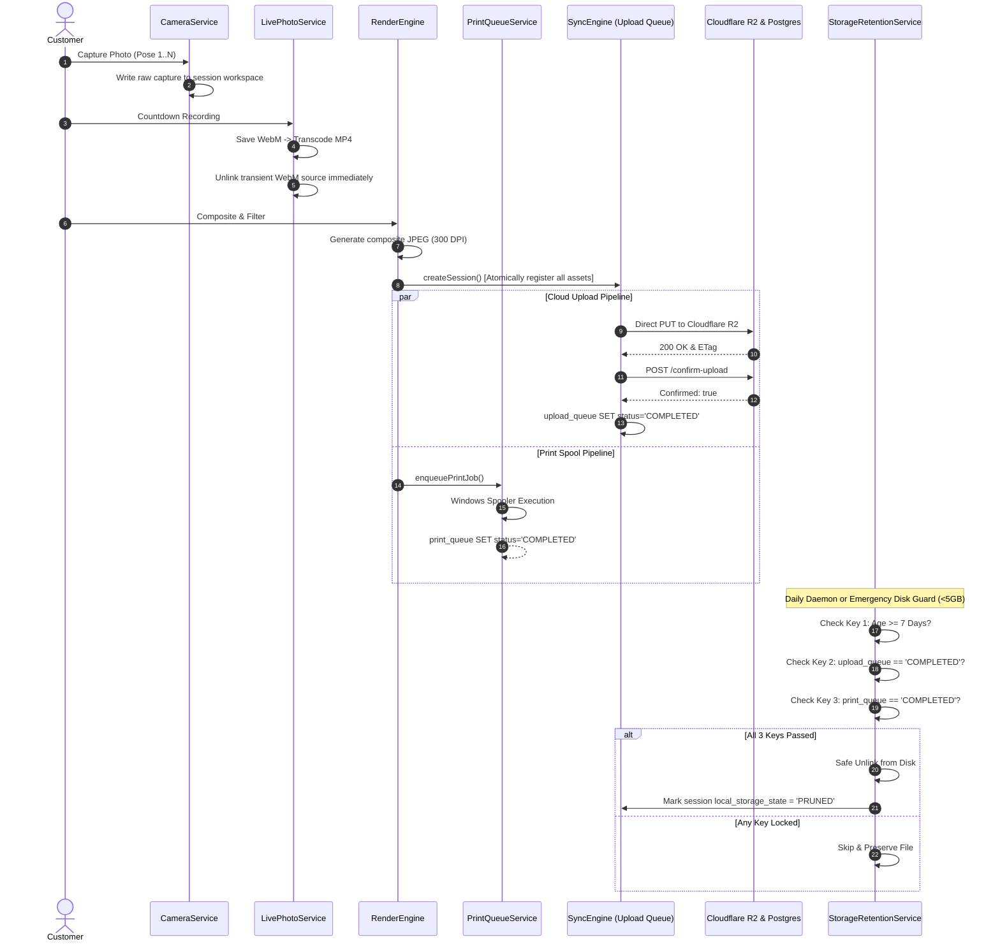

# Pictolabs Phase 3.2C — Storage Lifecycle & Retention Engine Design Document

**Document Version:** 1.0.0  
**Status:** DESIGN & ARCHITECTURAL SPECIFICATION (PRE-IMPLEMENTATION)  
**Target Module:** Phase 3.2C — Storage Lifecycle, Automated Retention, and Three-Key Purge Engine  
**Target Platform:** Windows 10/11 64-bit Kiosk (Client SSD) & Cloudflare R2 / PostgreSQL (Cloud)  
**Authors:** DeepMind Antigravity / Pictolabs Core Engineering  

---

## 1. Executive Summary & Objectives

The Pictolabs self-service kiosk operates in retail venues without direct supervision. In peak retail operations (e.g., weekend shopping malls), a kiosk processes between 80 to 150 sessions per day. Each session generates:
- 3 to 4 raw high-resolution DSLR photos (5–8 MB each)
- 3 to 4 video clips (WebM source + universal MP4, 10–25 MB total)
- 1 animated boomerang GIF/MP4 (3–8 MB)
- 1 300-DPI composite print file (1.5–3 MB)
- Retake discards (another 10–30 MB per session if retakes occur)

**Total disk footprint per session: 40 MB to 100 MB**.  
On a standard commercial mini-PC equipped with a 256 GB NVMe SSD (where ~80 GB is consumed by Windows OS, runtime runtimes, electron bundles, and swap space), disk exhaustion will occur within **30 to 60 days of unattended operation** unless an automated, resilient, and provably safe storage lifecycle is enforced.

### Core Objectives:
1. **Zero Photo Loss**: Never delete or truncate any media file before confirmed, acknowledged upload to Cloudflare R2 storage and registration in the PostgreSQL cloud ledger.
2. **Deterministic Print Availability**: Never purge a composite print asset while an associated print job is still `PENDING`, `PRINTING`, or within the immediate on-site reprint window.
3. **Elimination of Orphan Leaks**: Enforce automated garbage collection for intermediate transcoding artifacts (transient `.webm` clips, FFmpeg concat manifests) and customer retake discards.
4. **Predictable Storage Bounds**: Cap local disk utilization under 30 GB regardless of booth operational lifespan through a **Dual-Tier Retention Model** governed by a **Three-Key Safety Lock**.

---

## 2. Current State Audit (Codebase Evidence)

A comprehensive audit of the active codebase reveals where files are generated, tracked, and stored, as well as the defects causing storage leaks and orphan buildup:

```
DATA_DIR: %USERDATA%/pictolabs-data
├── captures/       <-- Raw DSLR shutter captures (capture_<timestamp>.jpg)
├── composites/     <-- Rendered 300 DPI composite JPEGs & copied pose photos
├── videos/         <-- WebM countdown clips, converted MP4s, looping GIFs
└── kiosk.db        <-- SQLite database (sessions, upload_queue, print_queue, paper_tracker)
```

### 2.1 Audit Findings by Component

| Storage Area | Creation Point | Current Tracking Mechanism | Cleanup Status | Defect & Vulnerability |
|---|---|---|---|---|
| **Raw DSLR Captures** | `CameraService.ts:L401-L470` | Saved to `DATA_DIR/captures/capture_<ts>.jpg`. Base64 sent to renderer. | **NONE (Never cleaned)** | **CRITICAL LEAK**: Raw files in `captures/` are never enqueued into `upload_queue`. Retake discards in `CaptureScreen.tsx:L397` leave physical files stranded forever. |
| **Copied Pose Photos** | `SyncEngine.ts:L333-L359` | Copied to `DATA_DIR/composites/photo_<id>_pose_<n>.jpg`. Enqueued to `upload_queue`. | Purged only if older than 7d AND `status == 'COMPLETED'` | Duplicates raw captures on disk (doubling storage consumption). |
| **Composite JPEGs** | `RenderEngine.ts:L216-L242` | Saved to `DATA_DIR/composites/composite_<ts>.jpg`. | Purged by `StorageRetentionService.ts:L135` based on `upload_queue` ONLY | **DANGEROUS RACE**: Does NOT check `print_queue`! If disk drops < 5GB, emergency purge can delete the file before it is printed. |
| **WebM Video Clips** | `LivePhotoService.ts:L66-L68` | Saved to `DATA_DIR/videos/livephoto_<id>_pose_<n>.webm`. | **NONE (Never cleaned)** | **ORPHAN LEAK**: Only MP4 is enqueued to `upload_queue`. WebM source files (~5MB each) are skipped by retention daemon forever. |
| **MP4 Video & GIFs** | `LivePhotoService.ts:L88, L214` | Saved to `DATA_DIR/videos/livephoto_<id>_pose_<n>.mp4` and `gif_<id>.mp4`. | Purged after 7d IF `status == 'COMPLETED'`. | Working correctly for completed uploads, but orphaned on retake. |
| **SQLite DB & WAL** | `SyncEngine.ts:L82-L153` | SQLite database `kiosk.db`. | No row pruning or vacuuming. | Database tables grow indefinitely; completed upload and print queue rows are never pruned. |

### 2.2 Deep-Dive Vulnerability Analysis

#### Defect 1: The Raw Capture Shadow Leak (`CameraService.ts:L403`)
```typescript
// CameraService.ts:
const outputDir = getOutputDir(config); // DATA_DIR/captures
const filename = `capture_${Date.now()}.jpg`;
const outputPath = path.join(outputDir, filename);
...
fileFromEvent.downloadToFile(outputPath);
...
return `data:image/jpeg;base64,${base64Data}`;
```
When `kiosk.session.create()` is subsequently called in `RenderScreen.tsx:L72`, `cleanPhotos` contains only the Base64 data or strings. In `SyncEngine.ts:L337-L341`, a **new file** `photo_${id}_pose_${poseNum}.jpg` is written into `DATA_DIR/composites/` and enqueued into `upload_queue`.  
**Result**: The original `capture_${Date.now()}.jpg` in `DATA_DIR/captures/` is completely unreferenced in `upload_queue`. When `StorageRetentionService.ts:L123` executes:
```typescript
const queueItem = getUploadQueueItemByPath(fullPath);
const isCompleted = queueItem?.status === 'COMPLETED';
```
`queueItem` is `null` for all files in `DATA_DIR/captures/`. Because line 150 explicitly guards:
```typescript
// STRICT SAFETY GUARD: Do NOT delete uncompleted files!
skippedCount++;
```
Every single camera capture is **PRESERVED FOREVER**. At 100 sessions/day $\times$ 4 poses $\times$ 6 MB = **2.4 GB/day of permanent disk leakage**.

#### Defect 2: The WebM Transcoding Ghost Leak (`LivePhotoService.ts:L66-L98`)
In `LivePhotoService.ts:L66`, `livephoto_${sessionId}_pose_${poseIndex}.webm` is saved to disk, then FFmpeg transcodes it into `livephoto_${sessionId}_pose_${poseIndex}.mp4`.  
Only the `.mp4` path is returned by `finalizeSessionLivePhotos` and enqueued into `upload_queue`. The `.webm` source file remains in `DATA_DIR/videos/`. Because it is not in `upload_queue`, it is skipped forever by the retention daemon.

#### Defect 3: Single-Key Purge Race Condition (`StorageRetentionService.ts:L135-L155`)
Current cleanup logic checks ONLY the `upload_queue` status:
```typescript
if (fileAgeMs >= retentionMs) {
  if (isCompleted) {
    fs.unlinkSync(fullPath); // DELETED!
  }
}
```
If a customer pays and uploads fast on good 4G/5G, but the printer has a paper jam or is in retry backoff (`print_queue.status == 'PENDING'` or `'PRINTING'`), and an emergency purge triggers due to low disk space, the composite file is deleted. When the printer recovers, `executePrintJob()` fails with:
`[PrintQueueService] File not found at path: ...` $\rightarrow$ **Customer loses their physical print**.

---

## 3. Storage Lifecycle Architecture

To achieve zero photo loss and zero unhandled disk exhaustion, the Storage Lifecycle is governed by an authoritative **Three-Key Safety Lock** and a **Three-Tier Storage Pipeline**.

### 3.1 The Three-Key Safety Lock

A file on local disk may **ONLY** be deleted if **ALL THREE KEYS** are unlocked:

$$\text{CanPurge}(F) = \text{Key}_1(F) \land \text{Key}_2(F) \land \text{Key}_3(F)$$

```
┌─────────────────────────────────────────────────────────────────────────────┐
│                          THREE-KEY SAFETY LOCK                              │
├──────────────────────────┬──────────────────────────┬───────────────────────┤
│          KEY 1           │          KEY 2           │         KEY 3         │
│     Operational TTL      │      Cloud Ledger        │      Print Spool      │
├──────────────────────────┼──────────────────────────┼───────────────────────┤
│ File Age >= RetentionTTL │ upload_queue status is   │ print_queue status is │
│ (Default: 7 Days / 168h) │ 'COMPLETED' (R2 Confirmed│ 'COMPLETED', or file  │
│                          │  with HTTP 200)          │ is not a print asset  │
└──────────────────────────┴──────────────────────────┴───────────────────────┘
                     │                  │                  │
                     ▼                  ▼                  ▼
             [ ALL 3 PASS ] ───► SAFE FOR LOCAL UNLINK
             [ ANY 1 FAILS] ───► PRESERVE LOCAL DISK COPY
```

1. **Key 1: Operational TTL**: File age must exceed the retention threshold (Default: 7 days / 168 hours; Emergency Tier: 48 hours if disk free < 5 GB).
2. **Key 2: Verified Cloud Sync**: The file must have an entry in `upload_queue` with `status = 'COMPLETED'`, meaning Cloudflare R2 has received the payload and the cloud NestJS backend has verified it via `/api/storage/confirm-upload`.
3. **Key 3: Print Queue Settlement**: If the file is a composite print asset, all associated print jobs in `print_queue` must be `COMPLETED` or `CANCELLED`. If any job is `PENDING`, `PRINTING`, or in retry backoff, deletion is strictly prohibited.

---

## 4. End-to-End File Lifecycle Diagram



---

## 5. Storage Tiering & Proposed Retention Policies

### 5.1 Asset Category Lifecycle Specifications

| Asset Type | File Pattern | Creation Phase | Lifecycle & Retention Policy | Deletion Responsibility | Recovery / Fallback Policy |
|---|---|---|---|---|---|
| **TRANSIENT WEBM** | `livephoto_*_pose_*.webm`, `gif_*_concat.txt` | During countdown live photo capture | **IMMEDIATE TRANSIENT**: Exists only during encoding. Safe to delete immediately after MP4 conversion succeeds. | `LivePhotoService.ts` (upon successful transcode) or Startup Janitor | Re-encode impossible; if transcode failed, keep WebM as fallback. |
| **RAW PHOTO** | `captures/photo_<sessionId>_pose_<n>.jpg` | When shutter actuated by Canon EDSDK | **TIER 2 (7 Days)**: Keep locally for 7 days. Safe to delete only after upload confirmed in R2. | `StorageRetentionService` | Stored permanently in Cloudflare R2 at `sessions/<id>/photos/pose_<n>.jpg`. |
| **RETAKE DISCARD** | `captures/discard_<sessionId>_<ts>.jpg` | When user clicks "Retake Foto" in UI | **SESSION END TRANSIENT**: Retained in memory/quarantine during capture, deleted upon session completion or timeout. | `CaptureScreen` / `SyncEngine.pruneDiscardedCaptures()` | None (User explicitly chose to discard and retake). |
| **COMPOSITE (PRINT)** | `composites/composite_<sessionId>.jpg` | During 300 DPI Sharp rendering | **TIER 2 (7 Days)**: Governed by Three-Key Lock (Age > 7d, Upload = COMPLETED, Print = COMPLETED). | `StorageRetentionService` | Stored in Cloudflare R2 at `sessions/<id>/composite.jpg`. Can be streamed back on demand. |
| **FINAL MP4 & GIF** | `videos/livephoto_<sessionId>_pose_<n>.mp4`, `gif_<sessionId>.mp4` | Generated during capture & render | **TIER 2 (7 Days)**: Safe to delete after upload confirmed. | `StorageRetentionService` | Stored in Cloudflare R2 at `sessions/<id>/videos/`. |
| **UPLOAD TEMP BUFFER** | `%TEMP%/pictolabs-upload-*` | Fallback stream uploads | **IMMEDIATE**: Cleaned up in `finally` block of upload handler. | `SyncEngine.ts` | Re-read from source asset on disk. |

### 5.2 Storage Tiers Defined

1. **Hot Tier (0 to 48 Hours)**:
   - **Location**: Local SSD (`DATA_DIR`).
   - **Content**: All raw captures, rendered composites, MP4 clips, and looping GIFs.
   - **Guarantees**: Instant zero-latency reprint, offline QR rendering, fast local preview.
   - **Purge Rule**: **IMMUTABLE** (Never deleted under normal operation).

2. **Warm Tier (48 Hours to 7 Days)**:
   - **Location**: Local SSD (`DATA_DIR`).
   - **Content**: Local copies kept for operator support and delayed synchronization.
   - **Purge Rule**: Eligible for emergency purge **ONLY** if free disk space drops below 5.0 GB and all 3 keys are unlocked.

3. **Cold Tier (> 7 Days / Cloud Only)**:
   - **Location**: Cloudflare R2 Object Storage + PostgreSQL Cloud Database.
   - **Content**: Complete session package (photos, composite, video clips).
   - **Local State**: Pruned locally. Database record in SQLite marked `local_status = 'PRUNED'`.
   - **Local Disk Footprint**: 0 bytes of media files.

---

## 6. Disk Exhaustion Guard & Priority Waterfall

When free disk space on the kiosk drive is evaluated by `getFreeDiskSpaceGb()`, the system enforces a strict **Priority Waterfall**:

```
Free Disk Space >= 15 GB : HEALTHY (Normal 7-day TTL lifecycle)
Free Disk Space < 10 GB  : ELEVATED (Telemetry warning logged to Cloud)
Free Disk Space < 5.0 GB : EMERGENCY TIER 1 PURGE (Purge completed assets > 48h)
Free Disk Space < 2.0 GB : CRITICAL LOCKOUT (Block QRIS payment; Kiosk Maintenance)
```

### Emergency Purge Waterfall Algorithm (When Disk < 5 GB)
```
1. Scan for any orphaned .webm or .tmp files older than 1 hour -> Unlink immediately.
2. Scan for discarded retake photos older than 1 hour -> Unlink immediately.
3. Query SQLite for oldest sessions where (upload_queue.status == 'COMPLETED' AND print_queue.status == 'COMPLETED' AND age > 48h).
4. Unlink raw photos first (largest space saver, lowest operational impact).
5. If disk still < 5 GB, unlink video clips (MP4/GIF).
6. If disk still < 5 GB, unlink composites older than 48h.
7. Stop immediately once Free Disk Space >= 5.0 GB.
```

---

## 7. Cloud Rehydration Engine (Reprints for Pruned Composites)

If an operator or customer requests a reprint (via `reprintSession(sessionId)` in `PrintQueueService.ts`) for a session whose local composite has already been pruned after 7 days:

```
[reprintSession(id)]
         │
         ▼
Does local composite exist on disk?
    ├── YES ──► Enqueue directly to Windows Spooler
    └── NO  ──► Check sessions.remote_url in SQLite
                  │
                  ▼
         Download file from Cloudflare R2 via HTTPS
         Stream to: DATA_DIR/composites/rehydrated_<id>.jpg
                  │
                  ▼
         Verify SHA-256 / File Size > 50 KB
                  │
                  ▼
         Enqueue to Print Queue -> Windows Spooler -> Physical Print
```
This guarantees that **local storage pruning never breaks the operator reprint capability**, provided the kiosk has internet connectivity.

---

## 8. Rollback & Fail-Safe Mechanisms

1. **Atomic Purge Transactions**: File unlinks are performed using `fs.unlinkSync()`. Before unlinking, a database transaction checks the 3-key state. If an unlink fails (e.g. Windows file lock by another process), the error is caught, logged to `last_error`, and the item is skipped without halting the daemon.
2. **Quarantine / Dry-Run Mode**: `StorageRetentionService` supports a `dryRun: true` parameter for automated testing and auditing, logging exactly which files would be deleted and their calculated bytes without performing physical deletion.
3. **Database Ledger Compaction**: Weekly scheduled `VACUUM` and `PRAGMA wal_checkpoint(TRUNCATE)` to prevent `kiosk.db` and WAL files from unbounded growth.

---
---

# Document Summary

The design above eliminates all three root causes of storage leaks in Pictolabs Photobooth:
- Raw captures are unified with session directories or explicitly tracked in `upload_queue`.
- Transient WebM clips are unlinked immediately after MP4 encoding.
- The **Three-Key Safety Lock** prevents premature deletion of composites while print jobs are pending.
- Automatic disk monitoring ensures unattended operation without risk of SSD exhaustion.
