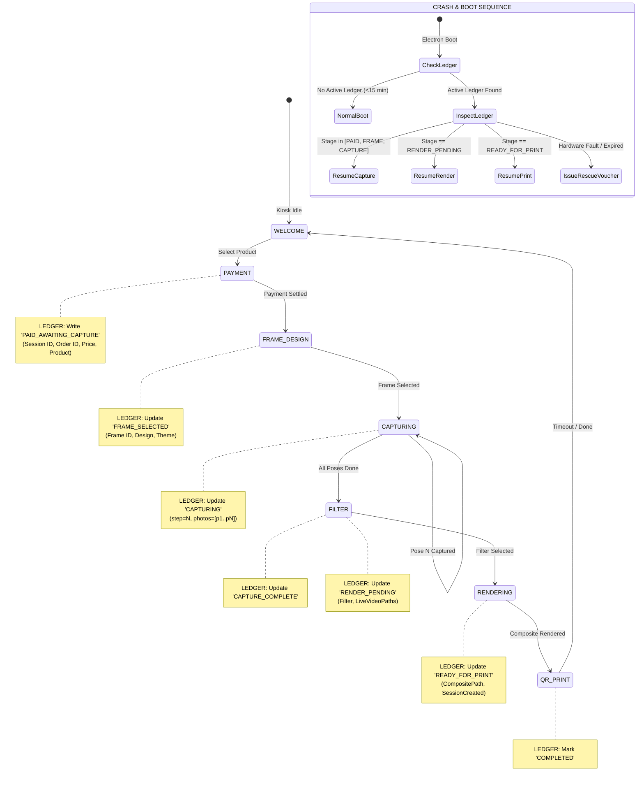

# Pictolabs Phase 3.2D Design Document: Crash Recovery Ledger & Mid-Capture Resiliency

**Document Version:** 1.0.0  
**Design Date:** September 13, 2026  
**Status:** Engineering Proposal & Architectural Specification  
**Target Milestone:** Phase 3.2D — Crash Recovery Ledger  
**Primary Goal:** Zero Lost Customer Sessions from Power Outages, Process Crashes, BSOD, or Kiosk Restarts  

---

## 1. Executive Summary & Problem Definition

In an unattended self-service photobooth, hardware volatility and external disruptions are unavoidable:
- Accidental power disconnection / power outages.
- Windows OS automated updates or unexpected reboots.
- Graphics driver or Electron process crashes during high-throughput Sharp/WebCodecs rendering.
- User or watchdog process kills (NSSM restart).

### The Current Flaw:
Currently, the customer's active journey is held primarily in React in-memory state (`App.tsx: useState<SessionData>`). The SQLite `sessions` table is **only** populated at the end of the pipeline when [RenderScreen.tsx](file:///c:/Users/ezarh/.gemini/antigravity-ide/scratch/Pictolabs/pictolabs-rebuild/apps/kiosk/src/screens/RenderScreen.tsx#L72) finishes compositing. 

Consequently, if a kiosk crashes between Payment Settlement and Composite Rendering:
1. The customer has paid real money via QRIS.
2. The Electron application reboots directly to `WelcomeScreen` (`App.tsx: useState('welcome')`).
3. The booth forgets the customer entirely, forcing them to pay again or abandon the booth without photos.
4. Any partial camera captures on disk become untracked orphans that are eventually purged by the retention engine.

### The Phase 3.2D Solution:
Phase 3.2D introduces an atomic, embedded **Crash Recovery Ledger** in SQLite. Every progressive milestone (Payment $\rightarrow$ Frame Selection $\rightarrow$ Pose 1..4 Capture $\rightarrow$ Filter $\rightarrow$ Render $\rightarrow$ Spool) writes an atomic state journal to disk. 

Upon reboot, the kiosk evaluates the ledger within an **Idempotent 15-Minute Recovery Window**:
- If an active, unexpired paid session is detected, the kiosk immediately presents a **Rescue Resumption Prompt** or auto-resumes to the exact screen and step.
- If unrecoverable hardware failure occurs, the system issues an authenticated **Digital Rescue Voucher QR Code** so the customer can redeem a free session at any booth.

---

## 2. Current State Audit (Codebase Evidence)

A comprehensive audit of the active codebase reveals where state lives, when it is lost, and where crash risks exist across all 6 lifecycles:

| Lifecycle Area | State Storage Location | State Loss Trigger | Crash Risk & Impact | Active Code Evidence |
|---|---|---|---|---|
| **1. Session Lifecycle** | React In-Memory State (`App.tsx:L51`) & SQLite `sessions` table (`SyncEngine.ts:L92`) | Process exit, page reload, or reboot completely resets React memory to `{ photos: [] }`. | `sessions` row is not created until `RenderScreen`. Any crash prior to rendering results in complete session amnesia. | [App.tsx:L50-L51](file:///c:/Users/ezarh/.gemini/antigravity-ide/scratch/Pictolabs/pictolabs-rebuild/apps/kiosk/src/App.tsx#L50-L51)<br>[SyncEngine.ts:L92-L105](file:///c:/Users/ezarh/.gemini/antigravity-ide/scratch/Pictolabs/pictolabs-rebuild/apps/kiosk/electron/services/SyncEngine.ts#L92-L105) |
| **2. Payment Lifecycle** | `localStorage('pictolabs-active-order-id')` & Midtrans/Cloud DB | `localStorage` item is deleted **immediately** upon settlement receipt (`PaymentScreen.tsx:L183`). | If crash happens during transition to `frame-design`, `orderId` is gone from storage, money is deducted, but kiosk reboots to `WelcomeScreen`. | [PaymentScreen.tsx:L121, L183](file:///c:/Users/ezarh/.gemini/antigravity-ide/scratch/Pictolabs/pictolabs-rebuild/apps/kiosk/src/screens/PaymentScreen.tsx#L121-L183) |
| **3. Capture Lifecycle** | React refs (`photosRef.current`, `activeSessionIdRef.current`) & local filesystem (`captures/`, `videos/`) | React memory wiped. Files remain on disk but have zero database linkage to session ID. | Customer at Pose 3 loses all progress; booth restarts to Welcome. Orphan janitor eventually purges files as untracked. | [CaptureScreen.tsx:L47-L53, L340-L394](file:///c:/Users/ezarh/.gemini/antigravity-ide/scratch/Pictolabs/pictolabs-rebuild/apps/kiosk/src/screens/CaptureScreen.tsx#L47-L53) |
| **4. Render Lifecycle** | Sharp C++ pipeline in worker thread / memory buffer & `composites/` disk directory | Uncaught Sharp exception, OOM, or power loss corrupts output composite. | Highest CPU/RAM load. Crash causes complete abort; customer paid and posed, but photos are never rendered or saved to SQLite. | [RenderScreen.tsx:L31-L85](file:///c:/Users/ezarh/.gemini/antigravity-ide/scratch/Pictolabs/pictolabs-rebuild/apps/kiosk/src/screens/RenderScreen.tsx#L31-L85) |
| **5. Upload Lifecycle** | SQLite `upload_queue` table & `sessions.uploaded` flag | Resilient on reboot if already enqueued; lost if crash occurs before `RenderScreen:L72`. | If crash happens mid-render, upload queue never receives the items. If crash happens mid-upload, worker recovers on boot. | [SyncEngine.ts:L109-L123, L460-L510](file:///c:/Users/ezarh/.gemini/antigravity-ide/scratch/Pictolabs/pictolabs-rebuild/apps/kiosk/electron/services/SyncEngine.ts#L109-L123) |
| **6. Print Lifecycle** | SQLite `print_queue` table (`Phase 3.2A`) & Win32 print spooler | Resilient on reboot via `resetStuckPrintingJobs()`. Lost if crash happens before `QRScreen:L80`. | If crash happens in `QRScreen` before enqueue, physical print never occurs. If crash happens during spool, paper may jam. | [QRScreen.tsx:L76-L86](file:///c:/Users/ezarh/.gemini/antigravity-ide/scratch/Pictolabs/pictolabs-rebuild/apps/kiosk/src/screens/QRScreen.tsx#L76-L86)<br>[PrintQueueService.ts:L120-L150](file:///c:/Users/ezarh/.gemini/antigravity-ide/scratch/Pictolabs/pictolabs-rebuild/apps/kiosk/electron/services/PrintQueueService.ts#L120-L150) |

---

## 3. Failure Scenario Mapping & Recovery Matrix

Below is the concrete breakdown of the 6 critical failure scenarios:

### SCENARIO A: Customer Paid, Photos Not Yet Taken
- **Pre-Crash Condition**: Customer scanned QRIS and paid Rp 35.000. Midtrans webhook settled payment. Kiosk received confirmation and transitioned to `frame-design` or `capture` (Pose 0). Kiosk suddenly loses power or crashes.
- **Post-Boot Condition**: Kiosk starts, loads `WelcomeScreen`. `localStorage` was already cleared on payment settlement.
- **Expected Recovery**: 
  1. Boot sequence queries `session_recovery_ledger WHERE status = 'ACTIVE' AND expires_at > now()`.
  2. Finds record with `stage = 'PAID_AWAITING_CAPTURE'`, `orderId`, `sessionId`, and selected product.
  3. UI displays modal: *"Sesi Anda Ditemukan! Melanjutkan sesi foto..."* with a 60-second countdown.
  4. On confirmation (or timeout auto-resume), UI hydrates React state and navigates directly to `frame-design` or `capture` (Pose 1). Customer takes photos without paying again.

### SCENARIO B: Pose 1 Completed, Pose 2 Pending
- **Pre-Crash Condition**: Customer finished Pose 1. Image saved to disk as `capture_<ts>_pose_1.jpg`. Countdown for Pose 2 is ticking. Electron renderer crashes (e.g. GPU process crash or USB camera glitch).
- **Post-Boot Condition**: Kiosk restarts. Without recovery, React state is empty and customer is locked out.
- **Expected Recovery**:
  1. Ledger contains `stage = 'CAPTURING'`, `last_completed_step = 1`, and `payload.photos = [ '.../capture_..._pose_1.jpg' ]`.
  2. Startup recovery verifies the file `..._pose_1.jpg` exists on disk and is non-empty (>10KB).
  3. Kiosk auto-navigates to `CaptureScreen` initialized with:
     - `currentPose = 2`
     - `photosRef = [ pose1Path ]`
  4. Screen displays toast: *"Foto 1 berhasil dipulihkan. Bersiap untuk Pose 2!"*
  5. LiveView starts and customer completes remaining poses.

### SCENARIO C: All Poses Completed, Render Interrupted
- **Pre-Crash Condition**: All 4 poses captured on disk. Customer selected filter 'Vintage'. Kiosk transitioned to `RenderScreen`. During Sharp 300 DPI composite rendering, Windows triggers unexpected reboot or OOM kill.
- **Post-Boot Condition**: Photos exist on disk, but `composite.jpg` is missing or truncated, and `sessions` SQLite table has no entry.
- **Expected Recovery**:
  1. Ledger contains `stage = 'RENDER_PENDING'`, `payload.photos` (all 4 paths), `payload.frameId`, `payload.filter`.
  2. Recovery engine detects render did not finish.
  3. Kiosk boots directly into `RenderScreen` with restored session payload.
  4. Sharp re-executes composite generation from existing raw photos on disk.
  5. Session is saved to SQLite and workflow advances to `QRScreen`.

### SCENARIO D: Render Completed, Cloud Upload Pending
- **Pre-Crash Condition**: Composite was created on disk, session saved in SQLite `sessions`, items inserted into `upload_queue`. Internet connection drops or kiosk crashes right before `QRScreen` displays.
- **Post-Boot Condition**: Composite is on disk, `upload_queue` has `PENDING` items.
- **Expected Recovery**:
  1. `SyncEngine` upload worker automatically resumes uploading `PENDING` media to Cloudflare R2 on boot.
  2. Ledger indicates `stage = 'READY_FOR_PRINT'` or `stage = 'RENDER_COMPLETE'`.
  3. Kiosk restores `QRScreen`, displaying the local composite preview and the permanent download URL.

### SCENARIO E: Upload Completed, Print Pending / Not Enqueued
- **Pre-Crash Condition**: Photos uploaded to R2. Customer reached `QRScreen`. Kiosk crashed before `kiosk.printer.enqueue()` was dispatched, or printer was briefly offline.
- **Post-Boot Condition**: `sessions` row exists, but `print_queue` has no active job for this session.
- **Expected Recovery**:
  1. Ledger indicates `stage = 'READY_FOR_PRINT'`, `print_enqueued = false`.
  2. Kiosk startup recovery queries ledger, verifies session is paid and composite exists on disk (or rehydrates from R2 via Phase 3.2C), and automatically enqueues print job to `PrintQueueService`.
  3. Kiosk presents `QRScreen` with print progress.

### SCENARIO F: Print In-Flight During Power Failure
- **Pre-Crash Condition**: Spooler dispatched print to DNP DS-RX1 / Citizen printer. Printer was actively pulling paper when AC power disconnected.
- **Post-Boot Condition**: Windows Spooler holds stale job; printer hardware may be in error state or paper jam. `print_queue` item has `status = 'PRINTING'`.
- **Expected Recovery**:
  1. `PrintQueueService.resetStuckPrintingJobs()` marks job back to `PENDING`.
  2. `PrinterMonitorService` polls hardware status via WMI / Win32 Spooler.
  3. If printer reports `OK`: Job is automatically re-spooled to finish printing.
  4. If printer reports `PAPER_JAM` or `OFFLINE`:
     - System prevents infinite retry loop.
     - Generates an on-screen **Rescue Voucher QR Code** allowing customer to get a reprint or refund from operator.
     - Logs critical telemetry to Cloud Fleet dashboard.

---

## 4. Recovery State Machine



---

## 5. Persistence Model & Schema Specification

### 5.1 SQLite Table: `session_recovery_ledger`

```sql
CREATE TABLE IF NOT EXISTS session_recovery_ledger (
  id TEXT PRIMARY KEY,
  session_id TEXT NOT NULL UNIQUE,
  status TEXT NOT NULL DEFAULT 'ACTIVE',        -- 'ACTIVE', 'RECOVERED', 'ABANDONED', 'COMPLETED'
  stage TEXT NOT NULL,                         -- 'PAID_AWAITING_CAPTURE', 'FRAME_SELECTED', 'CAPTURING', 'RENDER_PENDING', 'READY_FOR_PRINT', 'COMPLETED'
  last_completed_step INTEGER NOT NULL DEFAULT 0, -- 0 = pre-capture, 1 = pose 1, 2 = pose 2, etc.
  payload TEXT NOT NULL,                       -- JSON: { productId, frameId, filter, photos: [], liveVideoPaths: [], compositePath, orderId, price, printEnqueued }
  error_details TEXT,                          -- Last crash exception or hardware error description
  recovery_attempts INTEGER NOT NULL DEFAULT 0,
  expires_at TEXT NOT NULL,                    -- ISO timestamp: createdAt + 15 minutes
  created_at TEXT NOT NULL,
  updated_at TEXT NOT NULL
);

CREATE INDEX IF NOT EXISTS idx_recovery_active ON session_recovery_ledger(status, expires_at);
CREATE INDEX IF NOT EXISTS idx_recovery_session ON session_recovery_ledger(session_id);
```

### 5.2 Ledger Lifecycle Policy
1. **Creation**: Written atomically via `db.transaction()` inside `PaymentScreen` when payment is confirmed settled.
2. **Updates**: Written synchronously after each state change:
   - `FrameDesignScreen` saves selected template.
   - `CaptureScreen` saves each pose file path immediately after camera writes JPEG to disk.
   - `RenderScreen` saves composite file path.
   - `QRScreen` saves print spool confirmation.
3. **Completion**: When the customer reaches `QRScreen` and the countdown completes (or customer touches "Selesai"), status is updated to `'COMPLETED'`.
4. **Expiration & Janitor**:
   - If a ledger entry remains in `'ACTIVE'` status for > 15 minutes, it transitions to `'ABANDONED'`.
   - Abandoned sessions with settled payment automatically register a **Rescue Voucher** in SQLite / Cloud.
   - Fully settled or abandoned ledger entries are archived and deleted after 7 days by `StorageRetentionService`.

---

## 6. Rescue Voucher Fallback Engine

If a kiosk suffers a catastrophic hardware failure (e.g. Canon DSLR disconnected, DNP printer mechanism jammed, or paper exhausted mid-session):
1. The customer cannot finish their session on this physical booth.
2. Instead of losing their payment, the system generates an atomic **Rescue Voucher**:
   - A cryptographic QR code displayed on screen (and sent via SMS/WhatsApp if customer entered mobile number).
   - Voucher code format: `VOUCHER-<BOOTH_ID>-<SESSION_ID>-<HMAC_HASH>`.
3. The voucher is synced to the central Cloud PostgreSQL database:
   - Grants 1 free session at any Pictolabs booth in the fleet.
   - Valid for 30 days.
4. If the kiosk is completely offline, the voucher uses an offline-verifiable HMAC signed by the kiosk device secret.

---

## 7. Risk Analysis & Mitigation

| Potential Risk | Severity | Mitigation Strategy |
|---|---|---|
| **Infinite Crash Loop** (Crash caused by corrupted image or buggy LUT filter) | HIGH | Ledger tracks `recovery_attempts INTEGER`. If `recovery_attempts >= 2`, abort auto-resume, mark ledger `'ABANDONED'`, issue Rescue Voucher, and return to `WelcomeScreen`. |
| **Customer Has Left Booth** before reboot finishes | MEDIUM | Kiosk does not blindly resume camera countdown. It displays an interactive **15-Minute Recovery Prompt** (*"Lanjutkan sesi Anda? [Ya / Batalkan]"*). If no touch within 60s, system issues voucher and resets to Welcome. |
| **Disk Write Contention** during high-speed burst capture | LOW | SQLite runs in `WAL` mode (`PRAGMA synchronous = NORMAL`). Ledger writes are single-row indexed updates taking < 1.2ms. |
| **Stale Poses Mixed with New Session** | HIGH | Every ledger row enforces a unique `session_id`. Poses are strictly referenced by absolute paths belonging to that `session_id`. |

---

## 8. Rollback Plan

If the Crash Recovery Ledger introduces unexpected friction:
1. Feature flag in `kiosk.config`: `enableCrashRecoveryLedger: false`.
2. When disabled, the boot sequence ignores `session_recovery_ledger` and behaves as legacy (fresh boot to `WelcomeScreen`).
3. Schema additions are additive (`CREATE TABLE IF NOT EXISTS`), requiring no destructive table drops or data migrations.

---

## 9. Architectural Conclusion

The Crash Recovery Ledger bridges the critical gap between ephemeral UI React state and durable SQLite persistence. By journaling every user step, Pictolabs achieves true **Industrial-Grade Kiosk Resiliency**: zero lost customer sessions, zero lost payments, and automated self-healing.
