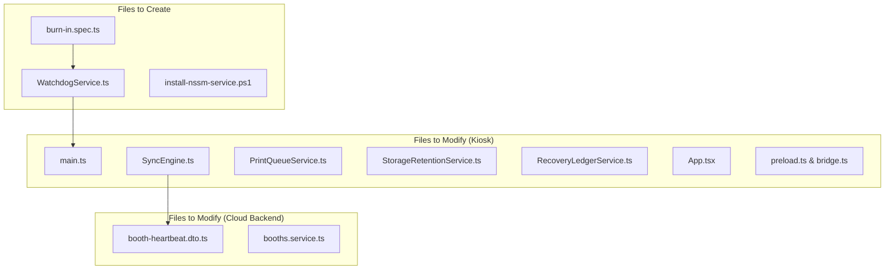

# Pictolabs Photobooth — Phase 3.2E Implementation Plan
**Document ID:** `DOC-P3.2E-IP-01`  
**Date:** September 13, 2026  
**Status:** DRAFT / AWAITING APPROVAL  
**Phase:** 3.2E Production Hardening & Watchdog Supervisor  
**Execution Guardrail:** DESIGN ONLY — NO CODE MODIFICATION PRIOR TO USER APPROVAL

---

## 1. Plan Overview & Objectives

This implementation plan outlines the exact engineering steps to implement the Watchdog Layer, self-healing remediation routines, and automated burn-in test harnesses specified in Phase 3.2E.

The objective is to harden the kiosk runtime against all edge cases identified in the Current Risk Audit without breaking existing APIs, database contracts, or user interfaces.

---

## 2. File Change Specifications



### 2.1. Files to Create

#### 1. `apps/kiosk/electron/services/WatchdogService.ts` [NEW]
- **Purpose:** Central internal supervisor daemon for Electron.
- **Responsibilities:**
  - Manages a high-priority 15-second supervision timer.
  - Monitors Upload Queue for stuck `'UPLOADING'` items and resets deadlocks.
  - Monitors Print Queue for stuck `'PRINTING'` items and terminates hung spooler child processes.
  - Checks V8 heap and RSS memory usage; runs garbage collection and flushes Sharp buffer caches.
  - Evaluates disk free space every 60 seconds; triggers emergency watermark purges.
  - Coordinates session inactivity timeouts with the renderer process.
  - Logs critical system events to SQLite `kiosk_system_events`.
  - Exposes IPC handlers: `watchdog:get-status`, `watchdog:pulse-activity`, `watchdog:trigger-healing`.

#### 2. `apps/kiosk/electron/services/burn-in.spec.ts` [NEW]
- **Purpose:** Automated endurance and fault-injection test suite.
- **Responsibilities:**
  - Implements Scenarios A through J from the Burn-In Test Plan.
  - Simulates 10, 50, and 100 consecutive session cycles.
  - Simulates upload queue burst under packet loss.
  - Simulates printer paper-out and mid-queue reload.
  - Simulates sudden process crash and restart recovery.
  - Validates recovery spam circuit breaker and voucher issuance.
  - Asserts zero photo loss, zero financial loss, and bounded memory growth.

#### 3. `scripts/install-nssm-service.ps1` [NEW]
- **Purpose:** Automated Windows Service installer using NSSM (Non-Sucking Service Manager).
- **Responsibilities:**
  - Registers `PictolabsKioskWatchdog` as an automatic Windows system service.
  - Sets restart delay to 3.5 seconds on unhandled crash or process kill.
  - Redirects stdout and stderr to `C:\Pictolabs\logs\service-watchdog.log`.
  - Configures environment variables and execution permissions.

---

### 2.2. Files to Modify

#### 1. `apps/kiosk/electron/main.ts` [MODIFY]
- **Changes:**
  - Import and initialize `initWatchdogService()` on startup.
  - Wire process-level crash traps:
    ```typescript
    process.on('uncaughtException', (err) => handleFatalCrash('uncaughtException', err));
    process.on('unhandledRejection', (reason) => handleFatalCrash('unhandledRejection', reason));
    mainWindow.webContents.on('render-process-gone', (_e, details) => handleRendererCrash(details));
    ```
  - Expose `--expose-gc` flag support to allow the memory watchdog to invoke `global.gc()`.
  - Register cleanup hooks in `before-quit` and `window-all-closed` (`stopWatchdogService()`).

#### 2. `apps/kiosk/electron/services/SyncEngine.ts` [MODIFY]
- **Changes:**
  - Enforce `AbortSignal.timeout(30000)` on all outgoing `fetch()` requests (lines 533, 554, 585, 624).
  - Add `resetUploadWorkerMutex()` to clear deadlocked `isUploading` flags.
  - Enrich `sendHttpHeartbeat()` payload with comprehensive system telemetry (memory, CPU, disk, queue depths, crash count, uptime).

#### 3. `apps/kiosk/electron/services/PrintQueueService.ts` [MODIFY]
- **Changes:**
  - In `executePrintJob()`, wrap print subprocess execution with a watchdog timeout guard.
  - Add `killHungPrintSubprocesses()` using Windows `taskkill` to clean up orphaned `rundll32.exe` instances.
  - Expose `reconcileStuckPrintingJobs()` to reset hung jobs older than 120 seconds back to `'PENDING'`.

#### 4. `apps/kiosk/electron/services/StorageRetentionService.ts` [MODIFY]
- **Changes:**
  - Change periodic interval to allow the Disk Watchdog to trigger `evaluateDiskWatermarks()` every 60 seconds.
  - Export `evaluateDiskWatermarks()` to provide immediate synchronous disk evaluations.

#### 5. `apps/kiosk/electron/services/RecoveryLedgerService.ts` [MODIFY]
- **Changes:**
  - Add periodic background sweeping of stale ledger entries (`expireStaleLedgerEntries()`) every 60 seconds so abandoned mid-sessions are retired without needing an Electron reboot.

#### 6. `apps/kiosk/src/App.tsx` & Renderer Screens [MODIFY]
- **Changes:**
  - Attach global user interaction listeners (`touchstart`, `pointerdown`, `mousemove`, `keydown`) that pulse `window.kiosk.watchdog.pulseActivity()` every 10 seconds.
  - Implement a 15-second Inactivity Warning Modal that chimes and asks *"Apakah Anda masih di sana?"* before navigating back to `WelcomeScreen`.

#### 7. `apps/kiosk/electron/preload.ts` & `src/types/bridge.ts` [MODIFY]
- **Changes:**
  - Expose `kiosk.watchdog` IPC bridge methods:
    ```typescript
    pulseActivity: () => void;
    getStatus: () => Promise<WatchdogStatusDTO>;
    ```

#### 8. `apps/backend/src/booths/dto/booth-heartbeat.dto.ts` & `booths.service.ts` [MODIFY]
- **Changes:**
  - Add optional telemetry fields to DTO: `memoryUsageMb`, `cpuPercent`, `diskFreeGb`, `uploadQueueDepth`, `printQueueDepth`, `paperRemaining`, `uptimeSeconds`.
  - In `booths.service.ts`, persist enriched telemetry into `BoothHealthLog` record upon heartbeat receipt.

---

## 3. Database & Migration Impact Analysis

### 3.1. Local SQLite Impact (Kiosk)
- **Table Creation:** `kiosk_system_events`
  ```sql
  CREATE TABLE IF NOT EXISTS kiosk_system_events (
    id TEXT PRIMARY KEY,
    event_type TEXT NOT NULL,
    severity TEXT NOT NULL, -- 'INFO' | 'WARN' | 'ERROR' | 'CRITICAL'
    component TEXT NOT NULL,
    details TEXT,
    created_at TEXT NOT NULL
  );
  CREATE INDEX IF NOT EXISTS idx_events_severity ON kiosk_system_events(severity);
  CREATE INDEX IF NOT EXISTS idx_events_created_at ON kiosk_system_events(created_at);
  ```
- **Migration Risk:** **ZERO**. New table is created with `IF NOT EXISTS` during `initDatabase()`. Existing tables (`sessions`, `upload_queue`, `print_queue`, `paper_tracker`, `session_recovery_ledger`) are not altered.
- **WAL Pragma:** Retains existing `WAL` journal mode and `NORMAL` synchronous mode.

### 3.2. Cloud PostgreSQL Impact (Backend)
- **Schema Changes:**
  - Existing Prisma schema already contains `model BoothHealthLog` with `rawPayload String?`, `cpuTemp Float?`, `paperCount Int?`, `printerState String?`.
  - Telemetry payload will be stored in `rawPayload` JSON without requiring an immediate database migration.
  - Optional: Future Prisma migration can promote high-frequency columns (`memoryUsageMb`, `diskFreeGb`) if querying performance requires indexing.

---

## 4. Verification & Testing Strategy

```
┌────────────────────────────────────────────────────────────────────────┐
│                        VERIFICATION GATES                              │
├───────────────────┬───────────────────┬────────────────────────────────┤
│ GATE 1: UNIT/E2E  │ GATE 2: SOAK TEST │ GATE 3: HARDWARE INJECTION     │
│ burn-in.spec.ts   │ 100 Continuous    │ Cut USB cable, pull Ethernet,  │
│ 100% assertions   │ Session Run       │ fill disk to 1.8 GB.           │
│ PASSED            │ Memory <450MB     │ Assert self-healing.           │
└───────────────────┴───────────────────┴────────────────────────────────┘
```

1. **Gate 1: Automated Unit & Simulation Suite (`burn-in.spec.ts`)**
   - Execute test suite covering Scenarios A through J.
   - Verify that all timeout aborts, mutex resets, and circuit breaker transitions execute correctly in under 60 seconds.
2. **Gate 2: 100-Session Endurance Soak Test**
   - Run automated headless session loop.
   - Measure memory usage at sessions 10, 25, 50, 75, 100.
   - Assert heap does not exceed 450 MB and RSS does not exceed 850 MB.
3. **Gate 3: Physical & Network Fault Injection**
   - Disconnect network for 30 minutes during active photo session $\implies$ verify store-and-forward.
   - Simulate out-of-paper hardware error $\implies$ verify queue pause and resumption upon paper refill.
   - Artificially fill disk space $< 2.0\text{ GB} \implies$ verify maintenance lockout.

---

## 5. Deployment & Rollout Strategy

1. **Step 1: Staging Lab Validation (Booth #1 Hardware)**
   - Deploy code to physical kiosk testbed.
   - Run 72-hour burn-in profile with physical DNP printer and Canon EOS DSLR.
2. **Step 2: Windows OS Shell & Service Installation**
   - Run `scripts/lockdown-kiosk.ps1` to harden Windows user session.
   - Run `scripts/install-nssm-service.ps1` to activate watchdog supervisor service.
3. **Step 3: Staged Production Pilot**
   - Deploy to Mall of Indonesia (MOI) Booth #1.
   - 24-hour monitored pilot run with on-site technician standby.
4. **Step 4: Fleet-Wide Release**
   - Activate over-the-air update channel for remaining fleet booths.

---

## 6. Implementation Readiness Summary

All architectural specifications, threshold definitions, fault injection matrices, and code blueprints are fully defined. Coding and source code modifications will commence strictly upon explicit user authorization.
