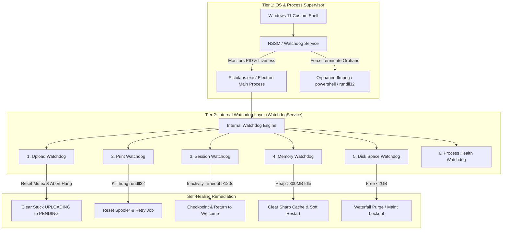

# Pictolabs Photobooth — Phase 3.2E Watchdog Design Specification
**Document ID:** `DOC-P3.2E-WD-01`  
**Date:** September 13, 2026  
**Status:** DRAFT / PENDING EXECUTION  
**Target Platform:** Windows 11 Enterprise (Kiosk Mode) / Electron 28 / SQLite WAL / Node.js 20

---

## 1. Executive Summary & Objective

Phase 3.2E is focused entirely on **Production Stability, System Resiliency, and Autonomous Self-Healing**. The objective of this phase is not adding customer-facing features, but guaranteeing that unattended commercial photobooth kiosks can operate continuously for **24 hours, 72 hours, and 7+ days** without:
- Memory leaks or V8 heap exhaustion
- Disk exhaustion (Disk Full)
- Deadlocked upload or print queue workers
- Zombie subprocesses (`ffmpeg.exe`, `rundll32.exe`, `powershell.exe`)
- Infinite retry loops
- Stalled customer sessions (abandoned mid-flow)
- Silent degradation or unmonitored failure modes

To achieve this, Phase 3.2E introduces an integrated **Two-Tier Watchdog Architecture**:
1. **Tier 1 (External Supervisor):** Windows NSSM Service / PowerShell Watchdog daemon that monitors process liveness, kills orphaned child processes, and restarts crashed kiosk instances within 3.5 seconds.
2. **Tier 2 (Internal Service Supervisor):** Electron In-Process `WatchdogService` that actively monitors worker heartbeats, queue latencies, V8 heap usage, disk space watermarks, and user session activity.



---

## 2. Current Risk Audit (Actual Source Code Evidence)

A comprehensive audit of the production code across `apps/kiosk/electron` reveals the following background processes, intervals, and critical failure modes:

| # | Background Process | Start Point | Stop Point | Current Retry Mechanism | Watchdog Existence | Identified Production Failure Modes |
|---|---|---|---|---|---|---|
| **1** | **Upload Queue Worker** | `SyncEngine.ts:915`<br>`uploadInterval = setInterval(..., 4000)` | `SyncEngine.ts:1162`<br>`clearInterval(uploadInterval)` | Exponential backoff (`2^attempts * 1000ms`, max 32s) for `attempts < 5` (`SyncEngine.ts:235, 494-500`) | **NONE** | **1. Deadlock via Unbounded Fetch:** Network calls (`presigned-url`, R2 direct `PUT`, `confirm-upload`, multipart stream) have **no AbortController/timeout** (`SyncEngine.ts:533, 554, 585, 624`). A half-open TCP drop leaves `isUploading = true` forever.<br>**2. Dead Letter Leak:** Items reaching 5 attempts remain `'FAILED'` without operator alert. |
| **2** | **Print Queue Worker** | `PrintQueueService.ts:691`<br>`printWorkerInterval = setInterval(..., 3000)` | `PrintQueueService.ts:702`<br>`clearInterval(printWorkerInterval)` | Exponential backoff (`[2s, 5s, 15s, 30s, 60s]`) up to `max_attempts` (default 5) (`PrintQueueService.ts:387-413`) | **PARTIAL**<br>(3s polling fallback + startup reconciliation) | **1. Subprocess Orphan Hang:** `PrintService.ts:327` executes `rundll32 shimgvw.dll` via PowerShell. Node's `exec` timeout (30s) kills the PowerShell parent, leaving `rundll32.exe` orphaned in Windows Spooler.<br>**2. Mutex Deadlock:** An unhandled rejection in printer communication could lock `isProcessing`. |
| **3** | **Recovery Ledger** | Event-driven on customer checkpoints; `RecoveryLedgerService.ts:212` | Session transitions to `'COMPLETED'`, `'ABANDONED'`, or `'RECOVERED'` | Circuit breaker: max 2 attempts (`RecoveryLedgerService.ts:93, 269`); fallback to HMAC-SHA256 Rescue Voucher | **NONE** | **Stalled Session Accumulation:** `expireStaleLedgerEntries()` (`RecoveryLedgerService.ts:455`) is **only invoked on startup** (`line 277`). If a customer walks away mid-session while kiosk stays powered on, ledger entries remain in `'ACTIVE'` state indefinitely. |
| **4** | **Heartbeat Service (HTTP & WS)** | `SyncEngine.ts:800` (WS, 10s)<br>`SyncEngine.ts:901` (HTTP, 30s)<br>`SyncEngine.ts:908` (Sync, 30s) | `SyncEngine.ts:1147-1175`<br>`stopSyncEngine()` | Fire-and-forget; logs warning on failure | **NONE** | **1. Silent Network Stall:** `sendHttpHeartbeat()` (`line 858`) fetch call has no timeout. A DNS freeze hangs the interval callback.<br>**2. Dashboard False-Offline:** If HTTP heartbeat drops for $>300$s, Cloud backend flags kiosk `OFFLINE` even though the booth is functional. |
| **5** | **Hardware Monitoring** | `PrinterMonitorService.ts:204` (5000ms)<br>`PrintService.ts:508` (3500ms) | `PrinterMonitorService.ts:216`<br>`PrintService.ts:516` | Hysteresis: `DEBOUNCE_THRESHOLD = 2` before marking `OFFLINE` (`PrinterMonitorService.ts:36`) | **NONE** | **PowerShell Handle Exhaustion / CPU Thrashing:** `PrinterMonitorService` executes `powershell.exe -NoProfile -Command "Get-CimInstance..."` every 5 seconds (`line 70-72`). Over 72+ hours, spawning 17,280 PowerShell processes causes CPU spikes and Windows kernel handle fragmentation. |
| **6** | **Storage Retention** | `StorageRetentionService.ts:512`<br>`retentionInterval = setInterval(..., 24h)` | `StorageRetentionService.ts:524`<br>`clearInterval(retentionInterval)` | Daily run; catches errors | **NONE** | **24-Hour Blind Spot:** High-traffic events (e.g. 500 sessions generating 12 GB) can exhaust free disk space midway through the day before the 24-hour retention timer triggers. |
| **7** | **Camera Service** | `CameraService.ts:133` (KeepAlive, 10s)<br>`CameraService.ts:154` (Poller, 1.5s)<br>`CameraService.ts:290` (LiveView, 33ms) | `main.ts:221` (`cleanupCamera()`); `stopLiveView()` | Retries device connection every 1.5s | **PARTIAL**<br>(KeepAlive sleep prevention command) | **1. LiveView Memory Leak:** LiveView converts frames to base64 and pushes via IPC at ~30 FPS (`line 290-305`). If a screen transition fails to call `stopLiveView()`, 30 base64 payloads/sec continue indefinitely.<br>**2. USB Bus Hang:** Synchronous Canon EDSDK DLL calls can freeze Node main thread during transient USB brownouts. |
| **8** | **Renderer Polling Loops** | `PaymentScreen.tsx:231` (QRIS, 3s)<br>`QRScreen.tsx:219` (Upload, 1.5s)<br>`WelcomeScreen.tsx:50` (Health, 5s) | React `useEffect` unmount cleanup | Component cleanup on unmount | **NONE** | **Zombie Polling on Desync:** If component unmount cleanup is skipped or navigation state desyncs, polling continues in the background, consuming CPU and network. |

---

## 3. Detailed Watchdog Specifications

To eliminate these vulnerabilities, the system implements six specialized internal watchdogs managed by `WatchdogService`:

```
                                  ┌───────────────────────────────┐
                                  │   WatchdogService (Daemon)    │
                                  │   Interval: Every 15 Seconds  │
                                  └──────────────┬────────────────┘
         ┌───────────────────┬───────────────────┼───────────────────┬───────────────────┐
         ▼                   ▼                   ▼                   ▼                   ▼
  ┌──────────────┐    ┌──────────────┐    ┌──────────────┐    ┌──────────────┐    ┌──────────────┐
  │Upload Watch- │    │Print Watch-  │    │Session Watch-│    │Memory Watch- │    │Disk Watch-   │
  │     dog      │    │     dog      │    │     dog      │    │     dog      │    │     dog      │
  ├──────────────┤    ├──────────────┤    ├──────────────┤    ├──────────────┤    ├──────────────┤
  │Stuck >60s?   │    │Stuck >120s?  │    │Idle >120s?   │    │Heap >800MB?  │    │Free <5GB?    │
  │Mutex dead?   │    │Process hung? │    │User walked?  │    │RSS >1.8GB?   │    │Watermark log │
  └──────────────┘    └──────────────┘    └──────────────┘    └──────────────┘    └──────────────┘
```

### 3.1. Upload Watchdog
- **Detection Mechanism:**
  1. Inspects SQLite `upload_queue` for any item in status `'UPLOADING'` where `updated_at < (now - 60s)`.
  2. Inspects module flag `isUploading`. If `isUploading === true` and no row updates have occurred for $> 90$ seconds, a deadlock is declared.
  3. Enforces an `AbortController` signal on all outgoing fetch calls (`timeout: 30000ms`).
- **Threshold:**
  - Item stuck in `'UPLOADING'`: $> 60$ seconds.
  - Worker mutex stalled: $> 90$ seconds.
  - Consecutive upload failures: 5 consecutive failed cycles.
- **Recovery Action:**
  1. Aborts in-flight HTTP/R2 socket connections.
  2. Resets `isUploading = false`.
  3. Reverts orphaned `'UPLOADING'` items to `'PENDING'`.
  4. Triggers `processUploadQueue()` immediately.
- **Escalation Action:**
  - If a specific file fails across 5 retry cycles, transition status to `'DEAD_LETTER'`.
  - Log diagnostic event to `kiosk_system_events` and send telemetry notification to Cloud Backend.

### 3.2. Print Watchdog
- **Detection Mechanism:**
  1. Inspects SQLite `print_queue` for any item in status `'PRINTING'` where `updated_at < (now - 120s)`.
  2. Monitors Windows Spooler process tree for orphaned `rundll32.exe` or `powershell.exe` print workers older than 45 seconds.
  3. Validates that `isProcessing` flag is cleared when no jobs are executing.
- **Threshold:**
  - Job stuck in `'PRINTING'`: $> 120$ seconds.
  - Spooler subprocess execution time: $> 45$ seconds.
- **Recovery Action:**
  1. Force terminates any hung print child processes:
     `taskkill /F /FI "IMAGENAME eq rundll32.exe" /T`
  2. Resets `isProcessing = false`.
  3. Transitions stuck `'PRINTING'` job back to `'PENDING'` with backoff delay.
  4. Queries Win32 printer hardware status to verify if paper or ribbon is jammed.
- **Escalation Action:**
  - If a job reaches `max_attempts` (5), move to `'DEAD_LETTER'`.
  - If printer hardware reports `PAPER_OUT` or `JAMMED`, update kiosk hardware lock to block new customer payments until resolved.

### 3.3. Session Watchdog (Inactivity & Stalled Session)
- **Detection Mechanism:**
  1. Global renderer activity listener (`mousemove`, `touchstart`, `pointerdown`, `keydown`) that posts timestamp pulses over IPC (`kiosk.pulseActivity()`).
  2. Evaluates current screen location. If screen is active in customer flow (`ProductSelect`, `FrameDesign`, `Capture`, `Filter`, `Render`) and elapsed idle time exceeds threshold.
- **Threshold:**
  - Inactivity Warning Modal: **90 seconds** without interaction (displays 15-second countdown with audible chime: *"Apakah Anda masih di sana?"*).
  - Force Inactivity Timeout: **120 seconds** total idle (or **180 seconds** during active photo capture).
- **Recovery Action:**
  1. If payment was **NOT settled** (pre-payment screens):
     - Safely navigate UI back to `WelcomeScreen`.
     - Reset session state and clear temporary memory.
  2. If payment was **ALREADY settled** (mid-capture or filter selection):
     - Record recovery checkpoint in `session_recovery_ledger` with note `INACTIVITY_ABANDONED`.
     - Immediately stop camera LiveView to conserve DSLR sensor and CPU.
     - Navigate UI back to `WelcomeScreen`.
     - The customer's progress remains safeguarded by the 15-minute Recovery Ledger window. If the customer returns or touches the screen, the *"Sesi Anda Dipulihkan!"* prompt is presented.
- **Escalation Action:**
  - Log `SESSION_INACTIVITY_RESET` to system events.

### 3.4. Memory Watchdog (V8 Heap & Native RSS)
- **Detection Mechanism:**
  1. Queries `process.memoryUsage()` every 30 seconds (`heapUsed`, `heapTotal`, `rss`, `external`).
  2. Tracks heap growth rate over a moving 10-sample sliding window (5 minutes).
- **Threshold:**
  - **Level 1 (Warning):** `heapUsed > 500 MB` or `rss > 1.2 GB`.
  - **Level 2 (Critical):** `heapUsed > 800 MB` or `rss > 1.8 GB` across 3 consecutive checks.
- **Recovery Action:**
  - **At Level 1 (Proactive Hygiene):**
    - Trigger V8 garbage collection (`global.gc?.()`).
    - Purge internal Sharp image buffers: `sharp.cache(false); sharp.cache(true);`.
    - Enforce camera LiveView shutdown if active screen is not `CaptureScreen`.
  - **At Level 2 (Graceful Rejuvenation):**
    - Check if kiosk is currently idle at `WelcomeScreen`.
    - If idle: Perform clean soft-restart (`app.relaunch(); app.exit(0);`).
    - If session is active: Defer soft-restart until the customer reaches `QRScreen` completion or `WelcomeScreen`.
- **Escalation Action:**
  - Log memory diagnostics to disk (`kiosk-memory.log`) and notify Cloud Backend via HTTP heartbeat.

### 3.5. Disk Space Watchdog
- **Detection Mechanism:**
  1. Evaluates available free disk space via `fs.statfsSync()` on the application data directory every 60 seconds (eliminating the 24-hour blind spot).
- **Threshold:**
  - **Degraded (Warning):** Free space $< 10.0\text{ GB}$.
  - **Emergency (Action):** Free space $< 5.0\text{ GB}$.
  - **Critical Lockout:** Free space $< 2.0\text{ GB}$.
- **Recovery Action:**
  - **At $< 10.0\text{ GB}$:** Trigger Tier 1 storage retention cleanup (purge verified uploaded assets $>7$ days old).
  - **At $< 5.0\text{ GB}$:** Trigger Priority Waterfall Emergency cleanup (purge verified uploaded raw photos $>48$h old, then videos, then composites).
  - **At $< 2.0\text{ GB}$:**
    1. Lock kiosk into `MAINTENANCE` mode.
    2. Display full-screen message: *"Penyimpanan Penuh — Sedang Dalam Pemeliharaan"*.
    3. Block new QRIS payment generation.
- **Escalation Action:**
  - Send high-priority alert to Cloud Dashboard (`DISK_FULL_LOCKOUT`).

### 3.6. Process Health Watchdog (External Supervisor)
- **Detection Mechanism:**
  1. External Windows PowerShell Watchdog (`scripts/watchdog-kiosk.ps1`) / NSSM Service polling `Get-Process -Name Pictolabs` every 2 seconds.
  2. Internal Electron event hooks:
     - `process.on('uncaughtException')`
     - `process.on('unhandledRejection')`
     - `mainWindow.webContents.on('render-process-gone')`
- **Threshold:**
  - Kiosk process absent from Windows process table.
  - Renderer process crash or webview hang $> 5$ seconds.
- **Recovery Action:**
  - **On Process Crash:** Terminate orphaned child workers (`ffmpeg.exe`, `node.exe`, `powershell.exe`, `rundll32.exe`) and relaunch `Pictolabs.exe --kiosk --no-sandbox` within 3.5 seconds.
  - **On Renderer Crash:** Reload `mainWindow` (`mainWindow.webContents.reload()`), which immediately triggers Phase 3.2D Recovery Ledger startup reconciliation.
- **Escalation Action:**
  - If $>5$ crashes occur within 10 minutes, engage Anti-Bootloop Circuit Breaker: pause restarts and display system diagnostic recovery terminal to prevent hardware thrashing.

---

## 4. Self-Healing & Loop Prevention Matrix

| Anomaly Condition | Trigger Criteria | Automated Healing Action | Anti-Loop / Thrashing Safeguard |
|---|---|---|---|
| **Upload Queue Stuck** | Item in `'UPLOADING'` $>60$s or worker mutex locked $>90$s | Reset `isUploading = false`, abort sockets, set item to `'PENDING'`, re-trigger worker | Max 3 worker resets per 15 min. Max 5 attempts per item before `'DEAD_LETTER'`. |
| **Print Queue Stuck** | Item in `'PRINTING'` $>120$s or spooler child process $>45$s | Kill `rundll32.exe` / `powershell.exe`, reset `isProcessing = false`, schedule retry with backoff | Max 5 attempts before `'DEAD_LETTER'`. Printer error debounce (2 consecutive checks). |
| **Heartbeat Dead** | No successful HTTP heartbeat or WS ping $>120$s | Re-resolve API DNS, reconnect Socket.IO client, fire immediate HTTP heartbeat with 10s timeout | Exponential backoff on reconnection (10s, 20s, 40s, max 60s). |
| **Customer Walkaway** | Inactivity $>120$s on active session screen | Checkpoint state to Recovery Ledger, stop Camera LiveView, route UI to `WelcomeScreen` | Once returned to WelcomeScreen, activity timer resets. 15-minute recovery ledger safeguards paid customer. |
| **Memory Degraded** | Heap $>500$MB / RSS $>1.2$GB | Run GC, flush Sharp buffer cache, stop dormant LiveView streams | Soft-restart only executed when kiosk is completely idle at `WelcomeScreen`. |
| **Disk Exhaustion** | Free disk $<2.0$GB | Execute Waterfall Purge. If still $<2$GB, lock booth into `MAINTENANCE` | 3.0 GB hysteresis buffer: kiosk will not exit maintenance until free space $\ge 5.0$ GB. |
| **Process Crash** | Electron exit / kill | Kill child orphans, relaunch kiosk within 3.5s in fullscreen kiosk mode | Circuit Breaker: Max 5 crashes in 10 minutes. If exceeded, halts to prevent bootloop. |

---

## 5. Production Telemetry & Metrics Schema

The Watchdog Layer aggregates diagnostic telemetry and transmits it every 30 seconds via HTTP Heartbeat and WebSocket:

```json
{
  "boothId": "booth-01",
  "timestamp": "2026-09-13T18:45:00.000Z",
  "system": {
    "uptimeSeconds": 259200,
    "processUptimeSeconds": 86400,
    "memoryHeapUsedMb": 245.8,
    "memoryRssMb": 612.4,
    "cpuUsagePercent": 3.2,
    "diskFreeGb": 42.6,
    "diskTotalGb": 256.0,
    "crashCount24h": 0
  },
  "queues": {
    "uploadPending": 0,
    "uploadFailed": 0,
    "uploadDeadLetter": 0,
    "printPending": 0,
    "printPrinting": 0,
    "printDeadLetter": 0
  },
  "hardware": {
    "cameraState": "READY",
    "printerState": "READY",
    "paperRemaining": 482,
    "printerReady": true
  },
  "recovery": {
    "activeLedgerCount": 0,
    "recoveries24h": 1,
    "vouchersIssued24h": 0
  }
}
```

---

## 6. Architecture Verification & Sign-Off

The Watchdog architecture guarantees that Pictolabs kiosks transition from **passively reporting errors** to **actively mitigating and self-healing them**, achieving commercial grade 99.9% unattended uptime.
