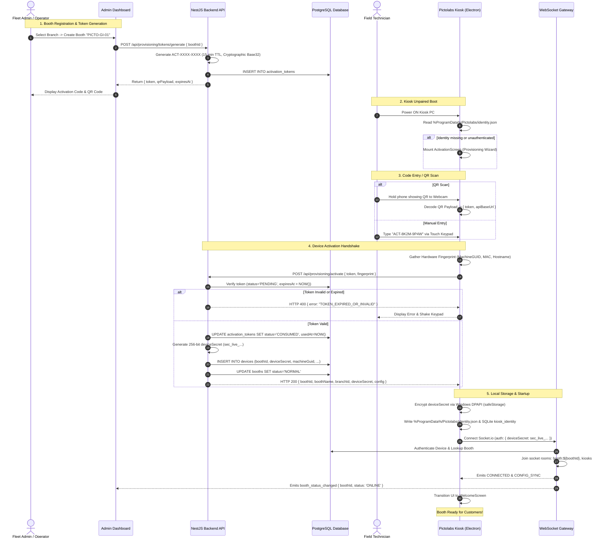

# Phase 3.3: Booth Activation Flow & Deployment SOP

**Document Version:** 1.0.0  
**Date:** September 13, 2026  
**Status:** Operational Protocol & API Specification  
**Target Milestone:** Standardized Field Deployment & Fleet Operations  

---

## 1. End-to-End Activation Sequence

The diagram below illustrates the complete lifecycle of provisioning a photo booth from the Admin Dashboard to an active, operational kiosk in the field.



---

## 2. API Endpoints Specification

### 2.1 Generate Activation Token
- **Endpoint**: `POST /api/provisioning/tokens/generate`
- **Access**: Restricted (`Roles: SUPER_ADMIN, FLEET_MANAGER`)
- **Request Body**:
  ```json
  {
    "boothId": "bth_9a8b1c2d-3e4f-5a6b-7c8d-9e0f1a2b3c4d",
    "ttlMinutes": 15
  }
  ```
- **Response** (HTTP 201):
  ```json
  {
    "success": true,
    "token": "ACT-8K2M-9P4W",
    "boothId": "bth_9a8b1c2d-3e4f-5a6b-7c8d-9e0f1a2b3c4d",
    "boothName": "Grand Indonesia - Booth 01",
    "branchName": "Grand Indonesia",
    "expiresAt": "2026-09-13T10:30:00.000Z",
    "qrPayload": "pictolabs://activate?token=ACT-8K2M-9P4W&api=https%3A%2F%2Fapi.pictolabs.id"
  }
  ```

### 2.2 Activate Kiosk (Device Handshake)
- **Endpoint**: `POST /api/provisioning/activate`
- **Access**: Public (Protected by Token Entropy + Rate Limiter)
- **Rate Limit**: Maximum 5 attempts per IP per 15 minutes.
- **Request Body**:
  ```json
  {
    "token": "ACT-8K2M-9P4W",
    "deviceFingerprint": {
      "machineGuid": "d3b07384-d113-40f2-b7e6-c73e04cf4c89",
      "macAddress": "00:1A:2B:3C:4D:5E",
      "hostname": "PICTO-BOOTH-01",
      "osVersion": "Windows 11 Pro 23H2",
      "electronVersion": "34.3.0",
      "appVersion": "1.0.0"
    }
  }
  ```
- **Response** (HTTP 200):
  ```json
  {
    "success": true,
    "boothId": "bth_9a8b1c2d-3e4f-5a6b-7c8d-9e0f1a2b3c4d",
    "boothName": "Grand Indonesia - Booth 01",
    "branchId": "brn_5e6f7a8b-9c0d-1e2f-3a4b-5c6d7e8f9a0b",
    "branchName": "Grand Indonesia",
    "companyId": "cmp_11223344-5566-7788-99aa-bbccddeeff00",
    "location": "Jakarta Pusat",
    "deviceSecret": "sec_live_9f83ac2748b910e5d4a6f81029384756c9a8b7d6e5f4a3b2c1d0e9f8a7b6c5d4",
    "config": {
      "price": 35000,
      "countdown": 5,
      "timeout": 120,
      "paperWarningThreshold": 10,
      "paperLockoutThreshold": 2
    }
  }
  ```

### 2.3 Re-Pair Hardware (Laptop Swap)
- **Endpoint**: `POST /api/provisioning/re-pair`
- **Access**: Restricted (`Roles: SUPER_ADMIN, FLEET_MANAGER`)
- **Description**: Generates a re-pairing token for an existing Booth whose hardware was damaged or upgraded. Automatically revokes the previous device secret upon activation of the new terminal.

### 2.4 Revoke Device (Security Emergency)
- **Endpoint**: `POST /api/provisioning/devices/:deviceId/revoke`
- **Access**: Restricted (`Roles: SUPER_ADMIN`)
- **Action**: Marks device status `REVOKED`, severs active WebSocket connection, and permanently rejects subsequent heartbeat/sync attempts with HTTP 401 `DEVICE_REVOKED`.

---

## 3. Standard Operating Procedures (Field Deployment SOPs)

### Scenario A: Installing Booth Pertama (Brand New Location)
1. **HQ Pre-Registration**:
   - Operator logs into Admin Dashboard $\to$ "Fleet" $\to$ "Branches" $\to$ selects "Grand Indonesia".
   - Clicks "+ Add Booth" $\to$ inputs name `"PICTO-GI-01"`, chooses pricing template (Rp 35.000).
   - Clicks "Generate Activation Code" $\to$ System shows code `ACT-8K2M-9P4W` and displays QR code.
2. **On-Site Physical Setup**:
   - Field technician installs booth chassis, mounts Canon DSLR, DNP printer, touch screen, and kiosk PC.
   - Connects power and LAN / 4G router.
   - Powers on Windows 11 Kiosk PC.
3. **App Launch & Provisioning**:
   - Kiosk automatically boots Pictolabs app in full-screen.
   - App detects no local identity file $\to$ Displays **ActivationScreen**.
   - Technician presses "Scan QR" and holds phone QR to the booth webcam, or types code via on-screen keypad.
   - Kiosk calls `POST /api/provisioning/activate`.
4. **Acceptance Verification**:
   - Kiosk confirms: `"Aktivasi Berhasil: Grand Indonesia - Booth 01"`.
   - UI transitions to `WelcomeScreen`.
   - Admin Dashboard immediately changes booth badge from `UNPROVISIONED` to `ONLINE` (Green).
   - Technician performs one sandbox test session: camera liveview, test capture, test print.
   - Technician signs off installation checklist.

---

### Scenario B: Installing Booth Kedua (Same Location or New City)
1. **Independence Assurance**:
   - HQ creates separate Booth `"PICTO-TP-01"` under "Tunjungan Plaza Surabaya".
   - Generates independent activation code `ACT-4N7Q-8X1L`.
2. **Kiosk Provisioning**:
   - Technician at Surabaya inputs `ACT-4N7Q-8X1L` on Booth #2.
   - Backend assigns unique `deviceSecret` bound to Booth #2's MachineGUID.
3. **Zero-Crosstalk Verification**:
   - Both booths connect to WebSocket gateway.
   - Booth #1 joins `booth:bth_gi01`.
   - Booth #2 joins `booth:bth_tp01`.
   - Payments, heartbeats, and printer paper roll counts remain 100% isolated.

---

### Scenario C: Replacing Laptop Rusak (Hardware Failure Swap)
1. **Failure Vector**: Kiosk PC motherboard in Booth #1 fails completely or SSD dies.
2. **Objective**: Replace PC with a fresh backup laptop without losing Booth #1's sales history, accumulated sessions, active paper counter, or customer vouchers.
3. **Field SOP**:
   - Technician replaces physical laptop inside the cabinet with fresh backup unit.
   - HQ Admin opens Dashboard $\to$ "Fleet" $\to$ locates `"PICTO-GI-01"`.
   - Clicks **"Hardware Maintenance"** $\to$ **"Swap Device"**.
   - System generates single-use swap token `ACT-SWAP-9921`.
   - Technician boots new laptop $\to$ inputs `ACT-SWAP-9921`.
   - Backend automatically:
     1. Marks old laptop's `Device` as `DECOMMISSIONED`.
     2. Revokes old `deviceSecret`.
     3. Binds new laptop's MachineGUID to `"PICTO-GI-01"`.
     4. Transmits full booth state and configuration to new laptop.
   - New laptop immediately resumes as `"PICTO-GI-01"`. Zero database surgery required.

---

### Scenario D: Transferring Booth to Another Location (Branch Relocation)
1. **Context**: Booth `"PICTO-GI-01"` is relocated from Grand Indonesia (Jakarta) to Kota Kasablanka (Jakarta Selatan).
2. **Field SOP**:
   - Physical unit is transported and plugged in at new mall.
   - **No software re-installation or re-activation is needed!**
   - HQ Admin opens Dashboard $\to$ Booth Details $\to$ **"Transfer Location"**.
   - Selects new Branch: `"Kota Kasablanka"`.
   - Backend updates `booth.branchId`.
   - Backend emits `CONFIG_UPDATE` over WebSocket to the live kiosk.
   - Kiosk updates its local metadata in background. Customer receipts and QRIS merchant references automatically align to the new branch.

---

### Scenario E: Revoking Compromised / Stolen Device (Security Incident)
1. **Context**: Physical booth broken into, or technician's laptop stolen.
2. **Immediate HQ Action**:
   - Admin opens Dashboard $\to$ Booth Details $\to$ **"Emergency Revoke Device"**.
   - Enters Admin confirmation password.
3. **Backend Enforcement**:
   - `Device.status` set to `REVOKED`.
   - `Device.deviceSecret` immediately blacklisted in memory cache.
   - Active WebSocket connection terminated with reason `DEVICE_REVOKED`.
4. **Kiosk Enforcement**:
   - If device is booted by thief and connects to internet:
     - Next heartbeat or sync returns HTTP 401 `DEVICE_REVOKED`.
     - Kiosk Electron main process triggers cryptographic wipe:
       - Deletes `%ProgramData%/Pictolabs/identity.json`.
       - Drops SQLite `kiosk_identity`.
       - Wipes cached payment tokens.
     - App drops back to locked `ActivationScreen`. No customer or financial data is exposed.
