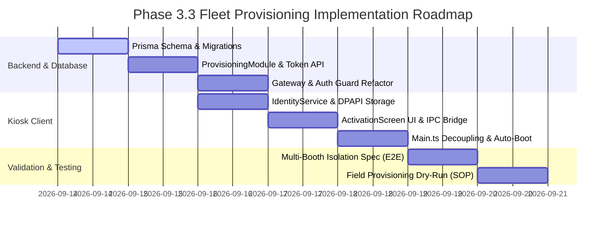

# Phase 3.3: Implementation Plan — Fleet Provisioning & Deployment Readiness

**Document Version:** 1.0.0  
**Date:** September 13, 2026  
**Status:** Implementation Blueprint (Pre-Implementation Plan — No Source Code Modified)  
**Execution Gate:** Approved for Technical Scheduling  

---

## 1. Subsystem Impact Analysis

```
┌──────────────────────────────────────────────────────────────────────────────────┐
│                             PICTOLABS FLEET ECOSYSTEM                            │
├───────────────────┬───────────────────┬───────────────────┬──────────────────────┤
│ 1. Backend Engine │  2. Kiosk Client  │ 3. Database Layer │ 4. Dashboard (Admin) │
│ • ProvisioningMod │ • ActivationScrn  │ • PostgreSQL:     │ • Fleet Mgmt Page    │
│ • DeviceGuard     │ • IdentityService │   - devices       │ • QR Code Modal      │
│ • Token Lifecycle │ • DPAPI Encrypt   │   - act_tokens    │ • Swap Hardware UI   │
│ • Socket Room Iso │ • Auto-Provision  │ • SQLite:         │ • Remote Revoke UI   │
│                   │                   │   - kiosk_ident   │                      │
└───────────────────┴───────────────────┴───────────────────┴──────────────────────┘
```

### 1.1 Backend Impact (`apps/backend`)
1. **New Module**: `ProvisioningModule` (`apps/backend/src/provisioning/`)
   - `provisioning.controller.ts`: Endpoints for token generation, activation handshake, device re-pairing, and revocation.
   - `provisioning.service.ts`: Cryptographic token generation (Base32, 10 chars, HMAC salt), rate limiting, hardware fingerprint binding, device secret generation (256-bit CSPRNG).
2. **Booths Service & Gateway Updates**:
   - Refactor `findBoothByIdentifier()` in [`booths.service.ts`](file:///c:/Users/ezarh/.gemini/antigravity-ide/scratch/Pictolabs/pictolabs-rebuild/apps/backend/src/booths/booths.service.ts) to resolve through the `devices` table.
   - Update [`kiosk.gateway.ts`](file:///c:/Users/ezarh/.gemini/antigravity-ide/scratch/Pictolabs/pictolabs-rebuild/apps/backend/src/gateway/kiosk.gateway.ts): Reject duplicate socket connections using the same device secret, log machine fingerprint on connect.
3. **Session & Payment Isolation**:
   - In [`payments.service.ts`](file:///c:/Users/ezarh/.gemini/antigravity-ide/scratch/Pictolabs/pictolabs-rebuild/apps/backend/src/payments/payments.service.ts), eliminate the fallback `this.prisma.booth.findFirst()`. Unknown booths must be rejected with HTTP 401 `UNREGISTERED_BOOTH`.
   - In [`sessions.controller.ts`](file:///c:/Users/ezarh/.gemini/antigravity-ide/scratch/Pictolabs/pictolabs-rebuild/apps/backend/src/sessions/sessions.controller.ts), eliminate `'dev-secret-booth-01'` fallback. Require an authenticated device secret.

### 1.2 Kiosk Client Impact (`apps/kiosk`)
1. **New Identity Service**: [`apps/kiosk/electron/services/IdentityService.ts`](file:///c:/Users/ezarh/.gemini/antigravity-ide/scratch/Pictolabs/pictolabs-rebuild/apps/kiosk/electron/services/IdentityService.ts)
   - Reads/writes `%ProgramData%\Pictolabs\identity.json`.
   - Uses Electron `safeStorage` (Windows DPAPI) to encrypt/decrypt `deviceSecret`.
   - Exposes IPC handlers: `identity:get-status`, `identity:activate`, `identity:wipe`.
2. **Main Process Boot Logic**: [`apps/kiosk/electron/main.ts`](file:///c:/Users/ezarh/.gemini/antigravity-ide/scratch/Pictolabs/pictolabs-rebuild/apps/kiosk/electron/main.ts)
   - Remove hardcoded `deviceSecret: 'dev-secret-booth-01'` (line 193).
   - Check `IdentityService.isPaired()` on app launch:
     - If paired: Initialize `SyncEngine`, `PrintQueue`, `Watchdogs`, and boot directly to `WelcomeScreen`.
     - If unpaired: Boot directly to `ActivationScreen`.
3. **Renderer UI Provisioning Wizard**: [`apps/kiosk/src/screens/ActivationScreen.tsx`](file:///c:/Users/ezarh/.gemini/antigravity-ide/scratch/Pictolabs/pictolabs-rebuild/apps/kiosk/src/screens/ActivationScreen.tsx)
   - Clean, minimal touch-friendly activation wizard.
   - Virtual keypad for typing `ACT-XXXX-XXXX` + camera QR code scanner option.
   - Status indicators: `"Verifying..."`, `"Device Paired: Grand Indonesia - Booth 01"`.

### 1.3 Database & Schema Impact
1. **PostgreSQL Migrations** (`packages/database/prisma/migrations/`):
   - Table `devices`: `id`, `booth_id`, `device_secret`, `machine_guid`, `mac_address`, `hostname`, `os_version`, `app_version`, `status`, `paired_at`, `last_seen_at`.
   - Table `activation_tokens`: `id`, `token`, `booth_id`, `created_by_user_id`, `expires_at`, `used_at`, `status`.
   - Indices: `idx_devices_booth`, `idx_devices_secret`, `idx_tokens_token`.
2. **SQLite Kiosk Schema** (`kiosk.db`):
   - Table `kiosk_identity`: `id PRIMARY KEY CHECK (id = 1)`, `booth_id`, `booth_name`, `branch_id`, `branch_name`, `paired_at`, `updated_at`.

### 1.4 Dashboard Impact (`apps/dashboard` / Admin Web)
1. **Fleet Management View**:
   - Table of all booths grouped by Company and Branch.
   - Visual badges: `ONLINE` (Green), `DEGRADED` (Yellow), `OFFLINE` (Gray), `UNPROVISIONED` (Blue).
2. **Activation Modal**:
   - "Add Booth" wizard generating the 15-minute activation code and QR code.
3. **Hardware Maintenance Actions**:
   - "Replace Hardware / Swap PC" button generating hot-swap token.
   - "Emergency Revoke Device" with confirmation challenge.

---

## 2. Zero-Downtime Pilot Migration Strategy

How do we migrate Pilot Booth #1 without disrupting current operations?

### Migration Seed Script (`apps/backend/prisma/seed-phase3-3.ts`):
1. Check existing Booth record with `deviceSecret = 'dev-secret-booth-01'`.
2. Automatically create a `Device` record linked to Booth #1 with `deviceSecret = 'dev-secret-booth-01'`, status = `'ACTIVE'`.
3. Kiosk update:
   - On first startup of the updated kiosk build, `IdentityService` checks if `%ProgramData%\Pictolabs\identity.json` exists.
   - If not found, but environment contains legacy `dev-secret-booth-01`, it automatically migrates the credentials into DPAPI-encrypted `identity.json` without requiring technician re-activation.
   - Subsequent boots run purely from the secure identity store.

---

## 3. Phased Implementation Roadmap



### Stage 1: Backend Foundation & Prisma Migration
- Add `Device` and `ActivationToken` models to Prisma schema.
- Implement `ProvisioningModule` with rate-limited activation endpoint.
- Verify migration with existing test suites.

### Stage 2: Kiosk Identity Manager & Provisioning Wizard
- Create `IdentityService.ts` in Electron main process with Windows DPAPI encryption.
- Create `ActivationScreen.tsx` with QR code reader and virtual keypad.
- Wire Electron IPC handlers and boot router.

### Stage 3: Multi-Booth Isolation & Security Enforcement
- Update `KioskGateway` to enforce single-socket connection per device secret.
- Update `BoothsService` to look up device relationships.
- Eliminate all hardcoded `'dev-secret-booth-01'` references in client and server.

### Stage 4: Comprehensive Automated Test Suite
- Create `fleet-provisioning.spec.ts` testing:
  - Token generation & expiration.
  - Multi-booth independent activation.
  - Re-pairing and hardware swap.
  - Remote revocation and lockout.

---

## 4. Verification & Quality Gates

| Gate | Test Condition | Success Threshold |
|---|---|---|
| **Gate 1: Schema Integrity** | Run Prisma migrate and seed on PostgreSQL. | Zero data loss, Booth #1 relationships intact. |
| **Gate 2: Fresh Install Boot** | Kiosk launched on clean machine with no identity file. | Mounts `ActivationScreen` within 2.0 seconds. |
| **Gate 3: Activation Handshake** | Valid token entered; fingerprint sent. | Returns `deviceSecret`, writes DPAPI JSON, enters `WelcomeScreen`. |
| **Gate 4: Multi-Booth Isolation** | Kiosk 1 (Booth A) and Kiosk 2 (Booth B) run simultaneously. | Separate WebSocket rooms, independent payments, zero telemetry crosstalk. |
| **Gate 5: Hot-Swap Hardware** | Swap token issued; new laptop paired to Booth A. | Old device secret immediately revoked; Booth A history preserved. |
| **Gate 6: Remote Revocation** | Device revoked via API. | Heartbeat returns 401; local secrets wiped; returns to `ActivationScreen`. |

---

## 5. Engineer Opinion & Scaling Assessment

### 5.1 Is this architecture sufficient for:

#### 1. 10 Booths (Single City / Pilot Expansion): **EXCELLENT (100% Ready)**
- At 10 booths, the database load is negligible (10 heartbeat pings every 30 seconds = 0.33 req/sec).
- Socket.io connection pool is minimal (10 persistent sockets).
- Technicians can easily activate new units in under 60 seconds per booth using QR codes.
- Management of branches and pricing templates is seamless.

#### 2. 50 Booths (Regional Multi-City Fleet): **VERY SOLID (95% Ready)**
- 50 booths generate ~1.6 req/sec heartbeat traffic. PostgreSQL and NestJS easily handle this on a standard 2 vCPU cloud instance without Redis.
- The separation of `Booth` vs `Device` completely eliminates logistical headaches when technicians need to swap damaged laptops in regional malls.
- Branch-level grouping enables region-specific pricing and marketing frame templates.

#### 3. 100 Booths (National Footprint): **SOLID WITH MINOR INFRA ADJUSTMENTS (88% Ready)**
- 100 concurrent WebSocket connections with live telemetry broadcasting requires:
  - Redis adapter for Socket.io (`@socket.io/redis-adapter`) to support backend clustering.
  - Database connection pooling (PgBouncer) for PostgreSQL.
- The provisioning and identity architecture itself remains 100% mathematically and structurally sound.

#### 4. Multi-Kota (Multi-City Distribution): **FULLY READY (92% Ready)**
- The hierarchical tree (`Company -> Branch -> Booth -> Device`) natively supports multiple cities, timezones, and regional technician teams.
- Token generation can be scoped by Branch Manager permissions, preventing technicians in Bandung from provisioning booths assigned to Surabaya.

---

### 5.2 The Biggest Remaining Bottlenecks / Risks

1. **Remote Binary OTA Updates (Over-The-Air Electron Deployment)**:
   - *The Bottleneck*: While configuration (pricing, countdown, themes) syncs seamlessly via WebSockets, updating the compiled Electron binary or C++ camera bindings across 100 booths in 10 cities currently requires manual physical USB updates or remote desktop intervention.
   - *Recommendation*: Phase 4 must implement an automated auto-updater pipeline (e.g. `electron-updater` + Cloudflare R2 bucket holding delta updates with SHA-256 validation and staging rings).

2. **Intermittent Cellular (4G/5G) Connectivity in Remote Malls**:
   - *The Bottleneck*: In lower-tier cities or basement mall corridors, 4G ping times fluctuate and WebSocket sockets reconnect frequently.
   - *Recommendation*: The kiosk's local SQLite queue (implemented in Phase 3.2A-E) is already fully store-and-forward. Activation tokens must be designed to tolerate poor latency with conservative 15-to-30 minute expiry windows.

3. **Technician Operational Compliance**:
   - *The Bottleneck*: Field technicians taking shortcuts (e.g. attempting to image an entire pre-activated SSD onto 5 machines, which would clone the `deviceSecret`).
   - *Mitigation*: Windows DPAPI encryption inherently breaks when an SSD image is cloned to foreign motherboard TPM/CPU architectures, forcing the technician to execute the official activation wizard.
