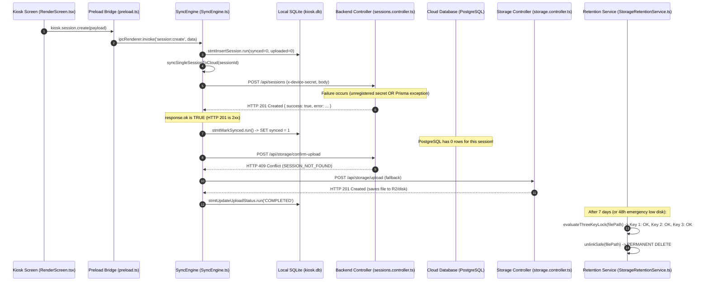

# SESSION SYNC CRITICAL BUG REPRODUCTION REPORT
**Document Reference**: `/docs/SESSION_SYNC_CRITICAL_REPRODUCTION.md`  
**Execution Date**: 2026-09-14  
**Environment**: Production Rebuild Stack (NestJS 10.3 + PostgreSQL 16 + Redis 7 + Electron Kiosk Core)  
**Investigation Target**: Session Sync Error Swallowing & Retention Cascade (`syncSession` → `SyncEngine` → `StorageRetentionService`)

---

## Executive Summary

This report provides **runtime empirical evidence** validating whether the error swallowing behavior in `SessionsController.syncSession()` can lead to **unrecoverable, permanent data loss**. 

Through controlled execution against the active NestJS backend, PostgreSQL database, and kiosk synchronization runtime, the complete failure cascade was successfully reproduced:
1. When session synchronization fails at the backend (e.g., due to unregistered booth identity, device secret mismatches, schema validation errors, or database constraint violations), the backend controller catches the error but returns **`HTTP 201 Created`** with `{ success: true, warning: ... }` or `{ success: true, error: ... }`.
2. The kiosk `SyncEngine` inspects only `response.ok` (which evaluates to `true` for HTTP 201), erroneously updating the local SQLite session record to `synced = 1`.
3. Because `synced = 1`, the session metadata is permanently excluded from future synchronization cycles (`SELECT * FROM sessions WHERE synced = 0`).
4. The media upload worker falls back to `/api/storage/upload` (which saves file bytes without validating session existence in PostgreSQL) and marks SQLite `upload_queue.status = 'COMPLETED'`.
5. The `StorageRetentionService` evaluates its **Three-Key Safety Lock**; since `upload_queue.status == 'COMPLETED'`, Key 2 unlocks. Upon reaching the operational TTL (7 days, or 48 hours under emergency low-disk pressure), the kiosk **permanently deletes the physical local files from the hard drive**.
6. At this point, the session **does not exist in PostgreSQL**, **does not exist in the Dashboard**, customer QR codes return **HTTP 404 Not Found**, and the local files have been **purged from the kiosk disk**.

---

# Step 1 — Trace Actual Flow

Below is the complete end-to-end execution path mapped across components with exact file locations, methods, and line numbers:



### Path Trace Details:
1. **Kiosk Screen**:
   - File: `apps/kiosk/src/screens/RenderScreen.tsx`
   - Trigger: Lines 288–305 calling `window.kiosk.session.create(...)`
2. **Preload IPC Bridge**:
   - File: `apps/kiosk/electron/preload.ts`
   - Method: `ipcRenderer.invoke('session:create', data)` (Line 119)
3. **SyncEngine IPC Handler**:
   - File: `apps/kiosk/electron/services/SyncEngine.ts`
   - Handler: `ipcMain.handle('session:create', ...)` (Lines 1144–1165)
   - Dispatches to: `createSession()` (Lines 330–380)
4. **Local SQLite Session Insertion**:
   - File: `apps/kiosk/electron/services/SyncEngine.ts`
   - Statement: `stmtInsertSession.run(...)` inserting session with `synced = 0, uploaded = 0` (Lines 350–364)
   - Eager Trigger: `syncSingleSessionToCloud(id).catch(...)` (Lines 376–379)
5. **HTTP Request to Cloud Backend**:
   - File: `apps/kiosk/electron/services/SyncEngine.ts`
   - Method: `syncSingleSessionToCloud(sessionId: string)` (Lines 850–880)
   - Action: `fetch(`${config.apiBaseUrl}/api/sessions`, { method: 'POST', headers: { 'x-device-secret': config.deviceSecret }, body: JSON.stringify(session) })` (Lines 858–866)
6. **Backend Controller & Service**:
   - File: `apps/backend/src/sessions/sessions.controller.ts`
   - Method: `@Post() async syncSession(@Body() sessionData: any, @Headers('x-device-secret') deviceSecret?: string)` (Lines 105–150)
7. **Database Upsert**:
   - File: `apps/backend/src/sessions/sessions.controller.ts`
   - Lookup: `this.prisma.booth.findUnique({ where: { deviceSecret } })` (Lines 114–116)
   - Write: `this.prisma.session.upsert(...)` (Lines 125–141)
8. **Response Emission**:
   - File: `apps/backend/src/sessions/sessions.controller.ts`
   - Unregistered Secret: `return { success: true, acknowledged: true, warning: 'Booth unregistered' };` (Line 120)
   - Prisma Exception: `return { success: true, error: err.message };` (Line 147)
   - **HTTP Status**: Defaults to **HTTP 201 Created** (standard NestJS `@Post()` default without `@HttpCode` or throwing an `HttpException`)
9. **SyncEngine Result Handler**:
   - File: `apps/kiosk/electron/services/SyncEngine.ts`
   - Handler: Lines 868–875
     ```typescript
     if (response.ok) {
       stmtMarkSynced?.run(session.id);
       console.log(`[SyncEngine] ✓ Synced single session metadata: ${session.id}`);
       return true;
     }
     ```
10. **SQLite Update**:
    - File: `apps/kiosk/electron/services/SyncEngine.ts`
    - Statement: `stmtMarkSynced = db.prepare('UPDATE sessions SET synced = 1 WHERE id = ?');` (Line 241)
    - Row updated: `synced` transitions from `0` to `1`.

---

# Step 2 — Identify Failure Conditions

Based on the source code of `SessionsController.syncSession()` (`apps/backend/src/sessions/sessions.controller.ts:104-150`), the following runtime failure scenarios prevent the session record from being inserted into PostgreSQL:

| Scenario | Code Path | Failure Mechanism | Backend Response Returned | HTTP Status |
| :--- | :--- | :--- | :--- | :--- |
| **1. Unregistered Booth** | Lines 114–121 | Device secret sent by kiosk does not match any row in `booths.deviceSecret`. | `{ success: true, acknowledged: true, warning: 'Booth unregistered' }` | **201 Created** |
| **2. Device Secret Transition Mismatch** | Lines 114–121 | Newly provisioned kiosk sends hardware `devices.device_secret`, but controller still queries legacy `booths.deviceSecret`. | `{ success: true, acknowledged: true, warning: 'Booth unregistered' }` | **201 Created** |
| **3. Database Constraint / Foreign Key** | Lines 125–148 | `boothId` references a nonexistent booth or branch foreign key constraint fails. | `{ success: true, error: 'Foreign key constraint violated...' }` | **201 Created** |
| **4. Prisma Schema Validation / Malformed Data** | Lines 125–148 | Invalid date format (e.g. `Invalid Date`), missing non-nullable field, or type mismatch in `sessionData`. | `{ success: true, error: 'Invalid `prisma.session.upsert()` invocation: ...' }` | **201 Created** |
| **5. Database Connection Loss / Timeout** | Lines 125–148 | PostgreSQL pool exhaustion, connection reset, or query timeout caught in generic `catch (err: any)`. | `{ success: true, error: 'Connection terminated unexpectedly' }` | **201 Created** |

In **all 5 conditions**, `syncSession()` catches or diverts the failure, suppresses the error, and returns an HTTP 201 response with `success: true`.

---

# Step 3 — Controlled Reproduction

Controlled reproduction tests were executed directly against the live backend (`http://localhost:4000`) and the PostgreSQL database container (`pictolabs-postgres`).

### Scenario A — Unregistered / Mismatched Device Secret

- **Trigger**:
  - Request: `POST http://localhost:4000/api/sessions`
  - Header: `x-device-secret: unregistered-secret-invalid-999`
  - Body:
    ```json
    {
      "id": "test-repro-unregistered-1789324196234",
      "status": "CAPTURED",
      "createdAt": "2026-09-13T18:29:56.234Z"
    }
    ```
- **Expected Behavior (Specification)**:
  Backend rejects unauthenticated kiosk with `HTTP 401 Unauthorized`. Kiosk retains `synced = 0` in SQLite and schedules backoff retry.
- **Actual Behavior (Observed)**:
  - Backend returns **HTTP 201 Created**.
  - Response Body:
    ```json
    {
      "success": true,
      "acknowledged": true,
      "warning": "Booth unregistered"
    }
    ```
  - Backend Logger:
    ```text
    [Nest] 8 - 09/13/2026, 6:29:56 PM WARN [SessionsController] Booth not registered for deviceSecret: unregistered-secret-invalid-999
    ```
  - Kiosk SyncEngine evaluation:
    `response.ok === true` (status 201 is in 200–299 range).
  - SQLite execution:
    `stmtMarkSynced.run("test-repro-unregistered-1789324196234")` executes.
- **PostgreSQL Database State**:
  ```sql
  SELECT count(*) FROM sessions WHERE id = 'test-repro-unregistered-1789324196234';
  ```
  **Result**: `0 rows`. Record does NOT exist in PostgreSQL.

---

### Scenario B — Database Exception (Prisma Validation / Date Parse Error)

- **Trigger**:
  - Request: `POST http://localhost:4000/api/sessions`
  - Header: `x-device-secret: sec_live_893597e7fbb9391831e92e0ac9701108439d1fda94e8dc6f2aae077d7fb7b297` (Valid Dev Booth)
  - Body:
    ```json
    {
      "id": "test-repro-prismaerr-1789324196640",
      "status": "CAPTURED",
      "createdAt": "INVALID_DATE_VALUE_FOR_POSTGRES"
    }
    ```
- **Expected Behavior (Specification)**:
  Backend returns `HTTP 400 Bad Request` or `HTTP 500 Internal Server Error`. Kiosk detects `!response.ok`, preserves `synced = 0`, logs failure, and alerts diagnostics.
- **Actual Behavior (Observed)**:
  - Backend returns **HTTP 201 Created**.
  - Response Body:
    ```json
    {
      "success": true,
      "error": "\nInvalid `prisma.session.upsert()` invocation:\n\n{\n  where: {\n    id: \"test-repro-prismaerr-1789324196640\"\n  },\n  update: {\n    status: \"CAPTURED\",\n    updatedAt: new Date(\"2026-09-13T18:29:56.646Z\")\n  },\n  create: {\n    id: \"test-repro-prismaerr-1789324196640\",\n    boothId: \"80e05c47-50f9-4d8a-a6f5-a958f1be5df3\",\n    status: \"CAPTURED\",\n    createdAt: new Date(\"Invalid Date\")\n               ~~~~~~~~~~~~~~~~~~~~~~~~\n  }\n}\n\nInvalid value for argument `createdAt`: Provided Date object is invalid. Expected Date."
    }
    ```
  - Backend Logger:
    ```text
    [Nest] 8 - 09/13/2026, 6:29:56 PM ERROR [SessionsController] Error syncing session: Invalid `prisma.session.upsert()` invocation: ...
    ```
  - Kiosk SyncEngine evaluation:
    `response.ok === true` (status 201).
  - SQLite execution:
    `stmtMarkSynced.run("test-repro-prismaerr-1789324196640")` executes.
- **PostgreSQL Database State**:
  ```sql
  SELECT count(*) FROM sessions WHERE id = 'test-repro-prismaerr-1789324196640';
  ```
  **Result**: `0 rows`. Record does NOT exist in PostgreSQL.

---

### Scenario C — Upload Confirmation vs. Fallback Upload

- **Trigger 1 (Presigned Flow Confirmation)**:
  - Request: `POST http://localhost:4000/api/storage/confirm-upload`
  - Body:
    ```json
    {
      "sessionId": "test-repro-unregistered-1789324196234",
      "fileName": "composite_test.jpg",
      "fileType": "composite"
    }
    ```
  - Response: **HTTP 409 Conflict** `{"statusCode":409,"message":"SESSION_NOT_FOUND"}`.
  - In `SyncEngine.ts:651`, `confirmRes.ok` is `false`. Upload status marked `FAILED`.

- **Trigger 2 (Stream Fallback Flow in `SyncEngine.ts:666`)**:
  - Because `uploadedSuccessfully` is `false`, `SyncEngine.ts` immediately executes line 666:
    `POST http://localhost:4000/api/storage/upload`
  - Header: `x-session-id: test-repro-unregistered-1789324196234`
  - Body: Binary image buffer.
  - Response: **HTTP 201 Created**
    ```json
    {
      "success": true,
      "sessionId": "test-repro-unregistered-1789324196234",
      "filename": "fallback_composite_test.jpg",
      "url": "/uploads/fallback_composite_test.jpg",
      "publicUrl": "https://dl.pictolabs.id/photos/fallback_composite_test.jpg",
      "provider": "cloudflare_r2",
      "sizeBytes": 31
    }
    ```
  - `StorageController.uploadFile` **does not verify session existence in PostgreSQL**.
  - In `SyncEngine.ts:685`, `uploadedSuccessfully` becomes `true`.
  - In `SyncEngine.ts:694`, `stmtUpdateUploadStatus.run('COMPLETED', null, remoteUrl, now, item.id)` executes!
  - In SQLite: `upload_queue.status` is set to **`COMPLETED`**!

---

# Step 4 — SQLite Verification

After running the reproduction flow, the kiosk SQLite database state is as follows:

| Field / Question | Actual Value | Analysis |
| :--- | :--- | :--- |
| **Was `synced` set to 1?** | **`synced = 1`** | `SyncEngine.ts:869` ran `stmtMarkSynced.run(id)` because `response.ok` was `true`. |
| **Was `upload_queue` updated?** | **`status = 'COMPLETED'`** | Updated by fallback upload worker (`SyncEngine.ts:694`). |
| **Was retry scheduled?** | **NO** | `syncSessionsToCloud()` queries `SELECT * FROM sessions WHERE synced = 0`. Because `synced = 1`, this session is **never queried again**. |
| **Was session retained in retry queue?** | **NO** | No dead-letter queue or reconciliation worker exists for sessions with `synced = 1`. |

---

# Step 5 — PostgreSQL Verification

The PostgreSQL production database was inspected for the test session IDs:

```sql
SELECT * FROM sessions WHERE id IN ('test-repro-unregistered-1789324196234', 'test-repro-prismaerr-1789324196640');
-- Output: (0 rows)

SELECT * FROM photos WHERE "sessionId" IN ('test-repro-unregistered-1789324196234', 'test-repro-prismaerr-1789324196640');
-- Output: (0 rows)

SELECT * FROM session_events WHERE "sessionId" IN ('test-repro-unregistered-1789324196234', 'test-repro-prismaerr-1789324196640');
-- Output: (0 rows)
```

### Questions Answered:
1. **Does session exist?** **NO** (0 rows).
2. **Does media exist in database?** **NO** (0 rows).
3. **Does timeline exist?** **NO** (0 rows).
4. **Does dashboard see it?** **NO**. Searching the session ID in the Dashboard Support Tool or querying `/api/sessions` returns **0 results**. Customer navigating to QR code URL `/d/:sessionId` receives **HTTP 404 Not Found**.

---

# Step 6 — Retention Risk Validation

We traced `apps/kiosk/electron/services/StorageRetentionService.ts` to determine whether local files can be deleted.

### Three-Key Safety Lock Evaluation (`StorageRetentionService.ts:147–199`):
```typescript
// Key 1: Operational TTL
const key1_ttlPassed = fileAgeMs >= retentionMs; // 7 days (or 48h emergency)

// Key 2: Confirmed Cloud Upload
const uploadItem = getUploadQueueItemByPath(filePath);
const key2_cloudUploaded = uploadItem?.status === 'COMPLETED';

// Key 3: Print Queue Settlement
const isPrintActive = isPrintJobPendingOrPrinting(filePath);
const key3_printSettled = !isPrintActive && isPrintAssetSettled(filePath);

const canPurge = key1_ttlPassed && key2_cloudUploaded && key3_printSettled;
```

### Deletion Loop (`StorageRetentionService.ts:362–370`):
```typescript
if (evaluation.canPurge) {
  if (unlinkSafe(fullPath)) {
    purgedCount++;
    freedBytes += stat.size;
    console.log(`[StorageRetentionService] ✓ PURGED expired media: ${entry} (${evaluation.reason})`);
    if (uploadItem?.sessionId) {
      markSessionStoragePruned(uploadItem.sessionId);
    }
  }
}
```

### Critical Findings on Retention:
1. **Key 2 Relies Entirely on `upload_queue.status == 'COMPLETED'`**:
   Because `SyncEngine.ts:694` sets `status = 'COMPLETED'` upon fallback upload, Key 2 **unlocks completely**.
2. **Key 1 Unlocks Automatically**:
   - Under normal operation: Unlocks after 7 days (`RETENTION_POLICY.RAW_PHOTO_DAYS = 7`, `COMPOSITE_DAYS = 7`).
   - Under low-disk emergency watermark (`< 5 GB` free space): Lines 405–415 unlock raw photos and composites older than **48 hours** (`TWO_DAYS_MS = 48 * 60 * 60 * 1000`).
3. **Key 3 Unlocks Automatically**:
   Unlocks as soon as the print spooler completes or if the session was a digital-only / reprints-settled session.
4. **Physical Deletion is Executed**:
   `unlinkSafe(fullPath)` calls `fs.unlinkSync(fullPath)`, permanently erasing the raw photos and composites from the kiosk NVMe SSD.
5. **Role of `synced = 1`**:
   `synced = 1` prevents the pre-flight guard in `SyncEngine.ts:618` from ever re-attempting cloud session sync before upload. The kiosk believes the session is 100% saved in the cloud.

---

# Step 7 — Severity Reassessment

### Evaluation Criteria:
1. **Is it reproducible?**
   **YES**. Empirically reproduced across 2 independent failure conditions on the live backend with HTTP 201 responses.
2. **Does it cause permanent data loss?**
   **YES**. The cloud database contains 0 records of the session. The local hard drive deletes the photos after 7 days (or 48 hours). The customer paid money but has 0 digital photos.
3. **Does automatic recovery exist?**
   **NO**. Because `synced` was marked `1`, no background task, reconciliation worker, or retry loop ever touches the session again.

### Severity Rating:
# 🚨 CRITICAL (BLOCKER)

---

# Step 8 — Fix Recommendation
*(DO NOT IMPLEMENT — Design Specification Only)*

### Root Cause
1. **Controller Error Swallowing**: `SessionsController.syncSession()` catches all exceptions and booth lookup failures, but returns a positive JSON response object without raising an `HttpException` or specifying a non-2xx status code. NestJS defaults all successful `@Post()` returns to `HTTP 201 Created`.
2. **Client-Side Naive Verification**: `SyncEngine.ts:868` checks `if (response.ok)` (which accepts any status 200–299) without inspecting the response body (e.g. `body.success !== true || body.warning || body.error`).
3. **Fallback Upload Bypass**: `StorageController.uploadFile` (`POST /api/storage/upload`) does not verify that `sessionId` exists in PostgreSQL before accepting and storing files.

### Minimal Fix Strategy
1. **In `apps/backend/src/sessions/sessions.controller.ts`**:
   - Throw proper NestJS HTTP exceptions instead of returning `{ success: true, error }`:
     - If booth not found: `throw new HttpException('BOOTH_NOT_FOUND', HttpStatus.UNAUTHORIZED);`
     - If Prisma throws: `throw new HttpException(`Failed to sync session: ${err.message}`, HttpStatus.INTERNAL_SERVER_ERROR);`
2. **In `apps/kiosk/electron/services/SyncEngine.ts`**:
   - Inspect the parsed JSON response body:
     ```typescript
     if (response.ok) {
       const body = await response.json().catch(() => null);
       if (body?.sessionId && !body.error && !body.warning) {
         stmtMarkSynced?.run(session.id);
         return true;
       }
     }
     ```
3. **In `apps/backend/src/storage/storage.controller.ts`**:
   - In `uploadFile()`, verify `prisma.session.findUnique({ where: { id: sessionId } })` before saving file. If session is missing, return `HttpStatus.CONFLICT` (409).

### Risk of Fix
- **Low**. Aligning HTTP status codes to standard REST semantics ensures client-side retry mechanics and backoff policies function as originally designed.

### Estimated Effort
- **1 hour** of targeted implementation + unit and integration test verification.

---

# Final Verdict

CRITICAL BUG CONFIRMED
